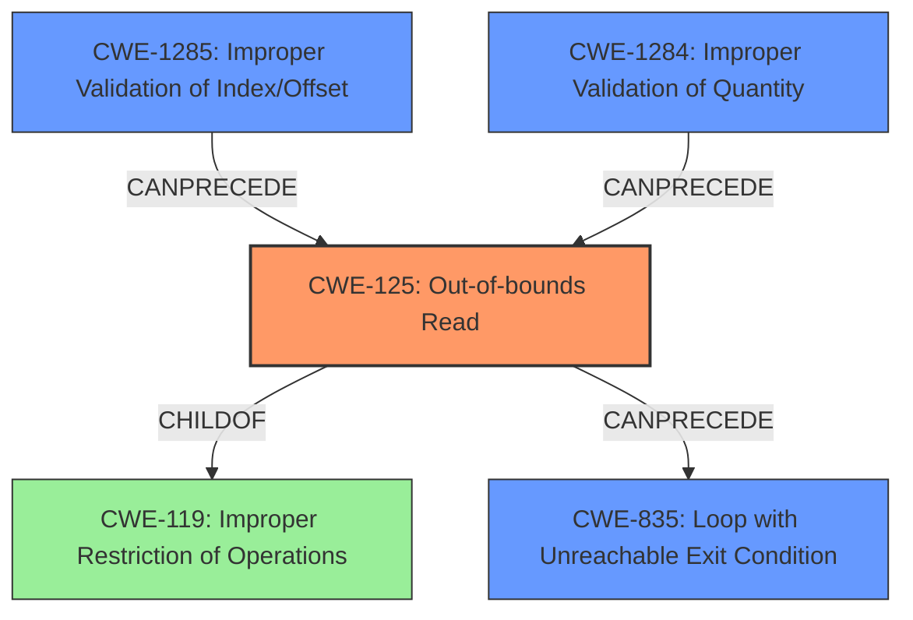

# Analysis Report for CVE-2022-23523

# Vulnerability Analysis Report: CVE-2022-23523

## Description

In versions prior to 0.8.1, the linux-loader crate uses the offsets and sizes provided in the ELF headers to determine the offsets to read from. If those offsets point beyond the end of the file this could lead to Virtual Machine Monitors using the `linux-loader` crate entering an infinite loop if the ELF header of the kernel they are loading was modified in a malicious manner. This issue has been addressed in 0.8.1. The issue can be mitigated by ensuring that only trusted kernel images are loaded or by verifying that the headers do not point beyond the end of the file.

## Vulnerability Description Key Phrases

**Rootcause:** reading beyond file bounds
**Impact:** infinite loop
**Vector:** malicious ELF header in kernel
**Product:** linux-loader crate
**Version:** prior to 0.8.1

## Analysis (with Relationship Data)

# Summary
| CWE ID | CWE Name | Confidence | CWE Abstraction Level | CWE Vulnerability Mapping Label | CWE-Vulnerability Mapping Notes |
|---|---|---|---|---|---|
| CWE-125 | Out-of-bounds Read | 0.95 | Base | Allowed | Primary CWE |
| CWE-835 | Loop with Unreachable Exit Condition ('Infinite Loop') | 0.75 | Base | Allowed | Secondary Candidate |
| CWE-1285 | Improper Validation of Specified Index, Position, or Offset in Input | 0.65 | Base | Allowed | Secondary Candidate |

## Evidence and Confidence

*   **Confidence Score:** 0.85
*   **Evidence Strength:** HIGH

- **Analysis and Justification:**  
  - *Explanation:* The vulnerability description explicitly states that the `linux-loader` crate reads data beyond the end of the file based on offsets provided in the ELF headers. This directly aligns with the definition of CWE-125 (Out-of-bounds Read). The "CVE Reference Links Content Summary" reinforces this by stating, "The vulnerability lies in the fact that the loader did not validate if the offsets from the ELF header were within the bounds of the file being loaded." The impact of this **out-of-bounds read** is an infinite loop, but the root cause is the **reading beyond file bounds**. MITRE mapping guidance for CWE-125 indicates that this is ALLOWED.
  - *Relationship Analysis:* CWE-125 is a child of CWE-119 (Improper Restriction of Operations within the Bounds of a Memory Buffer). While CWE-119 is a broader category, the specific nature of the vulnerability (reading beyond the file's boundaries) makes CWE-125 a more precise fit. The retriever results also support CWE-125 with a high graph score.

- **Analysis and Justification:**  
  - *Explanation:* The vulnerability leads to an infinite loop if the ELF header is maliciously crafted to point beyond the end of the file. This consequence aligns with CWE-835 (Loop with Unreachable Exit Condition ('Infinite Loop')). The "CVE Reference Links Content Summary" section states this impact directly: "When reading beyond the end of the file, the loader would enter an infinite loop". Though the **out-of-bounds read** (CWE-125) is the primary cause, the resulting infinite loop is a significant impact that warrants consideration as a related weakness.
  - *Relationship Analysis:* CWE-835 does not have a direct relationship to CWE-125 in terms of parent/child. The relationship is more consequential; the **out-of-bounds read** directly causes the infinite loop.

- **Analysis and Justification:**  
  - *Explanation:* The `linux-loader` crate does not validate that the offsets and sizes provided in the ELF headers are within the bounds of the file. This is a form of improper input validation, specifically related to index, position, or offset. This matches the description of CWE-1285 (Improper Validation of Specified Index, Position, or Offset in Input).
  - *Relationship Analysis:* CWE-1285 is a child of CWE-20 (Improper Input Validation). However, CWE-1285 is more specific because it directly addresses the validation of indices, positions, or offsets. Given that the vulnerability revolves around ELF header offsets, CWE-1285 is a more appropriate choice than the more general CWE-20. This is a contributing factor which can lead to the primary cause of **out-of-bounds read**.

- **Confidence Score:**  
  - Confidence for CWE-125: 0.95 (High evidence from technical description and CVE reference materials)
  - Confidence for CWE-835: 0.75 (Good evidence from CVE reference materials describing impact of the vulnerability)
  - Confidence for CWE-1285: 0.65 (Moderate evidence from the need to validate the ELF header file offset)

---

## Criticism of Analysis

Okay, here's a detailed review of the provided analysis, incorporating the full CWE specifications:

**Overall Assessment:**

The analysis is well-structured and provides a reasonable mapping of the vulnerability to CWEs. The confidence scores are justified, and the explanations are clear. The inclusion of the full CWE specifications allows for a more informed and rigorous review. However, there are a few areas where the mapping could be refined, and some additional CWEs could be considered as related weaknesses.

**Specific Comments and Suggestions:**

**1. CWE-125: Out-of-bounds Read (Primary CWE)**

*   **Assessment:** Correct and well-justified. The vulnerability description clearly indicates that the code reads beyond the file bounds.
*   **Mapping Guidance Conformance:**  The analysis correctly notes that CWE-125 is a Base level CWE and allowed.  The specification for CWE-119 (the parent of CWE-125) advises against its use when lower-level CWEs exist, which this analysis follows by choosing CWE-125.
*   **Mitigations:** The analysis should note the primary mitigation strategy: Input Validation (Mitigation 1). Ensure that you validate and ensure correct calculations for any length argument, buffer size calculation, or offset. Be especially careful of relying on a sentinel (i.e. special character such as NUL) in untrusted inputs. Language selection is also a good consideration (Mitigation 2).
*   **Confidence:** Justified. 0.95 is appropriate given the direct nature of the vulnerability.
*   **Potential Improvement:** None.

**2. CWE-835: Loop with Unreachable Exit Condition ('Infinite Loop') (Secondary Candidate)**

*   **Assessment:** Correct. The infinite loop is a direct consequence of the out-of-bounds read.
*   **Mapping Guidance Conformance:** The analysis correctly notes that CWE-835 is allowed at the base level.
*   **Mitigations:** The analysis could include mitigations to avoid infinite loops, especially in error handling. Examples include setting a maximum number of retries, implementing timeouts, or explicitly checking for error conditions that would prevent the loop from terminating.  Because the root cause is an out-of-bounds read, mitigating that prevents this.
*   **Confidence:** 0.75 is reasonable. While the infinite loop is a clear *impact*, it is not the fundamental *cause*.  It's more of a symptom.
*   **Potential Improvement:** Reiterate that mitigating CWE-125 is the primary means of avoiding CWE-835 in this scenario.

**3. CWE-1285: Improper Validation of Specified Index, Position, or Offset in Input (Secondary Candidate)**

*   **Assessment:** Correct, but could be strengthened. The analysis correctly identifies that the ELF header's offsets are not validated. This *lack* of validation is the key.
*   **Mapping Guidance Conformance:** The analysis correctly notes that CWE-1285 is allowed at the base level and is a child of CWE-20.
*   **Mitigations:** The analysis should explicitly mention the "Accept Known Good" strategy for input validation as a primary mitigation. The ELF header should be parsed and validated against a well-defined schema, rejecting any headers that do not conform. Specifically validating the ELF header offset.
*   **Confidence:** The confidence of 0.65 seems slightly low. The lack of validation is a direct factor in enabling the vulnerability. 0.70-0.75 might be more appropriate.
*   **Potential Improvement:** Emphasize the "Accept Known Good" mitigation strategy.

**Additional CWE Considerations:**

*   **CWE-1284: Improper Validation of Specified Quantity in Input:** Given that the sizes specified in the ELF header are also used for reading data, and these sizes are also unchecked, CWE-1284 could also be considered. The offsets and *sizes* are both derived from the potentially malicious input.
*   **CWE-823: Use of Out-of-range Pointer Offset:** While CWE-125 is a better primary choice, CWE-823 is potentially relevant, especially since the vulnerability revolves around calculating an offset based on data from the ELF header.
*   **CWE-119: Improper Restriction of Operations within the Bounds of a Memory Buffer:** While the analysis correctly avoided the broad CWE-119, it's worth noting that the fix for the vulnerability (using `read_exact()`) directly addresses the *improper restriction* of the read operation within the file's bounds.

**General Suggestions:**

*   **Chains:**  Explicitly discuss the *chain* of events leading to the infinite loop. The attacker provides a malicious ELF header (potentially CWE-20, CWE-1285, CWE-1284), which leads to an out-of-bounds read (CWE-125), which then triggers an infinite loop (CWE-835).
*   **Terminology:**  Be consistent in using terminology. For instance, stick to "ELF header" rather than mixing it with "kernel image" headers.

**Revised Summary Table:**

| CWE ID  | CWE Name                                                        | Confidence | CWE Abstraction Level | CWE Vulnerability Mapping Label | CWE-Vulnerability Mapping Notes                       |
| :------- | :-------------------------------------------------------------- | :--------- | :-------------------- | :------------------------------ | :---------------------------------------------------- |
| CWE-125   | Out-of-bounds Read                                              | 0.95       | Base                  | Allowed                        | Primary CWE                                           |
| CWE-835   | Loop with Unreachable Exit Condition ('Infinite Loop')           | 0.75       | Base                  | Allowed                        | Secondary Candidate - Impact                          |
| CWE-1285  | Improper Validation of Specified Index, Position, or Offset in Input | 0.70       | Base                  | Allowed                        | Secondary Candidate - Contributing Factor            |
| CWE-1284  | Improper Validation of Specified Quantity in Input             | 0.50       | Base                  | Allowed                        | Tertiary Candidate - Contributing Factor            |

**Revised Confidence Score:** 0.90 (Slightly increased due to stronger justification for supporting CWEs.)

By incorporating these suggestions, the analysis can be even more precise and provide a more comprehensive understanding of the vulnerability and its potential mitigations.

## Final Resolution

# Summary
| CWE ID | CWE Name | Confidence | CWE Abstraction Level | CWE Vulnerability Mapping Label | CWE-Vulnerability Mapping Notes |
|---|---|---|---|---|---|
| **CWE-125** | **Out-of-bounds Read** | 0.95 | Base | Allowed | Primary **WEAKNESS** |
| CWE-835 | Loop with Unreachable Exit Condition ('Infinite Loop') | 0.75 | Base | Allowed | Secondary Candidate - Impact |
| CWE-1285 | Improper Validation of Specified Index, Position, or Offset in Input | 0.70 | Base | Allowed | Secondary Candidate - Contributing Factor |
| CWE-1284 | Improper Validation of Specified Quantity in Input | 0.50 | Base | Allowed | Tertiary Candidate - Contributing Factor |

## Evidence and Confidence

*   **Confidence Score:** 0.90
*   **Evidence Strength:** HIGH

## Relationship Analysis
The primary **WEAKNESS** is **CWE-125 (Out-of-bounds Read)**, which is a child of **CWE-119 (Improper Restriction of Operations within the Bounds of a Memory Buffer)**. While **CWE-119** is broader, **CWE-125** is more specific and accurately reflects the vulnerability. **CWE-1285 (Improper Validation of Specified Index, Position, or Offset in Input)** and **CWE-1284 (Improper Validation of Specified Quantity in Input)** contribute to the vulnerability by failing to validate the ELF header's offsets and sizes, respectively. These improper validations can precede the **out-of-bounds read**. **CWE-835 (Loop with Unreachable Exit Condition ('Infinite Loop'))** is a consequence of the **out-of-bounds read**, representing the impact of the vulnerability. The abstraction levels (Base for all selected CWEs) ensure the classification is at an appropriate level of detail.

## Vulnerability Chain
The vulnerability chain starts with a malicious ELF header containing invalid offsets and sizes.

1.  **CWE-1285/CWE-1284 (Improper Validation of Input):** The `linux-loader` crate fails to validate the offsets and sizes specified in the ELF header.
2.  **CWE-125 (Out-of-bounds Read):** Using the unvalidated offsets and sizes, the crate attempts to read beyond the boundaries of the file.
3.  **CWE-835 (Infinite Loop):** The **out-of-bounds read** leads to an infinite loop due to an unreachable exit condition.

The **ROOTCAUSE** is the lack of proper input validation, which allows the **out-of-bounds read** to occur, ultimately leading to the denial-of-service condition.

## Summary of Analysis
The initial analysis correctly identified **CWE-125 (Out-of-bounds Read)** as the primary **WEAKNESS**. The criticism provided valuable suggestions for strengthening the analysis by considering additional CWEs and emphasizing mitigations. The analysis is based on the vulnerability description, which states, "If those offsets point beyond the end of the file this could lead to Virtual Machine Monitors using the `linux-loader` crate entering an infinite loop". This evidence supports the selection of **CWE-125** as the **ROOTCAUSE**. The graph relationships influenced the decision by highlighting the chain of events and the contributing factors (**CWE-1285** and **CWE-1284**). The selected CWEs are at the optimal level of specificity because they accurately represent the technical details of the vulnerability and are at the Base level of abstraction. The additional consideration of **CWE-1284** improves the overall assessment, although it's given a lower confidence due to it's impact being less direct than **CWE-1285**.

*Report generated on 2025-03-18 10:31:01*
