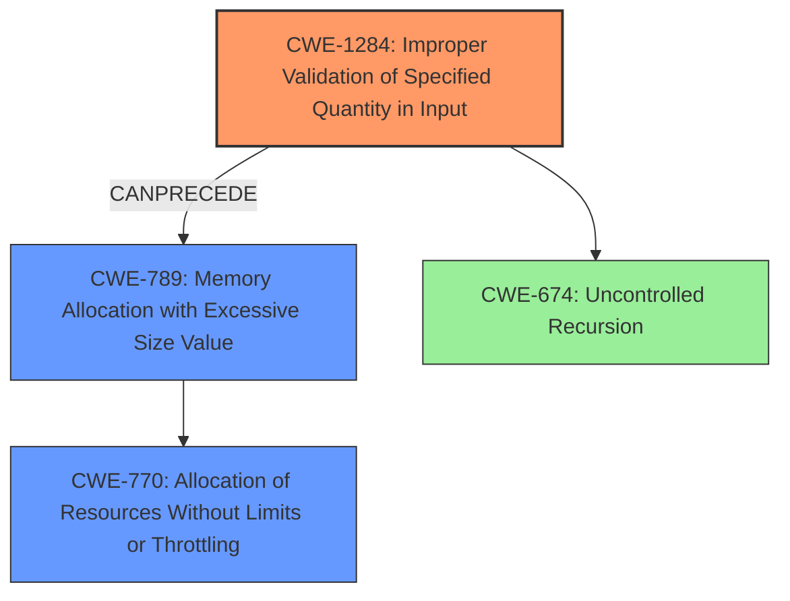

# Final Resolution for CVE-2022-23524

# Summary
| CWE ID | CWE Name | Confidence | CWE Abstraction Level | CWE Vulnerability Mapping Label | CWE-Vulnerability Mapping Notes |
|---|---|---|---|---|---|
| CWE-1284 | Improper Validation of Specified Quantity in Input | 0.8 | Base | Allowed | Primary CWE: The input strings are not validated, leading to the allocation of potentially very large data structures. |
| CWE-789 | Memory Allocation with Excessive Size Value | 0.7 | Variant | Allowed | Secondary CWE: Lack of input validation manifests by allocating excessive memory based on untrusted input. |
| CWE-770 | Allocation of Resources Without Limits or Throttling | 0.6 | Base | Allowed | Tertiary CWE: Describes the general resource exhaustion that occurs. |
| CWE-674 | Uncontrolled Recursion | 0.4 | Class | Allowed-with-Review | Conditional CWE: Only if the parsing logic is confirmed to be using recursion to build the arrays, which is not explicitly stated. |

## Evidence and Confidence

*   **Confidence Score:** 0.8
*   **Evidence Strength:** HIGH

## Relationship Analysis
The primary relationship influencing the decision is the chain: CWE-1284 (Improper Input Validation) can precede CWE-789 (Memory Allocation with Excessive Size Value), which can lead to CWE-770 (Resource Exhaustion). CWE-674 (Uncontrolled Recursion) is considered as a potential factor if the parsing logic uses recursion.

## Vulnerability Chain
The vulnerability chain starts with **CWE-1284 (Improper Validation of Specified Quantity in Input)**. The product receives input without validating the size, length, or structure implied by the input. This leads to **CWE-789 (Memory Allocation with Excessive Size Value)**, where the code allocates excessive memory based on the unvalidated input. This excessive memory allocation results in **CWE-770 (Allocation of Resources Without Limits or Throttling)**, causing resource exhaustion and Denial of Service (DoS). Optionally, the parsing process could involve **CWE-674 (Uncontrolled Recursion)**, further contributing to the stack overflow.

## Summary of Analysis
The initial analysis focused on **CWE-674 (Uncontrolled Recursion)**, but the criticism correctly pointed out that the root cause is more directly related to improper input validation and excessive memory allocation.

The vulnerability description states, "Input to functions in the _strvals_ package can cause a stack overflow." While a **stack overflow** is the impact, the *cause* is the lack of validation on user-supplied strings, leading to the creation of large arrays.

**CWE-1284 (Improper Validation of Specified Quantity in Input)** is the most direct description of the root cause: "The product receives input that is expected to specify a quantity (such as size or length), but it does not validate or incorrectly validates that the quantity has the required properties." This aligns perfectly with the vulnerability description and the recommended fix: "SDK users can validate strings supplied by users won't create large arrays causing significant memory usage before passing them to the _strvals_ functions."

**CWE-789 (Memory Allocation with Excessive Size Value)** describes how the lack of input validation manifests: "The product allocates memory based on an untrusted, large size value, but it does not ensure that the size is within expected limits, allowing arbitrary amounts of memory to be allocated."

**CWE-770 (Allocation of Resources Without Limits or Throttling)** describes the resulting resource exhaustion.

The graph relationships support this chain, with **CWE-1284** potentially preceding **CWE-789**, leading to **CWE-770**.

The selected CWEs are at the optimal level of specificity. **CWE-1284** is a Base-level CWE, which is a preferred level for mapping root causes. **CWE-789** is a Variant, also a preferred level. **CWE-770** is a Base-level. **CWE-674**, although initially considered, is a Class-level CWE and less specific.

Therefore, the final decision is to classify the vulnerability primarily as **CWE-1284**, with **CWE-789** and **CWE-770** as secondary contributing factors. **CWE-674** is a conditional factor.