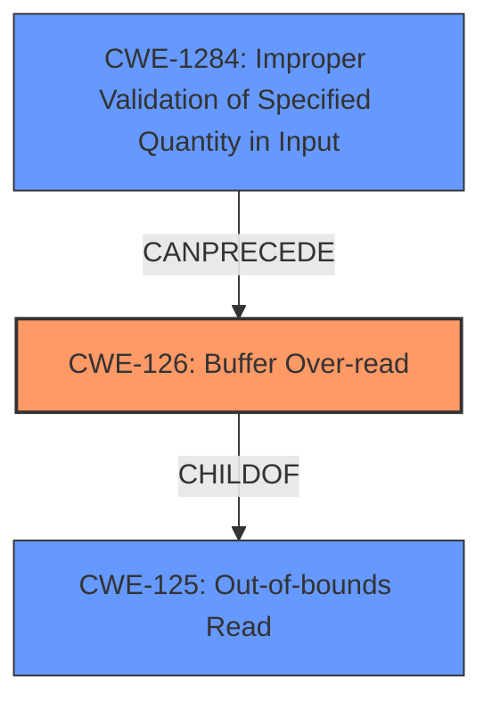

# Final Resolution for CVE-2022-23547

# Summary
| CWE ID   | CWE Name                                         | Confidence | CWE Abstraction Level | CWE Vulnerability Mapping Label | CWE-Vulnerability Mapping Notes                                                                                                                                                                                                                                                                                                                                                                 |
| :------- | :----------------------------------------------- | :--------- | :-------------------- | :------------------------------ | :------------------------------------------------------------------------------------------------------------------------------------------------------------------------------------------------------------------------------------------------------------------------------------------------------------------------------------------------------------------------------------------------------ |
| CWE-126  | Buffer Over-read                                | 0.9        | Variant               | Allowed                       | Primary CWE. The vulnerability is a heap buffer over-read due to missing length validation when copying the STUN error reason string.                                                                                                                                                                                                                                                                   |
| CWE-1284 | Improper Validation of Specified Quantity in Input | 0.7        | Base                  | Allowed                       | Secondary Candidate CWE. The code fails to validate the length of the error reason string attribute before copying it using `pj_strdup`, contributing to the over-read. Addressing this with an "accept known good" validation strategy would prevent the vulnerability.                                                                                                                                 |

## Evidence and Confidence

*   **Confidence Score:** 0.9
*   **Evidence Strength:** HIGH

## Relationship Analysis
The analysis is based on the provided vulnerability description, which clearly indicates a **buffer overread** when parsing a STUN message. The primary weakness is identified as CWE-126 (Buffer Over-read), a Variant of CWE-125 (Out-of-bounds Read). The secondary weakness, CWE-1284 (Improper Validation of Specified Quantity in Input), contributes to the vulnerability by failing to validate the length of the input string before copying.

## Vulnerability Chain
The vulnerability chain starts with the **ROOTCAUSE** of improper input validation (CWE-1284), which leads to the weakness of a **buffer overread** (CWE-126). The **buffer overread** can potentially cause a denial-of-service (DoS) or, in some cases, remote code execution (RCE) by corrupting heap metadata or other program data.

Missing Length Check (CWE-1284) -> Buffer Over-read (CWE-126) -> Potential DoS/RCE

## Summary of Analysis
The initial analysis and criticism provided a solid foundation for classifying this vulnerability. The primary **WEAKNESS** is clearly a **buffer overread** (CWE-126), as evidenced by the CVE description stating a "read beyond the allocated memory." The secondary contributing factor is the improper validation of the input string length (CWE-1284), specifically the "missing length check."

The graph relationships influenced the final selection by confirming that CWE-126 is a more specific type of CWE-125 (Out-of-bounds Read) and that CWE-1284 can precede CWE-126. This aligns with the understanding that the missing length check leads to the overread.

The selected CWEs are at the optimal level of specificity. CWE-126 is a Variant, and CWE-1284 is a Base, both of which are preferred levels of abstraction according to MITRE mapping guidance. These choices provide a balance between generality and precision.