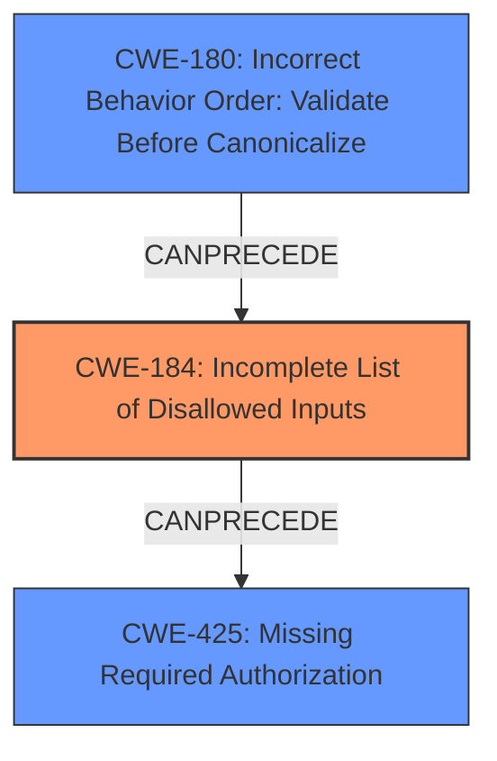

# Analysis Report for CVE-2022-23553

# Vulnerability Analysis Report: CVE-2022-23553

## Description

Alpine is a scaffolding library in Java. Alpine prior to version 1.10.4 allows URL access filter bypass. This issue has been fixed in version 1.10.4. There are no known workarounds.

## Vulnerability Description Key Phrases

**Weakness:** URL access filter bypass
**Product:** Alpine
**Version:** prior to version 1.10.4

## Analysis (with Relationship Data)

# Summary
| CWE ID | CWE Name | Confidence | CWE Abstraction Level | CWE Vulnerability Mapping Label | CWE-Vulnerability Mapping Notes |
|---|---|---|---|---|---|
| CWE-184 | Incomplete List of Disallowed Inputs | 0.85 | Base | Allowed | The product implements a protection mechanism that relies on a list of inputs (or properties of inputs) that are not allowed by policy or otherwise require other action to neutralize before additional processing takes place, but the list is incomplete. |
| CWE-425 | Missing Required Authorization | 0.75 | Base | Allowed | The web application does not adequately enforce appropriate authorization on all restricted URLs, scripts, or files. |

## Evidence and Confidence

*   **Confidence Score:** 0.80
*   **Evidence Strength:** HIGH

- **Analysis and Justification:**  
  - *Explanation:* "The vulnerability description highlights a **URL access filter bypass** in the Alpine library. The CVE reference summary clarifies that the `BlacklistUrlFilter` and `WhitelistUrlFilter` use the `startsWith` method for URL filtering, which doesn't normalize the request URI. This **weakness** allows attackers to bypass filters using sequences like `/allowed/..;/blocked`, which are later resolved to `/blocked` by the server. This directly corresponds to CWE-184 (Incomplete List of Disallowed Inputs) because the URL filter is incomplete in handling various URL encoding and path traversal sequences. While CWE-425 (Missing Required Authorization) is related, CWE-184 is more specific to the incomplete input validation that leads to the access control bypass. The fact that it relies on startsWith, and doesn't normalize the URL prior to validation is evidence for this. The MITRE mapping guidance for CWE-184 indicates that it is ALLOWED."
  
  - *Relationship Analysis:* "CWE-184 is a Base level CWE and is related to input validation and access control issues. It can precede CWE-79 (Improper Neutralization of Input During Web Page Generation) if the bypassed input leads to cross-site scripting, or CWE-78 (Improper Neutralization of Special Elements used in a Command) if it leads to command injection. There is also a CANPRECEDE relationship with CWE-434 (Unrestricted Upload of File with Dangerous Type) indicating that the bypass can lead to dangerous files being uploaded."

- **Confidence Score:**  
  - Confidence: 0.85 (High evidence from the technical description and CVE reference materials)

- **Analysis and Justification:**  
  - *Explanation:* "The vulnerability ultimately leads to an access control bypass, indicating a failure in authorization. While CWE-184 explains the root cause (incomplete list of disallowed inputs), the impact is that authorization is bypassed. Therefore, CWE-425 (Missing Required Authorization) is a relevant secondary CWE. This is because, in the end, the application fails to adequately enforce authorization on a restricted resource. The MITRE mapping guidance for CWE-425 indicates that it is ALLOWED."
  
  - *Relationship Analysis:* "CWE-425 is a Base level CWE and is related to authorization issues. It can follow CWE-73 (External Control of File Name or Path) or CWE-22 (Improper Limitation of a Pathname to a Restricted Directory) as it's common for file access vulnerabilities to lead to authorization bypass."

- **Confidence Score:**  
  - Confidence: 0.75 (Good evidence supporting an authorization failure as the end result, but the root cause is better described by CWE-184)

## Criticism of Analysis

Okay, here's a detailed review of the provided CWE analysis, incorporating the full CWE specifications:

**Overall Assessment:**

The analysis is generally well-reasoned and attempts to justify the CWE mappings with evidence from the vulnerability description and CVE content summary. The use of confidence scores is good practice. However, there are some areas where the analysis can be improved, especially in considering alternative CWEs and their relationships, and providing more specific mitigations based on the chosen CWEs.

**Detailed Review of CWE Mappings:**

**1. CWE-184: Incomplete List of Disallowed Inputs**

*   **Confidence:** 0.85
*   **Assessment:** The choice of CWE-184 as the primary weakness is **strong and justified**. The explanation clearly links the `startsWith` based filtering and the lack of URI normalization to an incomplete list of disallowed inputs (various forms of path traversal). The analysis correctly identifies the incomplete handling of URL encoding and path traversal sequences. The mention of MITRE mapping guidance is helpful.
*   **Mitigation:** The analysis could be improved by relating the potential mitigations for CWE-184 back to the specific vulnerability. The description mentions "Do not rely exclusively on detecting disallowed inputs," which is a good starting point. But the analysis could suggest to replace `startsWith` with a validated input.
*   **Relationships:** The relationship analysis is also good, correctly identifying `CanPrecede` relationships to `CWE-79`, `CWE-78`, and `CWE-434`.

**2. CWE-425: Missing Required Authorization**

*   **Confidence:** 0.75
*   **Assessment:** The choice of CWE-425 as a secondary weakness is **less compelling**. While the vulnerability ultimately results in an access control bypass (which is the end result of this access control), CWE-184 more accurately describes the *root cause*. Since the description highlights the root cause of the URL filtering bypass and the authorization bypass is a *consequence* of the input validation weakness, the confidence level of 0.75 is appropriate.
*   **Mitigation:** Mitigation 1 is "Apply appropriate access control authorizations for each access to all restricted URLs, scripts or files." This is generally a good point. Mitigation 2 is Consider using MVC based frameworks such as Struts.
*   **Relationships:** The relationship analysis is accurate, but less relevant since the root cause is described better by CWE-184.

**General Improvements and Alternative CWEs to Consider:**

1.  **Prioritize Root Cause:** Always focus on the most specific and fundamental root cause. In this case, the failure of the URL filter is more fundamental than the authorization bypass.

2.  **Canonicalization & Validation:** the root cause is the failure to properly handle path canonicalization and to validate the URI *after* canonicalization. This suggests considering CWE-22, CWE-23, CWE-36, CWE-41, and CWE-180. The reason it fails is because canonicalization takes place *after* validation. In this case, consider CWE-180 (Incorrect Behavior Order: Validate Before Canonicalize) which is a Variant level weakness.

3.  **Partial String Comparison:** The `startsWith` method is a partial string comparison, which can lead to vulnerabilities. Consider CWE-187 (Partial String Comparison). This is related, but not as directly applicable as CWE-184.

4.  **Template Injection or Expression Language Injection:** Because this is in Java, and is a scaffolding library, it might be used with some template engine. If an attacker could inject template code via the URL, consider CWE-1336 (Improper Neutralization of Special Elements Used in a Template Engine) or CWE-917 (Expression Language Injection). However, this does not seem to be the case here as it relates more specifically to the `startsWith` method.

5.  **Mitigation Specificity:** The analysis should tailor the "Potential Mitigations" sections to the specifics of the vulnerability. For example, for CWE-184, it should mention the need to normalize URLs before filtering, and to use a comprehensive list of disallowed patterns. It should not be a generic description, but provide recommendations specific to the Alpine security library.

6.  **Chains of Weaknesses:** When possible, the analysis should explicitly outline the chain of weaknesses, even if it's already implied in the "Relationships" section. For example: "The incomplete list of disallowed inputs (CWE-184) allows attackers to bypass URL filters, leading to unauthorized access (CWE-425) of protected resources."

7.  **Consider `CWE-96: Improperly Neutralized Special Elements in a Dynamically-Evaluated Code Fragment`:** If the manipulated URL segments can somehow be used to inject and execute code on the server.

8.  **Review Top Combined Results.** The Retriever results include a few higher-ranking CWEs that are potentially useful:
    *   **CWE-918 Server-Side Request Forgery (SSRF).** This is not applicable as the destination is not determined by the attacker.
    *   **CWE-201 Insertion of Sensitive Information Into Sent Data.** This is not applicable as there is no sensitive data being sent.
    *   **CWE-639 Authorization Bypass Through User-Controlled Key.** This could have some potential; if the URL itself is considered a key. However, `startsWith` is not related to this key, so this isn't fully applicable.

**Revised Summary Table:**

| CWE ID    | CWE Name                                                   | Confidence | CWE Abstraction Level | CWE Vulnerability Mapping Label | CWE-Vulnerability Mapping Notes                                                                                                                                                                                                                                                                                                                                                                                                                                                                                       |
| :-------- | :--------------------------------------------------------- | :--------- | :-------------------- | :------------------------------ | :------------------------------------------------------------------------------------------------------------------------------------------------------------------------------------------------------------------------------------------------------------------------------------------------------------------------------------------------------------------------------------------------------------------------------------------------------------------------------------------------------------------------------ |
| CWE-184   | Incomplete List of Disallowed Inputs                    | 0.90       | Base                  | Allowed                      | The product implements a protection mechanism that relies on a list of inputs (or properties of inputs) that are not allowed by policy or otherwise require other action to neutralize before additional processing takes place, but the list is incomplete. The `startsWith` method does not properly account for path traversal sequences.                                                                                                                                                              |
| CWE-180  | Incorrect Behavior Order: Validate Before Canonicalize          | 0.75       | Variant                 | Allowed                  | The product uses `startsWith` before normalizing the URL, making it possible to bypass the validation by using special characters to modify the URL. 
| CWE-425   | Missing Required Authorization                             | 0.60       | Base                  | Allowed                      | The URL access filter bypass ultimately leads to a failure in authorization, as restricted resources become accessible. However, this is a *consequence* of the input validation issue, not the root cause.                                                                                                                                                                                                                                                                                          |

**Key Takeaways:**

*   The analysis is mostly accurate but needs to focus more on the root cause.
*   The "Potential Mitigations" sections need to be more targeted to the specific vulnerability.
*   Consider alternative CWEs, even if they are ultimately rejected, to demonstrate a thorough understanding of the weakness.
*   Explicitly state the chain of weaknesses in the analysis.

## Final Resolution

# Summary
| CWE ID | CWE Name | Confidence | CWE Abstraction Level | CWE Vulnerability Mapping Label | CWE-Vulnerability Mapping Notes |
|---|---|---|---|---|---|
| **CWE-184** | **Incomplete List of Disallowed Inputs** | 0.90 | Base | Allowed | The product implements a protection mechanism that relies on a list of inputs (or properties of inputs) that are not allowed by policy or otherwise require other action to neutralize before additional processing takes place, but the list is incomplete. The `startsWith` method does not properly account for path traversal sequences. |
| CWE-180 | Incorrect Behavior Order: Validate Before Canonicalize | 0.75 | Variant | Allowed | The product uses `startsWith` before normalizing the URL, making it possible to bypass the validation by using special characters to modify the URL. |
| CWE-425 | Missing Required Authorization | 0.60 | Base | Allowed | The URL access filter bypass ultimately leads to a failure in authorization, as restricted resources become accessible. However, this is a *consequence* of the input validation issue, not the root cause. |

## Evidence and Confidence

*   **Confidence Score:** 0.90
*   **Evidence Strength:** HIGH

## Relationship Analysis
The primary weakness is **CWE-184 (Incomplete List of Disallowed Inputs)** because the URL filter's use of `startsWith` without proper normalization is the core issue. **CWE-180 (Incorrect Behavior Order: Validate Before Canonicalize)** is a variant that explains why this is happening. The startsWith validation occurs before canonicalization, therefore the canonicalization step essentially bypasses the filtering. **CWE-425 (Missing Required Authorization)** describes a consequence of the bypass, but not the root cause.

## Vulnerability Chain
The vulnerability chain begins with the **ROOTCAUSE**, where the URL filter uses an incomplete list of disallowed inputs due to the `startsWith` method and lack of normalization (**CWE-184**). Due to the **WEAKNESS** of validating before canonicalization (**CWE-180**), the attacker is able to bypass the URL filter. This **WEAKNESS** then leads to an authorization bypass (**CWE-425**), where restricted resources become accessible to unauthorized users. The **IMPACT** of this is unauthorized access to protected resources.

## Summary of Analysis
The initial analysis correctly identifies **CWE-184 (Incomplete List of Disallowed Inputs)** as a primary issue. The use of `startsWith` for URL filtering without normalizing the request URI allows attackers to bypass the filters. The original analysis also points out that "The fact that it relies on startsWith, and doesn't normalize the URL prior to validation is evidence for this."

The criticism suggests that **CWE-180 (Incorrect Behavior Order: Validate Before Canonicalize)** should be included. This is a valid point, as the order of operations is critical.

The decision to include **CWE-184** as the primary CWE is based on its direct relevance to the vulnerability description, which highlights the **URL access filter bypass**. The evidence, "The `BlacklistUrlFilter` and `WhitelistUrlFilter` use the `startsWith` method for URL filtering, which doesn't normalize the request URI," provides strong support for this classification. **CWE-184** is at the optimal level of specificity because it describes the core **WEAKNESS** related to input validation. **CWE-180** is included to add additional context of *why* this validation can be bypassed, due to the incorrect order of validating before canonicalization.

*Report generated on 2025-03-17 04:50:01*
