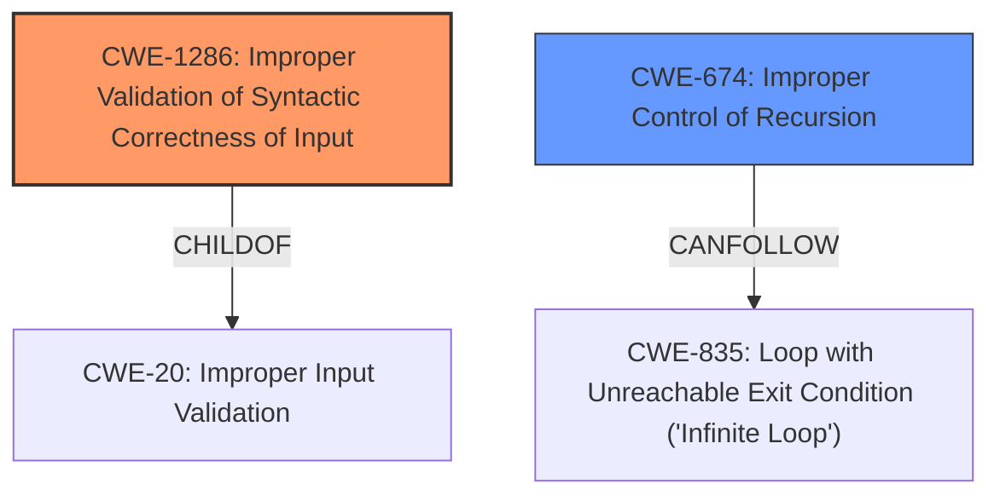

# Analysis Report for CVE-2022-23591

# Vulnerability Analysis Report: CVE-2022-23591

## Description

Tensorflow is an Open Source Machine Learning Framework. The `GraphDef` format in TensorFlow does not allow self recursive functions. The runtime assumes that this invariant is satisfied. However, a `GraphDef` containing a fragment such as the following can be consumed when loading a `SavedModel`. This would result in a stack overflow during execution as resolving each `NodeDef` means resolving the function itself and its nodes. The fix will be included in TensorFlow 2.8.0. We will also cherrypick this commit on TensorFlow 2.7.1, TensorFlow 2.6.3, and TensorFlow 2.5.3, as these are also affected and still in supported range.

## Vulnerability Description Key Phrases

**Weakness:** stack overflow
**Vector:** GraphDef containing a self recursive function
**Product:** Tensorflow
**Version:** 2.8.0 and prior versions

## Analysis (with Relationship Data)

# Summary
| CWE ID | CWE Name | Confidence | CWE Abstraction Level | CWE Vulnerability Mapping Label | CWE-Vulnerability Mapping Notes |
|---|---|---|---|---|---|
| CWE-674 | Improper Control of Recursion | 0.9 | Class | Primary | Allowed-with-Review |

## Evidence and Confidence

*   **Confidence Score:** 0.9
*   **Evidence Strength:** HIGH

- **Analysis and Justification:**  
  - *Explanation:* The vulnerability description clearly states that a `GraphDef` containing a self-recursive function can cause a **stack overflow** during execution in TensorFlow. This aligns directly with CWE-674 (Improper Control of Recursion), which describes a situation where a product does not properly control the amount of recursion, leading to excessive resource consumption. The CVE Reference Links Content Summary reinforces this by stating that the root cause is the lack of validation for self-recursive functions within the `GraphDef` format. CWE-674 is a Class-level CWE, and there might be Base-level children that are more appropriate. However, without more information about the specific mechanism of the recursion, CWE-674 is the most appropriate high-level classification.
  
  - *Relationship Analysis:* There are no direct relationships for CWE-674 in the provided data. However, stack overflows are a classic symptom of uncontrolled recursion.

- **Confidence Score:**  
  - *Example:* Confidence: 0.9 (High evidence from technical description and CVE reference materials)

---

## Criticism of Analysis

Okay, let's review the analysis for CWE mapping, focusing on the provided full CWE specifications.

**Overall Assessment:**

The initial assessment correctly identifies `CWE-674: Improper Control of Recursion` as the primary weakness. The justification is sound, linking the stack overflow directly to uncontrolled recursion. The confidence level of 0.9 is appropriate given the strong evidence in the vulnerability description and CVE summary.

However, the analysis could be improved by considering more specific, Base-level CWEs that reflect the *cause* of the uncontrolled recursion. The "Allowed-with-Review" guidance for CWE-674 explicitly suggests exploring more specific child CWEs.

**Detailed Critique:**

1.  **CWE-674: Improper Control of Recursion:**

    *   **Strengths:**
        *   The identification of CWE-674 is accurate at a high level.
        *   The justification clearly explains the link between self-recursive functions in `GraphDef` and stack overflow.
        *   The confidence score is justified.
    *   **Weaknesses:**
        *   It's a Class-level CWE. The mapping guidance advises looking for a more specific Base-level CWE.
        *   The analysis doesn't sufficiently explore *why* the recursion is uncontrolled.  Is it due to a lack of input validation, or a flawed algorithm?
    *   **Improvement Suggestions:**
        *   **Consider the *cause* of the uncontrolled recursion.**  Is it because the input (`GraphDef`) isn't validated to prevent self-recursive functions? If so, consider CWEs related to input validation.
        *   Explicitly mention the "Allowed-with-Review" mapping guidance and why a more specific CWE might be preferable *if* one can be identified.

2.  **Review of Retriever Results and Potentially More Specific CWEs:**

Let's examine the retriever results to see if they shed light on the *cause* of the uncontrolled recursion:

    *   **CWE-663: Use of a Non-reentrant Function in a Concurrent Context:** This is likely irrelevant.  The description doesn't suggest concurrency issues are involved.

    *   **CWE-824: Access of Uninitialized Pointer:**  Also likely irrelevant.  The description doesn't mention uninitialized pointers.

    *   **CWE-1284: Improper Validation of Specified Quantity in Input:** This is a *possibility*, although it doesn't directly fit. One could argue that the depth of recursion is a "quantity" and that the code isn't validating this quantity (i.e., limiting recursion depth). However, this is a stretch.

    *   **CWE-1287: Improper Validation of Specified Type of Input:** Again, not a great fit. The 'type' of data isn't the problem; it's the self-referential *structure* of the data.

    *   **CWE-787: Out-of-bounds Write:** This is a *consequence* of the stack overflow, not the *cause*. The stack overflow happens *before* memory is corrupted.

    *   **CWE-835: Loop with Unreachable Exit Condition ('Infinite Loop'):** This is related, but not the primary issue. The recursion is a *form* of loop, but the core problem is the *lack of control* over its depth due to a self-referential structure.

    *   **CWE-681: Incorrect Conversion between Numeric Types:** Irrelevant.

    *   **CWE-617: Reachable Assertion:** Irrelevant to the described root cause.

    *   **CWE-125: Out-of-bounds Read:** Same as CWE-787, a *consequence* of the stack overflow.

    *   **CWE-1286: Improper Validation of Syntactic Correctness of Input:** **This is the best alternative among the retriever results.** The `GraphDef` format has a defined syntax, and the vulnerability stems from the *improper validation* of that syntax. Specifically, the code doesn't validate that the `GraphDef` *doesn't* contain self-recursive function definitions.

3.  **Revised Recommendation:**

    *   **Primary CWE:** `CWE-1286: Improper Validation of Syntactic Correctness of Input` (Confidence: 0.8).
        *   **Justification:** The vulnerability arises because the TensorFlow runtime doesn't properly validate the syntactic correctness of the `GraphDef` input. It allows a `GraphDef` containing self-recursive functions, which violates the intended structure and leads to a stack overflow. The fix involves adding a check (`ValidateFunctionNotRecursive`) to enforce the syntactic constraint that functions cannot be self-recursive.
        *   **Notes:** This is a Base-level CWE, which is preferred. It directly addresses the *cause* of the problem: a lack of validation.

    *   **Secondary CWE (Consider):** `CWE-674: Improper Control of Recursion` (Confidence: 0.6).
        *   **Justification:** While not the root cause, it's the direct *manifestation* of the vulnerability.  The lack of validation leads to uncontrolled recursion and the resulting stack overflow.
        *   **Notes:** Use this as a secondary CWE to highlight the consequence.

**Revised Summary Table:**

| CWE ID  | CWE Name                                               | Confidence | CWE Abstraction Level | CWE Vulnerability Mapping Label | CWE-Vulnerability Mapping Notes                                                                                                                                      |
| :------ | :----------------------------------------------------- | :--------- | :---------------------- | :------------------------------ | :----------------------------------------------------------------------------------------------------------------------------------------------------------------- |
| CWE-1286 | Improper Validation of Syntactic Correctness of Input | 0.8        | Base                    | Primary                       | Best reflects the root cause: the lack of input validation on the GraphDef structure to prevent self-recursion.                                                      |
| CWE-674  | Improper Control of Recursion                          | 0.6        | Class                   | Secondary                     | Captures the direct consequence: uncontrolled recursion leading to a stack overflow. Use as a secondary CWE to emphasize the impact.                               |

**Final Notes:**

By focusing on the *cause* of the vulnerability (improper input validation), the analysis becomes more precise and actionable. CWE-1286 provides a clearer direction for mitigation efforts (e.g., stronger input validation routines). Remember that accurately identifying the root cause allows for the most effective remediation strategy. Using the CWE specifications to guide the analysis is essential for improving the accuracy and usefulness of the CWE mapping.

## Final Resolution

# Summary
| CWE ID   | CWE Name                                               | Confidence | CWE Abstraction Level | CWE Vulnerability Mapping Label | CWE-Vulnerability Mapping Notes                                                                                                                                      |
| :------- | :----------------------------------------------------- | :--------- | :---------------------- | :------------------------------ | :----------------------------------------------------------------------------------------------------------------------------------------------------------------- |
| CWE-1286 | Improper Validation of Syntactic Correctness of Input | 0.8        | Base                    | Primary                       | Best reflects the **root cause**: the lack of input validation on the GraphDef structure to prevent self-recursion.                                                      |
| CWE-674  | Improper Control of Recursion                          | 0.6        | Class                   | Secondary                     | Captures the direct consequence: uncontrolled recursion leading to a **stack overflow**. Use as a secondary CWE to emphasize the impact.                               |

## Evidence and Confidence

*   **Confidence Score:** 0.8
*   **Evidence Strength:** HIGH

## Relationship Analysis
The primary relationship that influenced the decision was the Parent-Child relationship between CWE-20 (Improper Input Validation) and CWE-1286 (Improper Validation of Syntactic Correctness of Input), and the observation that **stack overflow** can result from uncontrolled recursion. The decision favored the more specific CWE-1286 as it directly relates to the vulnerability's **root cause**: the lack of syntactic validation in the `GraphDef` format, which allows self-recursive functions. The relationship analysis also considered that CWE-674 (Improper Control of Recursion) is a class-level CWE, making CWE-1286 (a Base CWE) a more precise classification.

## Vulnerability Chain
The vulnerability chain starts with the **Improper Validation of Syntactic Correctness of Input (CWE-1286)**. Specifically, the `GraphDef` format is not validated to prevent self-recursive functions. This leads to **Improper Control of Recursion (CWE-674)**, where the amount of recursion is not properly managed. The consequence is a **stack overflow** during execution as the runtime attempts to resolve the self-recursive `NodeDef` instances. The lack of validation is the **root cause**, while the stack overflow is the impact.

## Summary of Analysis
The initial analysis correctly identified CWE-674 (Improper Control of Recursion) but at a higher level. The criticism pointed out the importance of identifying the **root cause** and suggested exploring more specific Base-level CWEs. The analysis of the retriever results identified CWE-1286 (Improper Validation of Syntactic Correctness of Input) as the most suitable primary CWE. This decision is based on the evidence that the vulnerability arises because the TensorFlow runtime doesn't properly validate the syntactic correctness of the `GraphDef` input, allowing self-recursive functions.

The vulnerability description states: "The `GraphDef` format in TensorFlow does not allow self recursive functions. The runtime assumes that this invariant is satisfied. However, a `GraphDef` containing a fragment such as the following can be consumed when loading a `SavedModel`. This would result in a stack overflow during execution".

This statement clearly indicates that the **root cause** is the lack of validation for self-recursive functions within the `GraphDef` format. Therefore, CWE-1286 is the optimal level of specificity because it directly addresses the lack of validation on the input syntax, which is the **root cause** of the vulnerability.

*Report generated on 2025-03-18 10:35:01*
