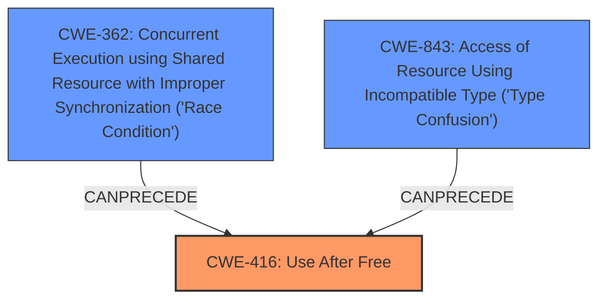

# Final Resolution for CVE-2022-2399

# Summary
| CWE ID | CWE Name | Confidence | CWE Abstraction Level | CWE Vulnerability Mapping Label | CWE-Vulnerability Mapping Notes |
|---|---|---|---|---|---|
| **CWE-416** | **Use After Free** | 1.0 | Variant | Primary | Allowed |

## Evidence and Confidence

*   **Confidence Score:** 1.0
*   **Evidence Strength:** HIGH

## Relationship Analysis
The primary relationship considered was that CWE-416 is a variant-level CWE, which is desirable for specificity. While other CWEs like CWE-362 (Race Condition) and CWE-843 (Type Confusion) were considered due to their potential to precede or contribute to memory corruption, the direct evidence pointed to **CWE-416** as the root cause. The "CanFollow" relationships for **CWE-416** were also considered, understanding the potential consequences of this **weakness**. No parent or child relationships influenced the decision because **CWE-416** was already at a suitable level of granularity.

## Vulnerability Chain
The vulnerability chain starts with the **ROOTCAUSE**: a **CWE-416 (Use After Free)** condition in WebGPU. This occurs when memory is freed but a pointer to that memory is still used. The consequence of this is heap corruption, potentially leading to arbitrary code execution.
- The initial flaw is the failure to properly manage memory, leading to a **use-after-free**.
- The consequence is heap corruption.
- An attacker exploits this **weakness** by crafting a malicious HTML page that triggers the **use-after-free** condition in WebGPU.

## Summary of Analysis
The initial analysis correctly identified **CWE-416 (Use After Free)** as the primary **weakness** based on the vulnerability description: "Use after free in WebGPU in Google Chrome prior to 100.0.4896.88 allowed a remote attacker to potentially exploit heap corruption via a crafted HTML page." The analysis is based on direct evidence from the vulnerability description and CVE summary, justifying the high confidence score. The criticism suggested considering other CWEs like CWE-843 and CWE-362, which was addressed by analyzing their relevance and determining that they were not the direct root cause in this specific scenario. The selection of **CWE-416** is at the optimal level of specificity because it directly describes the **ROOTCAUSE**.