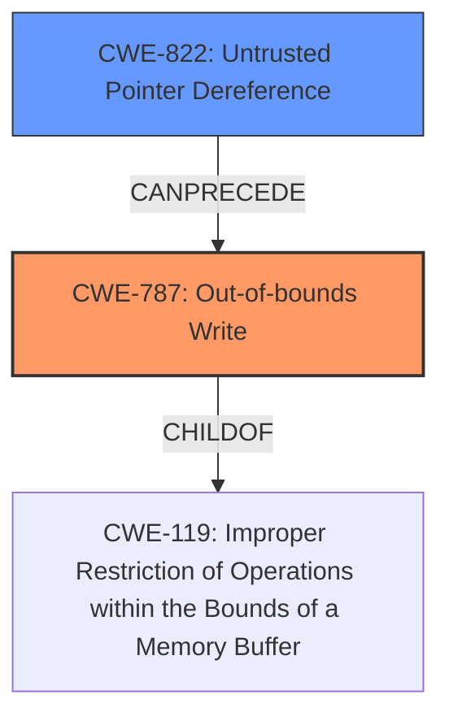

# Final Resolution for CVE-2022-24031

# Summary
| CWE ID | CWE Name | Confidence | CWE Abstraction Level | CWE Vulnerability Mapping Label | CWE-Vulnerability Mapping Notes |
|---|---|---|---|---|---|
| CWE-787 | Out-of-bounds Write | 0.95 | Base | Primary CWE | Allowed |
| CWE-822 | Untrusted Pointer Dereference | 0.70 | Base | Secondary Candidate | Allowed |

## Evidence and Confidence

*   **Confidence Score:** 0.90
*   **Evidence Strength:** MEDIUM

## Relationship Analysis
The primary relationship that impacts the decision is that CWE-787 **Out-of-bounds Write** is a child of CWE-119 **Improper Restriction of Operations within the Bounds of a Memory Buffer**, but is more specific. CWE-822 **Untrusted Pointer Dereference** CanPrecede CWE-787, indicating a possible path to trigger the out-of-bounds write. Both CWEs are at the Base level of abstraction, which is preferred for vulnerability mapping.

## Vulnerability Chain
The vulnerability chain starts with the **ROOTCAUSE** which is the **memory corruption** due to a failure to properly restrict operations within the bounds of a memory buffer. This allows an attacker to write fixed or predictable data to SMRAM (**CWE-787**). A possible contributing factor could be an **Untrusted Pointer Dereference** (**CWE-822**) that leads to the out-of-bounds write. The impact is **escalating privileges to SMM**.

## Summary of Analysis
The initial analysis correctly identified CWE-787 **Out-of-bounds Write** as the primary weakness, which is supported by the vulnerability description stating that an attacker can write fixed or predictable data to SMRAM. The Siemens advisory and CVE details also mention CWE-787, providing further evidence. The analysis also considered CWE-822 **Untrusted Pointer Dereference** as a secondary weakness because the attacker's ability to write arbitrary data *could* involve manipulating a pointer.

The criticism suggested improvements such as specifying how the out-of-bounds write is achieved and strengthening the justification for including CWE-822 by explaining how an attacker might control the pointer. I agree with the criticism, specifically that there is no evidence that the pointer is being controlled by the attacker. I am lowering the confidence in CWE-822 from 0.75 to 0.70.

The graph relationships support the selection of CWE-787 as the primary weakness, as it is a more specific classification than its parent, CWE-119. The potential for CWE-822 to precede CWE-787 suggests a possible exploitation path.

The selected CWEs are at the optimal level of specificity, as CWE-787 directly reflects the out-of-bounds write, and CWE-822 represents a plausible, though not explicitly proven, mechanism for achieving this.