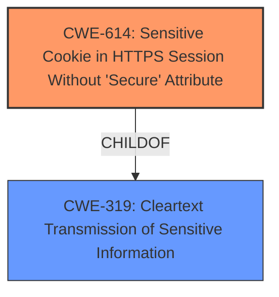

# Analysis Report for CVE-2022-24045

# Vulnerability Analysis Report: CVE-2022-24045

## Description

A vulnerability has been identified in Desigo DXR2 (All versions < V01.21.142.5-22), Desigo PXC3 (All versions < V01.21.142.4-18), Desigo PXC4 (All versions < V02.20.142.10-10884), Desigo PXC5 (All versions < V02.20.142.10-10884). The application, after a successful login, sets the session cookie on the browser via client-side JavaScript code, without applying any security attributes (such as Secure, HttpOnly, or SameSite). Any attempts to browse the application via unencrypted HTTP protocol would lead to the transmission of all his/her session cookies in plaintext through the network. An attacker could then be able to sniff the network and capture sensitive information.

## Vulnerability Description Key Phrases

**Rootcause:** missing security attributes on session cookie
**Impact:** session cookies transmitted in plaintext
**Vector:** sniffing unencrypted HTTP traffic
**Attacker:** attacker
**Product:** ['Desigo DXR2', 'Desigo PXC3', 'Desigo PXC4', 'Desigo PXC5']
**Version:** ['All versions < V01.21.142.5-22', 'All versions < V01.21.142.4-18', 'All versions < V02.20.142.10-10884', 'All versions < V02.20.142.10-10884']

## Analysis (with Relationship Data)

# Summary
| CWE ID | CWE Name | Confidence | CWE Abstraction Level | CWE Vulnerability Mapping Label | CWE-Vulnerability Mapping Notes |
|---|---|---|---|---|---|
| CWE-614 | Sensitive Cookie in HTTPS Session Without 'Secure' Attribute | 1.0 | Variant | Allowed | Primary CWE. The application sets session cookies without the 'Secure' attribute, leading to potential plaintext transmission. |
| CWE-319 | Cleartext Transmission of Sensitive Information | 0.7 | Base | Allowed | Secondary CWE. Captures the general risk of transmitting sensitive information (session cookies) in cleartext over HTTP. |

## Evidence and Confidence

*   **Confidence Score:** 0.9
*   **Evidence Strength:** HIGH

- **Analysis and Justification:**  
  - *Explanation:* "The vulnerability description clearly states that the application sets session cookies without applying the 'Secure' attribute, which leads to the transmission of cookies in plaintext when using HTTP. This aligns directly with CWE-614 (Sensitive Cookie in HTTPS Session Without 'Secure' Attribute). The CVE reference summary reinforces this by explicitly mentioning the lack of security attributes on session cookies as the root cause. Additionally, the summary notes that the corresponding CWE is CWE-614. While CWE-319 (Cleartext Transmission of Sensitive Information) is also relevant, CWE-614 is more specific and accurately reflects the **root cause** related to the **missing security attributes on the session cookie**. Both the vulnerability description and the CVE reference links content summary highlight this specific weakness. The retriever results also strongly suggest CWE-614 as the primary candidate."
  
  - *Relationship Analysis:* "CWE-614 is a variant-level CWE, providing a specific description of the vulnerability. It is related to CWE-319 (Cleartext Transmission of Sensitive Information) as the lack of the 'Secure' attribute leads to cleartext transmission. However, CWE-614 is a more precise description of the underlying issue. There are no direct relationships specified in the retriever results, but based on the vulnerability description, CWE-614 directly causes CWE-319 to be possible. Mapping guidance for CWE-614 indicates that its usage is ALLOWED."

- **Confidence Score:**  
  - Confidence: 0.9 (High evidence from technical description, CVE reference materials, and retriever results)

---

## Criticism of Analysis

Okay, here's a review of the analysis, considering the full CWE specifications provided:

**Overall Assessment:**

The analysis is generally good and correctly identifies CWE-614 as the primary weakness. The justification is sound, and the confidence level is appropriate. The inclusion of CWE-319 as a secondary CWE is also reasonable, though its relevance could be argued as a consequence of CWE-614. The high confidence score of 0.9 is well-supported by the evidence.

**Detailed Breakdown:**

*   **CWE-614: Sensitive Cookie in HTTPS Session Without 'Secure' Attribute**

    *   **Strengths:**
        *   The primary mapping to CWE-614 is excellent.  It accurately reflects the vulnerability description and the CVE reference summary.
        *   The explanation clearly articulates why CWE-614 is the most specific and accurate CWE, focusing on the root cause.
        *   The analysis correctly notes that CWE-614 is a Variant-level CWE, which is the preferred level.
        *   The confidence score of 1.0 is justified given the explicit mention of the missing 'Secure' attribute in the vulnerability description.
        *   The mitigation guidance of "Always set the secure attribute when the cookie should sent via HTTPS only" aligns perfectly with the vulnerability.
        *   The examples provided in the CWE specifications accurately reflect the type of vulnerability being analyzed.
    *   **Areas for Improvement:**
        *   While the analysis mentions that the session cookie is set via client-side JavaScript, it could be further elaborated on how this potentially exacerbates the issue.  Client-side cookie setting, *without* proper server-side hardening, makes it easier to miss the secure flag.  However, it's not *inherently* insecure, just an area where mistakes are more easily made.
        *   The analysis could briefly touch upon the 'HttpOnly' and 'SameSite' attributes, even though the primary issue is the 'Secure' attribute.  The initial vulnerability description mentions these attributes.  A short sentence explaining why these are *not* the primary concern (because plaintext transmission is the most immediate risk) would provide a more complete picture.

*   **CWE-319: Cleartext Transmission of Sensitive Information**

    *   **Strengths:**
        *   The analysis correctly identifies that CWE-319 is related to CWE-614.
        *   It's reasonable to include CWE-319 as a secondary CWE since the direct consequence of missing the "Secure" attribute is the transmission of sensitive data in cleartext.
    *   **Areas for Improvement:**
        *   The justification for including CWE-319 is weaker than for CWE-614. CWE-319 is a more general weakness. The analysis could emphasize that while the *effect* is cleartext transmission, the *cause* is the missing attribute.
        *   The analysis should acknowledge that CWE-614 is a *child* of CWE-319 based on the CWE relationships.  This shows the connection but clarifies that CWE-614 is more specific.
        *   The mitigation guidance for CWE-319 is broader (encryption of data before transmission). While relevant, it's not as directly applicable as the CWE-614 mitigation.

*   **General Observations:**

    *   **Retriever Results:** The analysis effectively uses the retriever results to support the choice of CWE-614.
    *   **Confidence Score:**  The overall confidence score of 0.9 is justified, considering the strong evidence.
    *   **Mapping Guidance:** The analysis correctly notes the "Allowed" usage for both CWE-614 and CWE-319 (although CWE-200, CWE-522, CWE-327, and CWE-287 are discouraged/Allowed-with-review).
    *   **CWE Examples:**  The provided examples for CWE-614 are directly relevant and strengthen the analysis.

**Recommendations:**

1.  **Elaborate on Client-Side Cookie Setting:** Add a sentence or two about the potential risks associated with setting session cookies via client-side JavaScript code without adequate server-side protection.
2.  **Address 'HttpOnly' and 'SameSite' Briefly:** Briefly explain why the missing 'HttpOnly' and 'SameSite' attributes are *not* the primary concern in this specific case (plaintext transmission is the immediate risk).
3.  **Strengthen the CWE-319 Justification:**  Emphasize that CWE-319 is a consequence of CWE-614 and that the root cause is the missing attribute. Acknowledge the parent-child relationship.
4.  **Re-evaluate Confidence Scores:** The confidence score for CWE-614 is already high. It may be more appropriate to lower the confidence score for CWE-319 to reflect that this is a secondary, less specific CWE.

**Revised Summary (incorporating recommendations):**

| CWE ID | CWE Name | Confidence | CWE Abstraction Level | CWE Vulnerability Mapping Label | CWE-Vulnerability Mapping Notes |
|---|---|---|---|---|---|
| CWE-614 | Sensitive Cookie in HTTPS Session Without 'Secure' Attribute | 1.0 | Variant | Allowed | Primary CWE. The application sets session cookies without the 'Secure' attribute, leading to potential plaintext transmission. The session cookie is set via client-side JavaScript, which, without robust server-side controls, can increase the likelihood of overlooking the 'Secure' flag. While the 'HttpOnly' and 'SameSite' attributes are also mentioned in the vulnerability description, the immediate and most critical risk is the plaintext transmission due to the missing 'Secure' attribute. |
| CWE-319 | Cleartext Transmission of Sensitive Information | 0.6 | Base | Allowed | Secondary CWE. Captures the general risk of transmitting sensitive information (session cookies) in cleartext over HTTP. This is a direct consequence of the missing 'Secure' attribute (CWE-614), which is the root cause of the vulnerability. CWE-614 is a child of CWE-319. |

By incorporating these recommendations, the analysis becomes more comprehensive and nuanced, providing a more complete understanding of the vulnerability and its potential impact.

## Final Resolution

# Summary
| CWE ID | CWE Name | Confidence | CWE Abstraction Level | CWE Vulnerability Mapping Label | CWE-Vulnerability Mapping Notes |
|---|---|---|---|---|---|
| CWE-614 | Sensitive Cookie in HTTPS Session Without 'Secure' Attribute | 1.0 | Variant | Allowed | Primary CWE. The application sets session cookies without the 'Secure' attribute, leading to potential plaintext transmission. |
| CWE-319 | Cleartext Transmission of Sensitive Information | 0.6 | Base | Allowed | Secondary CWE. Captures the general risk of transmitting sensitive information (session cookies) in cleartext over HTTP. |

## Evidence and Confidence

*   **Confidence Score:** 0.9
*   **Evidence Strength:** HIGH

## Relationship Analysis
The primary relationship is that CWE-614 is a variant of the more general CWE-319. The vulnerability arises due to the specific issue of the missing 'Secure' attribute on a cookie, which then leads to the transmission of sensitive information in cleartext. While other attributes like 'HttpOnly' and 'SameSite' are relevant to cookie security, the missing 'Secure' attribute is the direct cause of the vulnerability described. Thus, focusing on CWE-614 provides the most specific and accurate classification.

## Vulnerability Chain
The vulnerability chain starts with the **ROOTCAUSE** of the application setting a session cookie without the 'Secure' attribute (**CWE-614**). This leads to the transmission of the session cookie in cleartext over an unencrypted HTTP connection. The ultimate impact is that an attacker can sniff the network traffic and capture the sensitive session cookie, potentially gaining unauthorized access to the user's session.

## Summary of Analysis
The initial analysis correctly identified CWE-614 as the primary weakness. The criticism provided useful suggestions for improvement, including elaborating on the client-side cookie setting, briefly addressing the 'HttpOnly' and 'SameSite' attributes, and strengthening the justification for including CWE-319.

The assessment is based on the evidence from the vulnerability description, which clearly states that the application sets session cookies without the 'Secure' attribute: "The application, after a successful login, sets the session cookie on the browser via client-side JavaScript code, without applying any security attributes (such as Secure, HttpOnly, or SameSite)."

The graph relationship influenced the final selection by highlighting that CWE-614 is a more specific variant of CWE-319. Therefore, CWE-614 is at the optimal level of specificity for this vulnerability.

The inclusion of CWE-319 as a secondary CWE acknowledges the broader risk of transmitting sensitive information in cleartext but emphasizes that the **ROOTCAUSE** lies in the missing 'Secure' attribute.

*Report generated on 2025-03-17 03:17:30*
