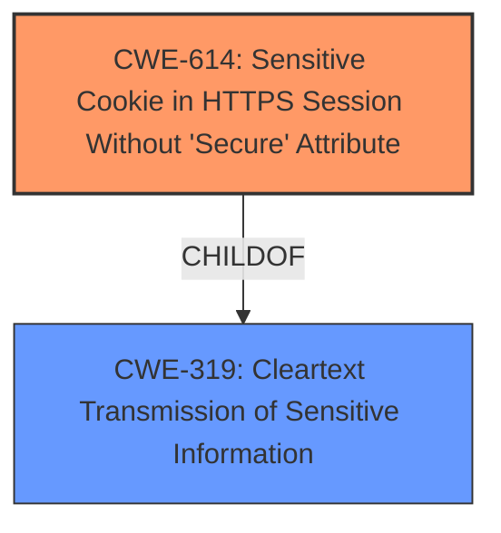

# Final Resolution for CVE-2022-24045

# Summary
| CWE ID | CWE Name | Confidence | CWE Abstraction Level | CWE Vulnerability Mapping Label | CWE-Vulnerability Mapping Notes |
|---|---|---|---|---|---|
| CWE-614 | Sensitive Cookie in HTTPS Session Without 'Secure' Attribute | 1.0 | Variant | Allowed | Primary CWE. The application sets session cookies without the 'Secure' attribute, leading to potential plaintext transmission. |
| CWE-319 | Cleartext Transmission of Sensitive Information | 0.6 | Base | Allowed | Secondary CWE. Captures the general risk of transmitting sensitive information (session cookies) in cleartext over HTTP. |

## Evidence and Confidence

*   **Confidence Score:** 0.9
*   **Evidence Strength:** HIGH

## Relationship Analysis
The primary relationship is that CWE-614 is a variant of the more general CWE-319. The vulnerability arises due to the specific issue of the missing 'Secure' attribute on a cookie, which then leads to the transmission of sensitive information in cleartext. While other attributes like 'HttpOnly' and 'SameSite' are relevant to cookie security, the missing 'Secure' attribute is the direct cause of the vulnerability described. Thus, focusing on CWE-614 provides the most specific and accurate classification.

## Vulnerability Chain
The vulnerability chain starts with the **ROOTCAUSE** of the application setting a session cookie without the 'Secure' attribute (**CWE-614**). This leads to the transmission of the session cookie in cleartext over an unencrypted HTTP connection. The ultimate impact is that an attacker can sniff the network traffic and capture the sensitive session cookie, potentially gaining unauthorized access to the user's session.

## Summary of Analysis
The initial analysis correctly identified CWE-614 as the primary weakness. The criticism provided useful suggestions for improvement, including elaborating on the client-side cookie setting, briefly addressing the 'HttpOnly' and 'SameSite' attributes, and strengthening the justification for including CWE-319.

The assessment is based on the evidence from the vulnerability description, which clearly states that the application sets session cookies without the 'Secure' attribute: "The application, after a successful login, sets the session cookie on the browser via client-side JavaScript code, without applying any security attributes (such as Secure, HttpOnly, or SameSite)."

The graph relationship influenced the final selection by highlighting that CWE-614 is a more specific variant of CWE-319. Therefore, CWE-614 is at the optimal level of specificity for this vulnerability.

The inclusion of CWE-319 as a secondary CWE acknowledges the broader risk of transmitting sensitive information in cleartext but emphasizes that the **ROOTCAUSE** lies in the missing 'Secure' attribute.