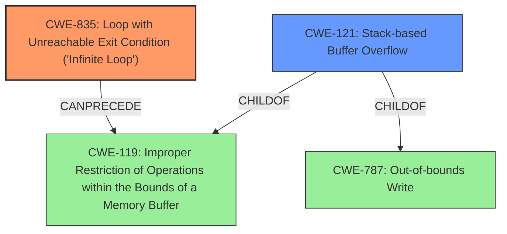

# Final Resolution for CVE-2022-24191

# Summary
| CWE ID | CWE Name | Confidence | CWE Abstraction Level | CWE Vulnerability Mapping Label | CWE-Vulnerability Mapping Notes |
|---|---|---|---|---|---|
| CWE-835 | Loop with Unreachable Exit Condition ('**Infinite Loop**') | 0.95 | Base | Allowed | Primary CWE. The vulnerability is caused by an **infinite loop** in the `gif_read_lzw` function. |
| CWE-121 | Stack-based Buffer Overflow | 0.85 | Variant | Allowed | Secondary CWE. The **infinite loop** leads to continuous incrementing of the `sp` variable, causing a stack buffer overflow. |

## Evidence and Confidence

*   **Confidence Score:** 0.93
*   **Evidence Strength:** HIGH

## Relationship Analysis
The analysis is primarily influenced by the parent-child relationship between CWE-119 (Improper Restriction of Operations within the Bounds of a Memory Buffer) and CWE-121 (Stack-based Buffer Overflow), as well as the chain relationship where CWE-835 (Loop with Unreachable Exit Condition ('**Infinite Loop**')) CanPrecede CWE-119. The base abstraction level of CWE-835 is appropriate for the root cause, while the variant level of CWE-121 describes the specific type of buffer overflow.

## Vulnerability Chain
The vulnerability chain starts with the **infinite loop** (CWE-835) in the `gif_read_lzw` function. This leads to uncontrolled incrementing of the stack pointer (`sp`), resulting in a stack-based buffer overflow (CWE-121). The root cause is the missing exit condition in the loop, and the impact is writing beyond the allocated stack memory.

## Summary of Analysis
The initial analysis and the criticism both agree on the primary and secondary CWE assignments, solidifying the confidence in the assessment. The explicit mention of the **infinite loop** in the vulnerability description directly maps to CWE-835. The resulting stack-based buffer overflow, caused by the uncontrolled increment of the stack pointer, directly maps to CWE-121. The relationship analysis further supports this by showing how CWE-835 can precede CWE-119 and how CWE-121 is a variant of CWE-119 (and CWE-787). The choice of CWEs is at the optimal level of specificity, with CWE-835 being a base CWE representing the root cause and CWE-121 being a variant CWE describing the specific type of buffer overflow. The analysis also incorporates the suggestion to clarify the initial report of a heap-based overflow, stating that the `sp` points to stack memory instead. The evidence provided is strong, justifying the high confidence score.