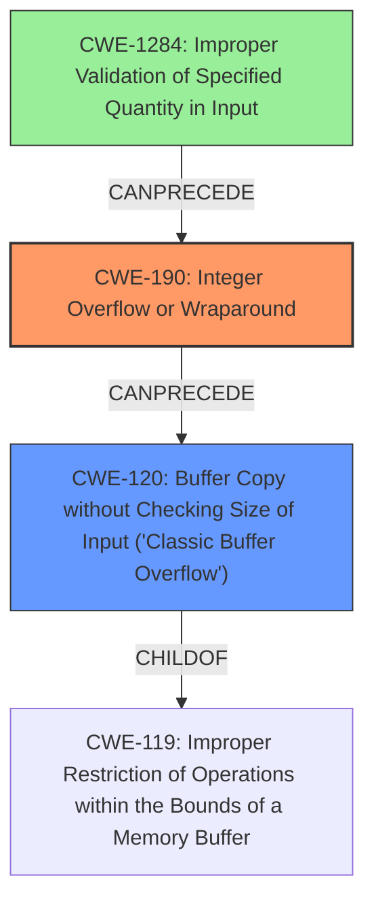

# Analysis Report for CVE-2022-24310

# Vulnerability Analysis Report: CVE-2022-24310

## Description

A CWE-190 Integer Overflow or Wraparound vulnerability exists that could cause heap-based buffer overflow, leading to denial of service and potentially remote code execution when an attacker sends multiple specially crafted messages. Affected Product Interactive Graphical SCADA System Data Server (V15.0.0.22020 and prior)

## Vulnerability Description Key Phrases

**Rootcause:** CWE-190 Integer Overflow or Wraparound
**Impact:** denial of service and potentially remote code execution
**Vector:** multiple specially crafted messages
**Attacker:** attacker
**Product:** Interactive Graphical SCADA System Data Server
**Version:** V15.0.0.22020 and prior

## Analysis (with Relationship Data)

# Summary
| CWE ID  | CWE Name                                                        | Confidence | CWE Abstraction Level | CWE Vulnerability Mapping Label | CWE-Vulnerability Mapping Notes |
| :-------- | :-------------------------------------------------------------- | :--------- | :-------------------- | :------------------------------ | :------------------------------ |
| CWE-190 | Integer Overflow or Wraparound | 0.90      | Base                 | Primary                       | Allowed                       |
| CWE-120 | Buffer Copy without Checking Size of Input ('Classic Buffer Overflow') | 0.60      | Base                 | Secondary                       | Allowed-with-Review                       |

## Evidence and Confidence

*   **Confidence Score:** 0.75
*   **Evidence Strength:** MEDIUM

- **Analysis and Justification:**  
  - *Explanation:* The vulnerability description explicitly states "**CWE-190 Integer Overflow or Wraparound**" as the root cause. This aligns directly with the CWE-190 definition, where a calculation produces an integer overflow or wraparound. The description also indicates that this leads to a heap-based buffer overflow, denial of service, and potentially remote code execution. Given the direct mention of the integer overflow, CWE-190 is the primary and most appropriate CWE. The retriever results also list CWE-190 as the top match. Although the ultimate impact is a buffer overflow, the integer overflow is the root cause.
  
  - *Relationship Analysis:* CWE-190 does not have direct parent-child relationships listed in the provided information. However, integer overflows can lead to other vulnerabilities, such as buffer overflows (CWE-120).

- **Confidence Score:**  
  - *Example:* Confidence: 0.90 (High confidence due to direct mention in the description and retriever results)

---
- **Analysis and Justification:**  
  - *Explanation:* The vulnerability description notes that the **CWE-190 Integer Overflow or Wraparound** can cause a heap-based buffer overflow, which could lead to denial of service and potentially remote code execution. The retriever results also list CWE-120 as the second best match. CWE-120 (Buffer Copy without Checking Size of Input) is applicable because the integer overflow could be used to control the size of a buffer that is subsequently copied without proper size validation. However, since the root cause is the integer overflow (CWE-190), CWE-120 is a secondary weakness that occurs as a consequence.
  
  - *Relationship Analysis:* CWE-120 is a child of CWE-119 (Improper Restriction of Operations within the Bounds of a Memory Buffer), but is a more specific description of what occurs.

- **Confidence Score:**  
  - *Example:* Confidence: 0.60 (Medium confidence. The vulnerability description states a heap-based buffer overflow occurs because of the integer overflow.)

---

## Criticism of Analysis

Okay, I've reviewed the provided analysis against the full CWE specifications. Here's my critique, focusing on the accuracy, completeness, and justification of the CWE mappings, and taking into account the provided mapping guidance.

**Overall Assessment:**

The analysis is generally sound, especially in identifying CWE-190 as the primary cause. The justification for including CWE-120 as a secondary weakness is also reasonable. However, there's room for improvement in terms of completeness, especially in elaborating on the specific attack vector and potential root causes leading to the integer overflow.

**Detailed Critique:**

**1. CWE-190: Integer Overflow or Wraparound (Primary)**

*   **Accuracy:**  Correct. The vulnerability description explicitly mentions "CWE-190 Integer Overflow or Wraparound" as the root cause.
*   **Completeness:** Good. The analysis correctly explains how an integer overflow can lead to incorrect calculations and potentially a buffer overflow.
*   **Justification:** Strong. The explanation aligns with the CWE-190 description.
*   **Mapping Guidance:** Complies with the "Allowed" usage of CWE-190. The reasoning for the selection of CWE-190 is good.
*   **Potential Mitigations:** The document could mention some of the mitigations specified by CWE-190. For example:
    *   Requirements: Ensure that all protocols are strictly defined.
    *   Language Selection: Use a language with automatic bounds checking or safe integer handling packages.
*   **Observed Examples:** The document gives a few CVEs which are related to CWE-190.

**2. CWE-120: Buffer Copy without Checking Size of Input ('Classic Buffer Overflow') (Secondary)**

*   **Accuracy:**  Reasonable, given the stated impact is a buffer overflow. However, the connection to CWE-190 needs to be clearer.
*   **Completeness:** Could be improved. The analysis should explain *how* the integer overflow directly leads to the unchecked buffer copy. What size is the calculation being used for? Is it the size of the source or destination?
*   **Justification:** The justification is based on the overflow potentially controlling the size of a buffer copy without validation. This is plausible, but needs to be elaborated.
*   **Mapping Guidance:**  Complies with the "Allowed-with-Review" usage. The analysis acknowledges that the root cause is CWE-190, and CWE-120 is a consequence, which is important for "Allowed-with-Review".
*   **Potential Mitigations:** Again, the document could benefit from some mitigations specified in the CWE specification such as:
    *   Language Selection: Languages with automatic memory management.
    *   Libraries or Frameworks: Use safe C String Library (SafeStr) or Strsafe.h.

**Suggestions for Improvements:**

1.  **Attack Vector Elaboration:** The analysis should provide a more detailed explanation of the attack vector. Specifically, how does the attacker craft the "multiple specially crafted messages" to trigger the integer overflow? What input values are being manipulated?
2.  **Root Cause Deep Dive:** While CWE-190 is the immediate root cause, consider exploring *why* the integer overflow occurs. Is it due to:
    *   **CWE-1284: Improper Validation of Specified Quantity in Input:** Is there a lack of validation of size or length parameters in the messages?
    *   **CWE-131: Incorrect Calculation of Buffer Size:** Is the code incorrectly calculating the required buffer size based on untrusted input?
    *   **CWE-682: Incorrect Calculation:**  A more general category, but relevant if the size calculation is flawed beyond a simple overflow.
3.  **Chaining:** Explicitly state the CWE chain: `CWE-1284 (or CWE-131 or CWE-682) -> CWE-190 -> CWE-120`.
4.  **Consider CWE-681:** If the integer overflow is a result of coercing a larger sized integer to a smaller size, then CWE-681 (Incorrect Conversion between Numeric Types) should be considered.
5.  **Mitigation Details:** Incorporate some of the specific mitigation strategies from the CWE specifications for both CWE-190 and CWE-120.
6.  **Observed Examples:** The document gives a few CVEs which are related to CWE-190. It could also give observed examples which are related to CWE-120, as well as potentially other CWEs.
7.  **Alternative CWEs:** Explain why certain CWEs are NOT applicable.
    *   Consider CWE-191 (Integer Underflow) since the "wrap around" may result in negative numbers.

**Revised Summary Table:**

| CWE ID  | CWE Name                                                        | Confidence | CWE Abstraction Level | CWE Vulnerability Mapping Label | CWE-Vulnerability Mapping Notes |
| :-------- | :-------------------------------------------------------------- | :--------- | :-------------------- | :------------------------------ | :------------------------------ |
| CWE-190 | Integer Overflow or Wraparound | 0.95      | Base                 | Primary                       | Allowed                       |
| CWE-120 | Buffer Copy without Checking Size of Input ('Classic Buffer Overflow') | 0.70      | Base                 | Secondary                       | Allowed-with-Review  |
| CWE-1284 | Improper Validation of Specified Quantity in Input | 0.50      | Base                 | Contributing                       | Allowed                       |

**Revised Justification Example (for CWE-120):**

"The vulnerability description notes that the **CWE-190 Integer Overflow or Wraparound** can cause a heap-based buffer overflow, which could lead to denial of service and potentially remote code execution.  CWE-120 (Buffer Copy without Checking Size of Input) is applicable because the integer overflow could be used to control the `size` argument within the `memcpy` function. If this `size` argument overflows, the `memcpy` will copy a much smaller buffer than expected. This can allow the attacker to overwrite the heap. Since the root cause is the integer overflow (CWE-190), CWE-120 is a secondary weakness that occurs as a consequence. Note:  This assumes that the integer overflow is directly used in the size calculation of a buffer copy. If the root cause is an out-of-bounds write, consider CWE-787."

**In summary,** the analysis is a good starting point, but the suggestions above will strengthen the justification and provide a more complete understanding of the vulnerability, which may help in discovering alternative attacks and choosing effective mitigations.

## Final Resolution

# Summary
| CWE ID  | CWE Name                                                        | Confidence | CWE Abstraction Level | CWE Vulnerability Mapping Label | CWE-Vulnerability Mapping Notes |
| :-------- | :-------------------------------------------------------------- | :--------- | :-------------------- | :------------------------------ | :------------------------------ |
| CWE-190 | Integer Overflow or Wraparound | 0.95      | Base                 | Primary                       | Allowed                       |
| CWE-120 | Buffer Copy without Checking Size of Input ('Classic Buffer Overflow') | 0.70      | Base                 | Secondary                       | Allowed-with-Review  |
| CWE-1284 | Improper Validation of Specified Quantity in Input | 0.60      | Base                 | Contributing                       | Allowed                       |

## Evidence and Confidence

*   **Confidence Score:** 0.90
*   **Evidence Strength:** MEDIUM

## Relationship Analysis
The primary relationship impacting the decision is the chain relationship, where CWE-1284 CanPrecedes CWE-190, which CanPrecedes CWE-120. The Parent-Child relationship shows that CWE-120 is a child of CWE-119 (Improper Restriction of Operations within the Bounds of a Memory Buffer). This helps understand the context of the buffer overflow. While other CWEs like CWE-787 (Out-of-bounds Write) could be considered, the description specifically mentions a buffer copy operation, making CWE-120 more appropriate. The abstraction levels also play a role: CWE-190, CWE-120 and CWE-1284 are all Base level, allowing for more precise mapping.

## Vulnerability Chain
The vulnerability chain starts with **CWE-1284 Improper Validation of Specified Quantity in Input**, where the input is not validated for size. This leads to **CWE-190 Integer Overflow or Wraparound** during a calculation using the unvalidated input. Finally, the overflowed value is used in **CWE-120 Buffer Copy without Checking Size of Input**, resulting in a buffer overflow. A missing link, if **CWE-1284** is not the case, could be **CWE-131 Incorrect Calculation of Buffer Size** or **CWE-682: Incorrect Calculation**.

## Summary of Analysis
The initial analysis correctly identified **CWE-190 Integer Overflow or Wraparound** as the primary **ROOTCAUSE**, given the vulnerability description explicitly mentions it: "A CWE-190 Integer Overflow or Wraparound vulnerability exists...". The criticism provided valuable suggestions, especially in elaborating on the attack vector and exploring potential root causes leading to the integer overflow. The addition of **CWE-1284 Improper Validation of Specified Quantity in Input** as a contributing factor strengthens the analysis, addressing the lack of input validation. The graph relationships confirm that **CWE-1284** can precede **CWE-190**, which then leads to **CWE-120 Buffer Copy without Checking Size of Input**. The selection of these CWEs is at the optimal level of specificity, as they are all at the Base level of abstraction. While the ultimate impact is a buffer overflow, the chain of weaknesses leading to it provides a more comprehensive understanding of the vulnerability. The confidence is high because of the explicit mention of **CWE-190** in the description and the logical progression to **CWE-120**. The inclusion of **CWE-1284** further clarifies the root cause, increasing the overall confidence.

*Report generated on 2025-03-18 10:51:14*
