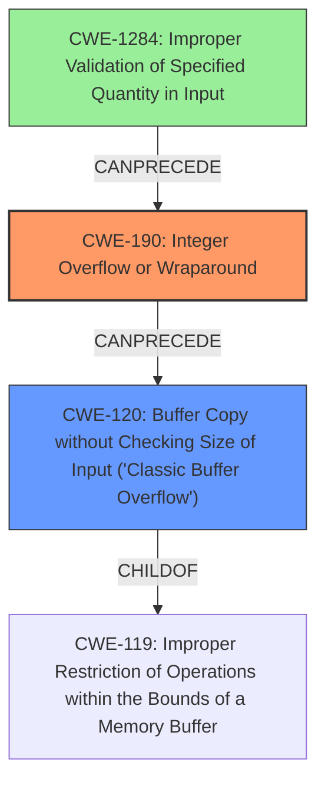

# Final Resolution for CVE-2022-24310

# Summary
| CWE ID  | CWE Name                                                        | Confidence | CWE Abstraction Level | CWE Vulnerability Mapping Label | CWE-Vulnerability Mapping Notes |
| :-------- | :-------------------------------------------------------------- | :--------- | :-------------------- | :------------------------------ | :------------------------------ |
| CWE-190 | Integer Overflow or Wraparound | 0.95      | Base                 | Primary                       | Allowed                       |
| CWE-120 | Buffer Copy without Checking Size of Input ('Classic Buffer Overflow') | 0.70      | Base                 | Secondary                       | Allowed-with-Review  |
| CWE-1284 | Improper Validation of Specified Quantity in Input | 0.60      | Base                 | Contributing                       | Allowed                       |

## Evidence and Confidence

*   **Confidence Score:** 0.90
*   **Evidence Strength:** MEDIUM

## Relationship Analysis
The primary relationship impacting the decision is the chain relationship, where CWE-1284 CanPrecedes CWE-190, which CanPrecedes CWE-120. The Parent-Child relationship shows that CWE-120 is a child of CWE-119 (Improper Restriction of Operations within the Bounds of a Memory Buffer). This helps understand the context of the buffer overflow. While other CWEs like CWE-787 (Out-of-bounds Write) could be considered, the description specifically mentions a buffer copy operation, making CWE-120 more appropriate. The abstraction levels also play a role: CWE-190, CWE-120 and CWE-1284 are all Base level, allowing for more precise mapping.

## Vulnerability Chain
The vulnerability chain starts with **CWE-1284 Improper Validation of Specified Quantity in Input**, where the input is not validated for size. This leads to **CWE-190 Integer Overflow or Wraparound** during a calculation using the unvalidated input. Finally, the overflowed value is used in **CWE-120 Buffer Copy without Checking Size of Input**, resulting in a buffer overflow. A missing link, if **CWE-1284** is not the case, could be **CWE-131 Incorrect Calculation of Buffer Size** or **CWE-682: Incorrect Calculation**.

## Summary of Analysis
The initial analysis correctly identified **CWE-190 Integer Overflow or Wraparound** as the primary **ROOTCAUSE**, given the vulnerability description explicitly mentions it: "A CWE-190 Integer Overflow or Wraparound vulnerability exists...". The criticism provided valuable suggestions, especially in elaborating on the attack vector and exploring potential root causes leading to the integer overflow. The addition of **CWE-1284 Improper Validation of Specified Quantity in Input** as a contributing factor strengthens the analysis, addressing the lack of input validation. The graph relationships confirm that **CWE-1284** can precede **CWE-190**, which then leads to **CWE-120 Buffer Copy without Checking Size of Input**. The selection of these CWEs is at the optimal level of specificity, as they are all at the Base level of abstraction. While the ultimate impact is a buffer overflow, the chain of weaknesses leading to it provides a more comprehensive understanding of the vulnerability. The confidence is high because of the explicit mention of **CWE-190** in the description and the logical progression to **CWE-120**. The inclusion of **CWE-1284** further clarifies the root cause, increasing the overall confidence.