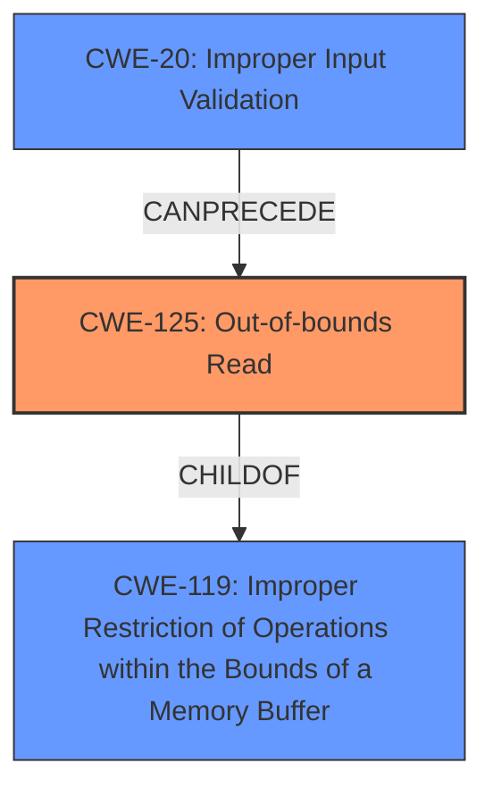

# Final Resolution for CVE-2022-24314

# Summary
| CWE ID | CWE Name | Confidence | CWE Abstraction Level | CWE Vulnerability Mapping Label | CWE-Vulnerability Mapping Notes |
|---|---|---|---|---|---|
| CWE-125 | Out-of-bounds Read | 1.0 | Base | Allowed | Primary CWE: The vulnerability description explicitly states "**CWE-125 Out-of-bounds Read**" as the root cause. |
| CWE-20 | Improper Input Validation | 0.3 | Class | Contributing Factor | Secondary Candidate: There may be a lack of sufficient input validation performed on the "specially crafted message", which allows the **OOB** read to occur. This would need more confirmation. |

## Evidence and Confidence

*   **Confidence Score:** 0.9
*   **Evidence Strength:** MEDIUM

## Relationship Analysis
The primary relationship is that **CWE-125 (Out-of-bounds Read)** is a child of **CWE-119 (Improper Restriction of Operations within the Bounds of a Memory Buffer)**. However, **CWE-125** is more specific and directly reflects the vulnerability as described. **CWE-20 (Improper Input Validation)** is considered as a potential preceding weakness, as a lack of input validation could lead to the **out-of-bounds read**. The abstraction levels influenced the decision by favoring the Base level **CWE-125** over the Class level **CWE-119** and considering the Class level **CWE-20** only as a secondary factor due to lower confidence.

## Vulnerability Chain
The vulnerability chain starts with a "specially crafted message" being sent to the affected product.

1.  Potential **Improper Input Validation (CWE-20)**: The system might fail to adequately validate the crafted message.
2.  **Out-of-bounds Read (CWE-125)**: Due to the lack of proper validation or other error (e.g., off-by-one, improper length handling), the system reads data past the end or before the beginning of the intended buffer.
3.  Impact: Memory leaks occur, potentially leading to denial of service.

The missing link is confirmation of the **CWE-20** aspect. Without further information, it remains a possible contributing factor.

## Summary of Analysis
The initial analysis correctly identified **CWE-125 (Out-of-bounds Read)** as the primary **WEAKNESS**. The vulnerability description explicitly states "**CWE-125 Out-of-bounds Read**" as the root cause. The criticism suggested considering potential chaining with **CWE-20 (Improper Input Validation)**, which is a valid point. The analysis is updated to include **CWE-20** as a secondary candidate with lower confidence (0.3) because, while plausible, there's no explicit evidence in the provided description to confirm it. The graph relationships influenced the selection by highlighting the parent-child relationship between **CWE-125** and **CWE-119**, reinforcing the decision to choose the more specific **CWE-125**. The abstraction levels were also considered, favoring the Base level **CWE-125**. The selected CWEs are at the optimal level of specificity, with **CWE-125** directly addressing the stated vulnerability and **CWE-20** speculatively included as a potential contributing factor. The evidence for **CWE-125** is strong, based on this quote from the vulnerability description: "A **CWE-125 Out-of-bounds Read** vulnerability exists...".