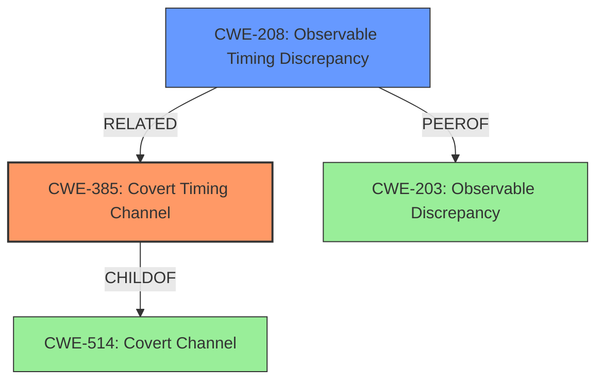

# Final Resolution for CVE-2022-24409

# Summary
| CWE ID  | CWE Name                      | Confidence | CWE Abstraction Level | CWE Vulnerability Mapping Label | CWE-Vulnerability Mapping Notes |
| :-------- | :---------------------------- | :--------- | :-------------------- | :------------------------------ | :---------------------------- |
| CWE-385 | Covert Timing Channel | 1.00      | Base                  | Allowed                         | Acceptable-Use   |
| CWE-208 | Observable Timing Discrepancy | 0.75      | Base                  | Allowed                         | Acceptable-Use                |

  - The Primary CWE should be first and noted as the Primary CWEs
  - The secondary candidate CWEs should be next and noted as secondary candidates.
  - The confidence is a confidence score 0 to 1 to rate your confidence in your assessment for that CWE.
  - The CWE Abstraction Level as one of these values: Base, Variant, Pillar, Class, Compound
  - The Mapping Notes Usage as one of these values: Allowed, Allowed-with-Review, Prohibited, Discouraged

## Evidence and Confidence

*   **Confidence Score:** 0.95
*   **Evidence Strength:** HIGH

## Relationship Analysis
The primary relationship that influenced the decision was the parent-child relationship between CWE-514 (Covert Channel) and CWE-385 (**Covert Timing Channel**). While CWE-514 is a relevant ancestor, CWE-385 is more specific and aligns directly with the vulnerability description's explicit mention of a "**covert timing channel**". The peer relationship between CWE-203 (Observable Discrepancy) and CWE-208 (**Observable Timing Discrepancy**) highlights alternative classifications based on observable differences, but these are less precise than CWE-385. The Base abstraction level of CWE-385 and CWE-208 influenced the selection, as Base-level CWEs are preferred for vulnerability mapping.

## Vulnerability Chain
The vulnerability chain starts with the **root cause**: the implementation of the Dell BSAFE SSL-J library introduces time variances in operations, creating a **covert timing channel (CWE-385)**. This **weakness** allows malicious users to observe these timing differences and infer security-relevant information, potentially compromising the affected system. The final impact is the exposure of sensitive data or unauthorized access due to the compromised system. There are no missing links in the chain based on the available information.

## Summary of Analysis
The initial analysis and criticism were both well-reasoned and accurate. My assessment agrees with the primary classification of CWE-385 (**Covert Timing Channel**) and the secondary classification of CWE-208 (**Observable Timing Discrepancy**).

The primary justification is based on the explicit mention of a "**covert timing channel vulnerability**" in the vulnerability description, which directly corresponds to the definition of CWE-385. As the analysis states, "The vulnerability description explicitly states a "**covert timing channel vulnerability**" exists in Dell BSAFE SSL-J...CWE-385 (**Covert Timing Channel**) directly matches this description."

The graph relationships influenced the decision by highlighting the importance of selecting the most specific and relevant CWE. While CWE-514 (**Covert Channel**) is a parent, CWE-385 provides a more precise characterization of the vulnerability.

The selected CWEs are at the optimal level of specificity because CWE-385 directly addresses the **root cause**, and both CWE-385 and CWE-208 are Base-level CWEs, which are preferred for vulnerability mapping.