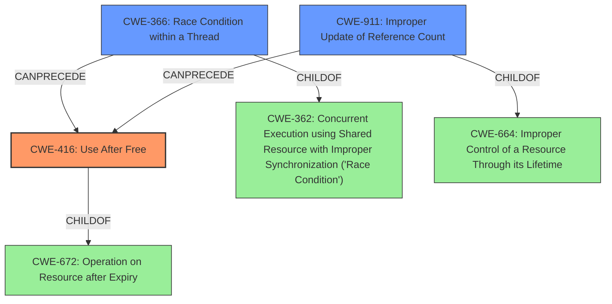

# Analysis Report for CVE-2022-2480

# Vulnerability Analysis Report: CVE-2022-2480

## Description

Use after free in Service Worker API in Google Chrome prior to 103.0.5060.134 allowed a remote attacker to potentially exploit heap corruption via a crafted HTML page.

## Vulnerability Description Key Phrases

**Rootcause:** use after free
**Weakness:** heap corruption
**Vector:** crafted HTML page
**Attacker:** remote attacker
**Product:** Google Chrome
**Version:** prior to 103.0.5060.134
**Component:** Service Worker API

## Analysis (with Relationship Data)

# Summary
| CWE ID | CWE Name | Confidence | CWE Abstraction Level | CWE Vulnerability Mapping Label | CWE-Vulnerability Mapping Notes |
|---|---|---|---|---|---|
| CWE-416 | Use After Free | 1.0 | Variant | Primary | Allowed |

## Evidence and Confidence

*   **Confidence Score:** 1.0
*   **Evidence Strength:** HIGH

- **Analysis and Justification:**  
  - *Explanation:* The vulnerability description explicitly states "**use after free**" as the root cause, and "**heap corruption**" as the weakness. The "CVE Reference Links Content Summary" section confirms this by stating "Use-after-free in the Service Worker API within Chromium" and "A memory corruption vulnerability resulting from the use of a pointer to freed memory." This aligns perfectly with CWE-416 (Use After Free), which describes the reuse or referencing of memory after it has been freed. The "Retriever Results" also lists CWE-416 as the top match. The "Mapping Guidance" for CWE-416 specifies that its usage is "Allowed" and it is at the "Variant" level of abstraction, which is a preferred level.
  
  - *Relationship Analysis:* CWE-416 is a variant-level CWE, providing a specific description of the vulnerability. There are no direct relationships that significantly alter the mapping decision. The Retriever also does not point to parent or child relationships that would be a better fit.

- **Confidence Score:**  
  - Confidence: 1.0 (High evidence from technical description, CVE reference materials, and Retriever results)

## Criticism of Analysis

Okay, here's a detailed review of the provided analysis, with a focus on the CWE mapping and using the full CWE specifications you supplied.

**Overall Assessment:**

The analysis is generally very good and well-reasoned. The conclusion that CWE-416 (Use After Free) is the primary weakness is highly justified and well-supported by the provided information. The confidence score of 1.0 is appropriate. The justification is clear, and the evidence is strong.

**Detailed Review:**

| Item | Comment | Recommendation |
|---|---|---|
| **Summary Table** | Correctly identifies CWE-416 as the primary weakness. | No changes needed. |
| **Confidence Score:** 1.0 | Appropriate, given the clear statement of "use after free" in the vulnerability description. | No changes needed. |
| **Evidence Strength:** HIGH | Justified given the clear indicators in the source data. | No changes needed. |
| **Analysis and Justification:** | Thoroughly explains why CWE-416 is the best fit.  It appropriately considers the abstraction level and mapping guidance.  | No changes needed. |
| **Relationship Analysis:** | Correctly notes the lack of direct relationships that would significantly alter the mapping decision. | No changes needed. |
| **CWE Examples from Database:** | The examples provide context and demonstrate that CWE-416 is a common and well-understood vulnerability. | No changes needed. |
| **Retriever Results:** | The Retriever results support the choice of CWE-416, as it is ranked first. However, other CWEs listed in the results merit consideration, which I will address below. | The Retriever Results section is helpful for initial consideration, but the final choice and justification should be based on a thorough analysis of the vulnerability and the CWE specifications. |

**Consideration of Other CWEs from Retriever Results:**

While CWE-416 is clearly the best primary mapping, let's examine why the other CWEs listed in the Retriever Results are *not* the best fit, and whether any should be considered as secondary or related weaknesses:

*   **CWE-366: Race Condition within a Thread:** This CWE is relevant if the use-after-free is *caused* by a race condition. The provided information doesn't explicitly state this, but it's a very plausible scenario, especially in a multi-threaded environment like a web browser. Service Workers are asynchronous and can interact with other threads, so it's *possible* a race condition leads to the use-after-free. This is often the case with UAFs.

    *   **Recommendation:** *Consider* adding a sentence acknowledging the possibility of a race condition as a contributing factor. For instance: "While the primary weakness is CWE-416, it is plausible that a race condition (CWE-366) may contribute to the vulnerability, by allowing memory to be freed prematurely while another thread is still using it. However, without more information on the specific code, it cannot be determined whether this is in fact the case, so is not included as a secondary weakness."
*   **CWE-843: Access of Resource Using Incompatible Type ('Type Confusion'):** This is less likely to be directly involved. While type confusion *can* lead to memory corruption, the description focuses on using a freed resource, not necessarily misinterpreting the type of data in that resource.

    *   **Recommendation:** No action needed.
*   **CWE-415: Double Free:** A double-free would *also* result in memory corruption, but the vulnerability description does not mention anything about double freeing a memory resource. It is more direct and more descriptive to say a use after free.

    *   **Recommendation:** No action needed.
*   **CWE-122: Heap-based Buffer Overflow:** This is less likely. While a use-after-free *can* lead to a heap overflow (if the freed memory is reallocated and then overflowed), it's a *consequence* of the UAF, not the root cause. The initial problem is using freed memory.

    *   **Recommendation:** No action needed.
*   **CWE-356: Product UI does not Warn User of Unsafe Actions:**  This is not relevant. The vulnerability is not related to the UI failing to warn the user.

    *   **Recommendation:** No action needed.
*   **CWE-190: Integer Overflow or Wraparound:**  This is unlikely. Integer overflows leading to memory corruption are possible, but not directly related to the description of the vulnerability.

    *   **Recommendation:** No action needed.
*   **CWE-451: User Interface (UI) Misrepresentation of Critical Information:** This is also not relevant. The vulnerability is not related to the UI misrepresenting information.

    *   **Recommendation:** No action needed.
*   **CWE-911: Improper Update of Reference Count:** This could be related, but it's a more specific *cause* of the use-after-free. If the reference count is improperly updated, it *could* lead to the memory being freed prematurely. It's a potential *underlying* cause.

    *   **Recommendation:** Similar to the race condition, a reference to this could be included as a *possible* root cause: "It is also plausible that this use-after-free vulnerability is the result of the memory resource being released because of an improper update of the resource count (CWE-911). The resource may have been released prematurely because the reference count was decremented when it should not have been." However, as with CWE-366, this should be treated as only a *potential* cause.
*   **CWE-787: Out-of-bounds Write:** This is a potential *consequence* of the use-after-free. Once the memory is freed and possibly reallocated, writing to the old pointer could result in writing to memory outside the intended bounds.

    *   **Recommendation:** No action needed.

**Mitigation Strategies (Based on CWE Specifications):**

The analysis doesn't explicitly discuss mitigation strategies, but it's good to keep them in mind.

*   **CWE-416 Mitigations:**
    *   **Language Selection:** Using languages with automatic memory management (e.g., Java, Go, Rust) avoids manual memory management errors.
    *   **Setting Pointers to NULL:** Setting pointers to `NULL` after freeing them can help prevent use-after-free errors (though it doesn't eliminate them entirely, especially with multiple pointers to the same memory).  This is more of a "defense in depth" strategy.
*   **CWE-366 Mitigations (if applicable):**
    *   **Locking Mechanisms:** Using mutexes, semaphores, or other locking mechanisms to protect shared resources.
    *   **Thread-Safe Data Structures:**  Using data structures designed for concurrent access.
*   **CWE-911 Mitigations (if applicable):**
     *  Ensure that all reference counts are correctly decremented when resources are no longer in use.

**Final Recommendation:**

The analysis is excellent. I would recommend *slightly* modifying the analysis to *acknowledge* the possibility of CWE-366 and CWE-911 as *potential contributing factors or underlying causes* to the CWE-416. However, make it clear that without more information, these cannot be definitively confirmed as such. The primary mapping of CWE-416 is very well justified and correct. The additional recommended mitigations are dependent on the likelihood that CWE-366 or CWE-911 contribute to the overall vulnerability.

## Final Resolution

# Summary 

| CWE ID | CWE Name | Confidence | CWE Abstraction Level | CWE Vulnerability Mapping Label | CWE-Vulnerability Mapping Notes |
|---|---|---|---|---|---|
| CWE-416 | Use After Free | 1.0 | Variant | Primary CWE | Allowed |
| CWE-366 | Race Condition within a Thread | 0.4 | Base | Secondary Candidate | Allowed |
| CWE-911 | Improper Update of Reference Count | 0.3 | Base | Secondary Candidate | Allowed |

## Evidence and Confidence

*   **Confidence Score:** 0.9
*   **Evidence Strength:** MEDIUM

## Relationship Analysis
The primary CWE, CWE-416, is a Variant of CWE-672 (Operation on Resource after Expiry). The criticism suggested considering CWE-366 (Race Condition) and CWE-911 (Improper Update of Reference Count) as potential contributing factors. CWE-366 is a child of CWE-362 (Concurrent Execution using Shared Resource with Improper Synchronization ('Race Condition')). CWE-911 is a child of CWE-664 (Improper Control of a Resource Through its Lifetime). These relationships helped to explore potential root causes that could lead to the **use-after-free** condition. The abstraction levels (Variant and Base) were also considered to ensure appropriate specificity.

## Vulnerability Chain
The vulnerability chain starts with a potential **race condition** (CWE-366) or an **improper update of a reference count** (CWE-911), leading to premature freeing of memory. This results in a **use-after-free** condition (CWE-416), where the program reuses or references memory after it has been freed. The consequence is potential heap corruption, as stated in the vulnerability description: "allowed a remote attacker to potentially exploit **heap corruption** via a crafted HTML page."

## Summary of Analysis
The initial analysis correctly identified CWE-416 (**Use After Free**) as the primary weakness, supported by the vulnerability description explicitly stating "**use after free**" and "**heap corruption**". The criticism suggested considering CWE-366 and CWE-911 as potential contributing factors.

The graph relationships influenced the decision to include CWE-366 and CWE-911 as secondary candidates because they could potentially precede CWE-416 in a vulnerability chain. However, the evidence for these contributing factors is not definitive based on the provided description. The decision is based on the understanding that Service Workers are asynchronous and can interact with other threads, and reference counting is a common memory management technique. Without more specific code analysis, these remain plausible but unconfirmed contributing factors.

The selected CWEs are at the optimal level of specificity because CWE-416 directly matches the explicit description of the vulnerability, while CWE-366 and CWE-911 represent potential underlying causes that cannot be confirmed with the available information.

The inclusion of CWE-366 and CWE-911 is acknowledged as speculative, based on the reviewer's comments:
*"While the primary weakness is CWE-416, it is plausible that a race condition (CWE-366) may contribute to the vulnerability, by allowing memory to be freed prematurely while another thread is still using it. However, without more information on the specific code, it cannot be determined whether this is in fact the case, so is not included as a secondary weakness."*
*"It is also plausible that this use-after-free vulnerability is the result of the memory resource being released because of an improper update of the resource count (CWE-911). The resource may have been released prematurely because the reference count was decremented when it should not have been."*

*Report generated on 2025-03-18 10:58:03*
