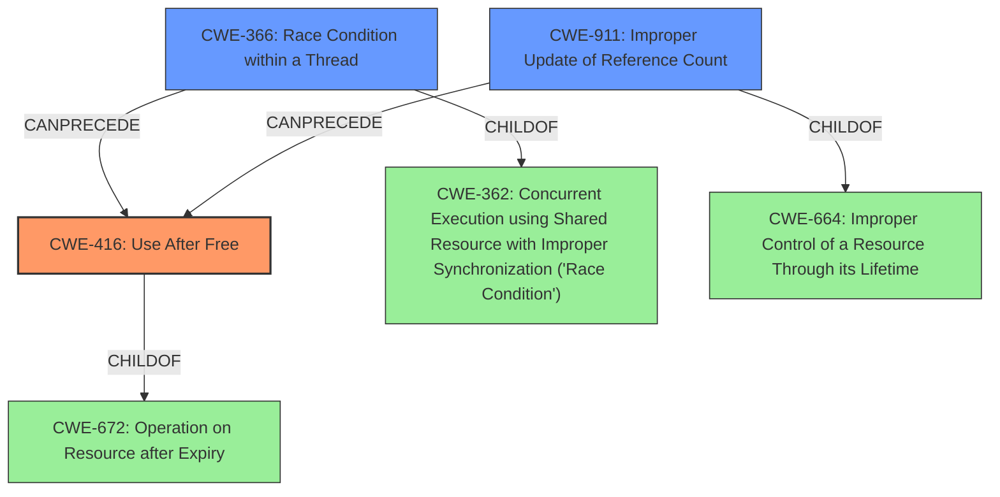

# Final Resolution for CVE-2022-2480

# Summary 

| CWE ID | CWE Name | Confidence | CWE Abstraction Level | CWE Vulnerability Mapping Label | CWE-Vulnerability Mapping Notes |
|---|---|---|---|---|---|
| CWE-416 | Use After Free | 1.0 | Variant | Primary CWE | Allowed |
| CWE-366 | Race Condition within a Thread | 0.4 | Base | Secondary Candidate | Allowed |
| CWE-911 | Improper Update of Reference Count | 0.3 | Base | Secondary Candidate | Allowed |

## Evidence and Confidence

*   **Confidence Score:** 0.9
*   **Evidence Strength:** MEDIUM

## Relationship Analysis
The primary CWE, CWE-416, is a Variant of CWE-672 (Operation on Resource after Expiry). The criticism suggested considering CWE-366 (Race Condition) and CWE-911 (Improper Update of Reference Count) as potential contributing factors. CWE-366 is a child of CWE-362 (Concurrent Execution using Shared Resource with Improper Synchronization ('Race Condition')). CWE-911 is a child of CWE-664 (Improper Control of a Resource Through its Lifetime). These relationships helped to explore potential root causes that could lead to the **use-after-free** condition. The abstraction levels (Variant and Base) were also considered to ensure appropriate specificity.

## Vulnerability Chain
The vulnerability chain starts with a potential **race condition** (CWE-366) or an **improper update of a reference count** (CWE-911), leading to premature freeing of memory. This results in a **use-after-free** condition (CWE-416), where the program reuses or references memory after it has been freed. The consequence is potential heap corruption, as stated in the vulnerability description: "allowed a remote attacker to potentially exploit **heap corruption** via a crafted HTML page."

## Summary of Analysis
The initial analysis correctly identified CWE-416 (**Use After Free**) as the primary weakness, supported by the vulnerability description explicitly stating "**use after free**" and "**heap corruption**". The criticism suggested considering CWE-366 and CWE-911 as potential contributing factors.

The graph relationships influenced the decision to include CWE-366 and CWE-911 as secondary candidates because they could potentially precede CWE-416 in a vulnerability chain. However, the evidence for these contributing factors is not definitive based on the provided description. The decision is based on the understanding that Service Workers are asynchronous and can interact with other threads, and reference counting is a common memory management technique. Without more specific code analysis, these remain plausible but unconfirmed contributing factors.

The selected CWEs are at the optimal level of specificity because CWE-416 directly matches the explicit description of the vulnerability, while CWE-366 and CWE-911 represent potential underlying causes that cannot be confirmed with the available information.

The inclusion of CWE-366 and CWE-911 is acknowledged as speculative, based on the reviewer's comments:
*"While the primary weakness is CWE-416, it is plausible that a race condition (CWE-366) may contribute to the vulnerability, by allowing memory to be freed prematurely while another thread is still using it. However, without more information on the specific code, it cannot be determined whether this is in fact the case, so is not included as a secondary weakness."*
*"It is also plausible that this use-after-free vulnerability is the result of the memory resource being released because of an improper update of the resource count (CWE-911). The resource may have been released prematurely because the reference count was decremented when it should not have been."*