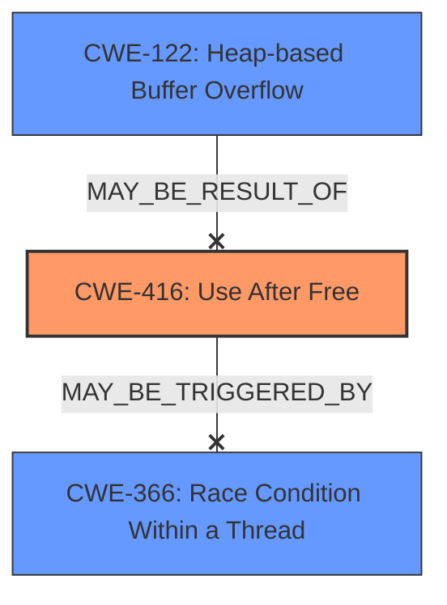

# Final Resolution for CVE-2022-2481

# Summary

| CWE ID | CWE Name | Confidence | CWE Abstraction Level | CWE Vulnerability Mapping Label | CWE-Vulnerability Mapping Notes |
|---|---|---|---|---|---|
| CWE-416 | Use After Free | 1.0 | Variant | Allowed | Primary CWE |

## Evidence and Confidence

*   **Confidence Score:** 1.0
*   **Evidence Strength:** HIGH

## Relationship Analysis
The primary relationship considered was the direct match of the vulnerability description to **CWE-416 (Use After Free)**. While other CWEs like **CWE-366 (Race Condition Within a Thread)**, **CWE-843 (Access of Resource Using Incompatible Type)**, and **CWE-122 (Heap-based Buffer Overflow)** were considered, they were deemed less specific to the root cause. The abstraction level of **CWE-416 (Use After Free)** as a Variant further solidified its appropriateness.

## Vulnerability Chain
The vulnerability chain starts with the **ROOTCAUSE** being a use-after-free condition (**CWE-416**). This leads to accessing memory that has been freed, potentially leading to **heap corruption**. The UI interaction serves as a trigger or vector.

## Summary of Analysis
The initial analysis correctly identified **CWE-416 (Use After Free)** as the primary **WEAKNESS**. The vulnerability description explicitly mentions "**use after free** in Views in Google Chrome...allowed a remote attacker...to potentially exploit **heap corruption** via UI interaction." The analysis accurately dismissed other potential CWEs due to their lower specificity. The graph relationships confirm that while other weaknesses may be related, **CWE-416 (Use After Free)** is the most direct and precise mapping. The selected CWE is at the optimal level of specificity (Variant). The final recommendation is to keep the classification as **CWE-416 (Use After Free)** with a confidence score of 1.0.