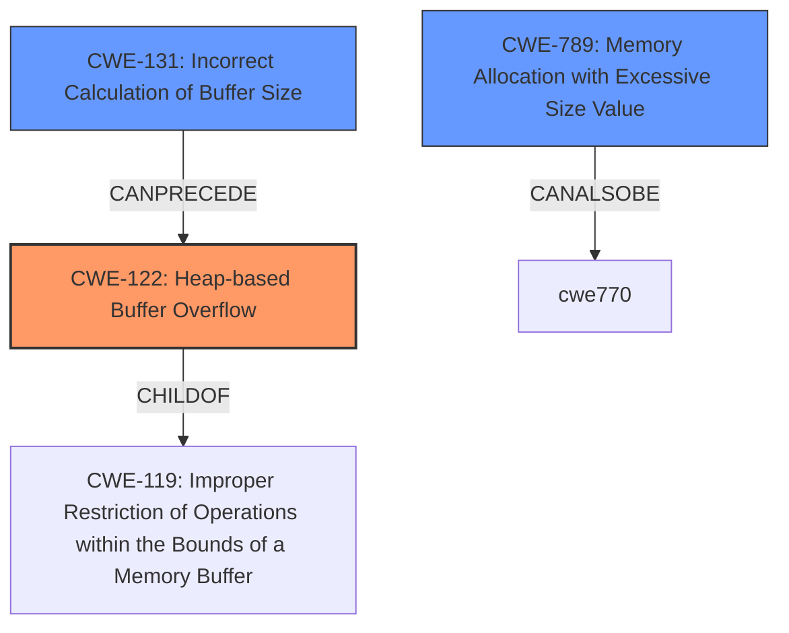

# Final Resolution for CVE-2022-24903

# Summary

| CWE ID | CWE Name | Confidence | CWE Abstraction Level | CWE Vulnerability Mapping Label | CWE-Vulnerability Mapping Notes |
|---|---|---|---|---|---|
| CWE-122 | Heap-based Buffer Overflow | 0.95 | Variant | Allowed | The primary **weakness** is a heap buffer overflow due to writing digits to a heap buffer without proper bounds checking. |
| CWE-131 | Incorrect Calculation of Buffer Size | 0.70 | Base | Allowed | A secondary contributing factor may be an incorrect calculation of the buffer size, leading to the overflow. This is speculative, but plausible, if the digits are written *without* bounds checking and a buffer overflow occurs, that means the initial size calculation is incorrect. |
| CWE-789 | Memory Allocation with Excessive Size Value | 0.60 | Variant | Allowed | A related concern might be the lack of limits and validation on the *size* of the allocated buffer, but the primary issue is the overflow itself, not necessarily an unbounded allocation. However, CWE-789 would be more appropriate than CWE-770 because the size is based on *untrusted input*. |

## Evidence and Confidence

*   **Confidence Score:** 0.90
*   **Evidence Strength:** HIGH

## Relationship Analysis
The primary **weakness** is clearly a heap-based buffer overflow (CWE-122). This is a variant of the more general improper restriction of operations within the bounds of a memory buffer (**CWE-119**). The analysis also considers the possibility of an incorrect buffer size calculation (**CWE-131**) contributing to the overflow, creating a potential chain where **CWE-131** can precede **CWE-122**. Finally, the analysis examines resource allocation issues, suggesting **CWE-789** (Memory Allocation with Excessive Size Value) as a more fitting alternative to **CWE-770** due to the untrusted nature of the input size.

## Vulnerability Chain
The vulnerability chain begins with potentially an **incorrect calculation of buffer size (CWE-131)**. This could lead to a heap-based buffer overflow (**CWE-122**) when data is written to the buffer without proper bounds checking. The allocation of memory with an excessive size value based on untrusted input (**CWE-789**) could also contribute. The final impact is a segfault or other malfunction, potentially leading to remote code execution.
- **CWE-131 (Incorrect Calculation of Buffer Size)** -> **CWE-122 (Heap-based Buffer Overflow)** -> Impact (Segfault, Malfunction, Potential RCE)
- **CWE-789 (Memory Allocation with Excessive Size Value)** -> **CWE-122 (Heap-based Buffer Overflow)** -> Impact (Segfault, Malfunction, Potential RCE)

## Summary of Analysis
The initial analysis correctly identifies **CWE-122** as the primary **weakness**. The criticism suggests replacing **CWE-770** with **CWE-789**, which is a better fit given that the vulnerability description mentions that the size is based on untrusted input. The initial assessment and criticism both highlight the speculative nature of **CWE-131**, acknowledging it as a possible contributing factor. The decision to keep **CWE-131** and **CWE-789** as secondary CWEs is based on their potential to contribute to the **rootcause**, even if the evidence is not conclusive. The selected CWEs are at the optimal level of specificity, with **CWE-122** being a Variant that pinpoints the heap as the location of the overflow. **CWE-131** and **CWE-789** are at the Base and Variant level, respectively, providing additional context.