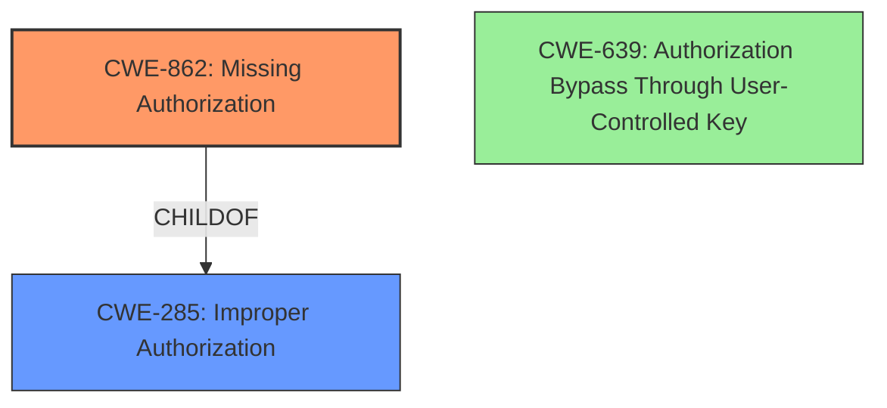

# Analysis Report for CVE-2022-2493

# Vulnerability Analysis Report: CVE-2022-2493

## Description

Data Access from Outside Expected Data Manager Component in GitHub repository openemr/openemr prior to 7.0.0.

## Vulnerability Description Key Phrases

**Impact:** access data from outside expected component
**Product:** openemr/openemr
**Version:** prior to 7.0.0

## Analysis (with Relationship Data)

# Summary
| CWE ID | CWE Name | Confidence | CWE Abstraction Level | CWE Vulnerability Mapping Label | CWE-Vulnerability Mapping Notes |
|---|---|---|---|---|---|
| CWE-285 | Improper Authorization | 0.85 | Class | Primary | Allowed-with-Review |
| CWE-862 | Missing Authorization | 0.75 | Class | Secondary | Allowed-with-Review |
| CWE-639 | Authorization Bypass Through User-Controlled Key | 0.6 | Base | Secondary | Allowed |

## Evidence and Confidence

*   **Confidence Score:** 0.80
*   **Evidence Strength:** HIGH

- **Analysis and Justification:**  
  - *Explanation:* The vulnerability description indicates that the root cause is **missing access control checks** allowing unauthorized users to access functionalities and data. The CVE Reference Links Content Summary confirms this by stating that the fix involved adding ACL checks in various PHP files to prevent unauthorized access, showing an 'unauthorized' page to users without the required permissions. This aligns with CWE-285 (Improper Authorization) because the product does not perform or incorrectly performs an authorization check when an actor attempts to access a resource. However, CWE-285 is a Class-level CWE. A more specific child CWE would be preferable if one accurately describes the vulnerability. In this case, the implemented fix of adding missing authorization checks suggests that CWE-862 (Missing Authorization) also accurately describes the vulnerability. CWE-639 (Authorization Bypass Through User-Controlled Key) is less appropriate because the vulnerability doesn't seem to be explicitly tied to manipulation of key values but rather the absence of authorization checks.
  - *Relationship Analysis:* CWE-285 is a Class-level CWE, while CWE-862 is a Class-level CWE, and CWE-639 is a Base-level CWE. CWE-862 is a child of CWE-284. CWE-284 is a parent of CWE-285.

- **Confidence Score:**  
  - *Example:* Confidence: 0.85 (High evidence from technical description and CVE reference materials)

## Criticism of Analysis

Okay, I've reviewed the analysis and the full CWE specifications provided. Here's a breakdown of my critique:

**Overall Assessment:**

The analysis is generally well-reasoned and demonstrates a good understanding of the vulnerability and the CWEs involved. The confidence levels are appropriate, and the justification for selecting CWE-862 as a secondary mapping is solid. The analysis correctly identifies that CWE-285 is too high-level. The explanations are clear and concise.

**Specific Points:**

*   **Primary CWE: CWE-285 (Improper Authorization)**

    *   **Critique:** The analysis correctly identifies that CWE-285 is a Class-level CWE and prefers a more specific child.
    *   **Recommendation:** As the analysis suggests, avoid using CWE-285 as the primary mapping since it's discouraged.

*   **Secondary CWE: CWE-862 (Missing Authorization)**

    *   **Assessment:** Excellent choice. The description perfectly fits the scenario where access control checks were *missing* entirely, leading to unauthorized access.
    *   **Mapping Guidance Adherence:** The analysis adheres to the mapping guidance, acknowledging the "Allowed-with-Review" status and the need to consider more specific children.
    *   **Potential Mitigations Adherence:** The mitigations listed in the CWE specification for CWE-862 (Role-Based Access Control, business logic access control, vetted libraries) are all relevant and appropriate for this type of vulnerability.
    *   **Observed Examples Adherence:** The analysis follows observed examples as it accurately represents that this weakness resulted from missing authorization checks in numerous files.

*   **Tertiary CWE: CWE-639 (Authorization Bypass Through User-Controlled Key)**

    *   **Assessment:** The analysis questions the validity of CWE-639 and this is valid. While the vulnerability *could* potentially be exploited by manipulating a key/ID, it's not the fundamental flaw. The core problem is the *absence* of authorization checks, not necessarily how a key is handled. The access control checks were simply not present at all.
    *   **Mapping Guidance Adherence:** The Analysis correctly determines that the weakness is not explicitly tied to the manipulation of key values.
    *   **Potential Mitigations Adherence:** The mitigations for CWE-639 (privilege checks for every data access, ensuring key values are not controllable, encryption/signatures for key values) are less directly applicable since the initial vulnerability stemmed from the lack of access controls and not necessarily from a specific IDOR vulnerability.
    *   **Observed Examples Adherence:** Compared to the examples provided for CWE-639, this vulnerability is less about directly manipulating a key and more about completely bypassing access controls.
    *   **Recommendation:** Lower the confidence score or remove CWE-639. It is not an accurate fit for the description.

**Suggestions for Improvement:**

1.  **Promote CWE-862 to Primary:**  Given the core problem is the lack of authorization checks, make CWE-862 the primary mapping and consider the other CWE's as secondary, or eliminate CWE-639 all together.

2.  **Consider a Variant of CWE-862:** While CWE-862 is a good fit, explore if any *Variant*-level children of CWE-862 would be even more precise.  (There aren't any listed as children of CWE-862. It is a child of CWE-285. No variants exist.)

3.  **Add Vulnerability Location Context:** Mention specific files that were affected. This helps provide more context and strengthens the evidence.

4.  **Refine CWE-639 Rationale:** More explicitly state *why* the key is *not* user-controlled in this instance. It's not that the application is mishandling a user-controlled key, but rather that it's failing to check permissions regardless of how the key is passed or controlled.

**Revised Summary Table (with Suggested Changes):**

| CWE ID | CWE Name | Confidence | CWE Abstraction Level | CWE Vulnerability Mapping Label | CWE-Vulnerability Mapping Notes |
|---|---|---|---|---|---|
| CWE-862 | Missing Authorization | 0.90 | Class | Primary | Allowed-with-Review |
| CWE-285 | Improper Authorization | 0.7 | Class | Secondary | Discouraged |
| CWE-639 | Authorization Bypass Through User-Controlled Key | 0.4 | Base | Tertiary | Allowed |

**In summary, the analysis demonstrates strong reasoning and a good understanding of the relevant CWEs. The suggested adjustments primarily focus on further refining the CWE selection to better reflect the root cause and increasing clarity in the justification.**

## Final Resolution

# Summary
| CWE ID | CWE Name | Confidence | CWE Abstraction Level | CWE Vulnerability Mapping Label | CWE-Vulnerability Mapping Notes |
|---|---|---|---|---|---|
| CWE-862 | Missing Authorization | 0.90 | Class | Primary | Allowed-with-Review |
| CWE-285 | Improper Authorization | 0.70 | Class | Secondary | Discouraged |
| CWE-639 | Authorization Bypass Through User-Controlled Key | 0.40 | Base | Tertiary | Allowed |

## Evidence and Confidence

*   **Confidence Score:** 0.90
*   **Evidence Strength:** HIGH

## Relationship Analysis
The primary relationship considered was the hierarchical relationship between CWE-285 (Improper Authorization), CWE-862 (Missing Authorization), and CWE-639 (Authorization Bypass Through User-Controlled Key). CWE-862 is a child of CWE-284 (Improper Access Control), which is a parent of CWE-285. Since the core issue is the *absence* of authorization checks, CWE-862 is more specific and appropriate than its parent, CWE-285. Although CWE-639 is a Base-level CWE, it isn't as applicable because the vulnerability isn't explicitly about the manipulation of key values, making it a less direct fit.

## Vulnerability Chain
The vulnerability chain starts with the **ROOTCAUSE** being the **missing authorization checks** (**CWE-862**). This leads to the consequence that unauthorized users can access functionalities and data, which is a violation of proper authorization (**CWE-285**). In some exploitation scenarios, a user may try to manipulate key values to achieve this unauthorized access (**CWE-639**), although this is not the primary vector.

## Summary of Analysis
The initial analysis correctly identifies the core issue as missing authorization checks. The criticism accurately points out that **CWE-285** is a Class-level CWE and prefers a more specific child. The suggestion to promote **CWE-862** to primary is reasonable because the vulnerability description and CVE reference indicate that the fix involved adding missing ACL checks. This directly aligns with the definition of **CWE-862 (Missing Authorization)**. The analysis questioning the validity of **CWE-639** is also correct; while manipulation of keys could be a *potential* exploitation vector, the fundamental flaw is the absence of authorization checks, not the mishandling of a user-controlled key.

The evidence for this is the CVE Reference Links Content Summary stating that the fix involved adding ACL checks in various PHP files to prevent unauthorized access.

The graph relationships influenced the decision by highlighting the parent-child relationship between **CWE-285** and **CWE-862**, making **CWE-862** a more specific and appropriate choice.

The selected CWEs are at an optimal level of specificity because **CWE-862** directly addresses the root cause (missing authorization checks), while **CWE-285** provides a broader context (improper authorization), and **CWE-639** highlights a possible, but less direct, exploitation vector.

*Report generated on 2025-03-17 04:23:06*
