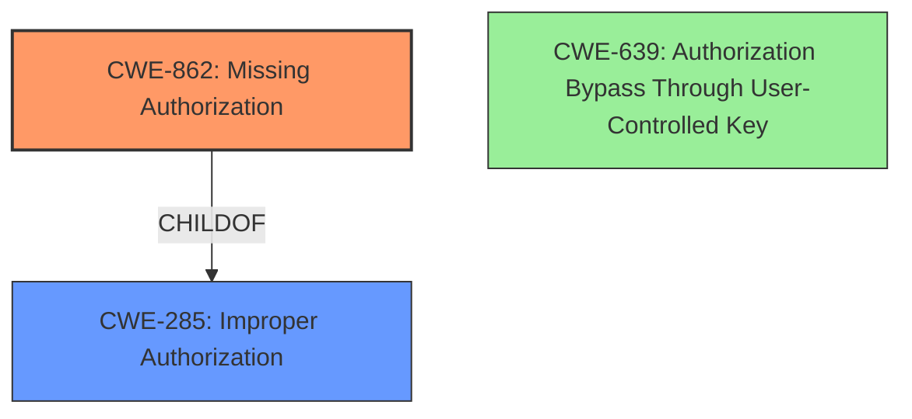

# Final Resolution for CVE-2022-2493

# Summary
| CWE ID | CWE Name | Confidence | CWE Abstraction Level | CWE Vulnerability Mapping Label | CWE-Vulnerability Mapping Notes |
|---|---|---|---|---|---|
| CWE-862 | Missing Authorization | 0.90 | Class | Primary | Allowed-with-Review |
| CWE-285 | Improper Authorization | 0.70 | Class | Secondary | Discouraged |
| CWE-639 | Authorization Bypass Through User-Controlled Key | 0.40 | Base | Tertiary | Allowed |

## Evidence and Confidence

*   **Confidence Score:** 0.90
*   **Evidence Strength:** HIGH

## Relationship Analysis
The primary relationship considered was the hierarchical relationship between CWE-285 (Improper Authorization), CWE-862 (Missing Authorization), and CWE-639 (Authorization Bypass Through User-Controlled Key). CWE-862 is a child of CWE-284 (Improper Access Control), which is a parent of CWE-285. Since the core issue is the *absence* of authorization checks, CWE-862 is more specific and appropriate than its parent, CWE-285. Although CWE-639 is a Base-level CWE, it isn't as applicable because the vulnerability isn't explicitly about the manipulation of key values, making it a less direct fit.

## Vulnerability Chain
The vulnerability chain starts with the **ROOTCAUSE** being the **missing authorization checks** (**CWE-862**). This leads to the consequence that unauthorized users can access functionalities and data, which is a violation of proper authorization (**CWE-285**). In some exploitation scenarios, a user may try to manipulate key values to achieve this unauthorized access (**CWE-639**), although this is not the primary vector.

## Summary of Analysis
The initial analysis correctly identifies the core issue as missing authorization checks. The criticism accurately points out that **CWE-285** is a Class-level CWE and prefers a more specific child. The suggestion to promote **CWE-862** to primary is reasonable because the vulnerability description and CVE reference indicate that the fix involved adding missing ACL checks. This directly aligns with the definition of **CWE-862 (Missing Authorization)**. The analysis questioning the validity of **CWE-639** is also correct; while manipulation of keys could be a *potential* exploitation vector, the fundamental flaw is the absence of authorization checks, not the mishandling of a user-controlled key.

The evidence for this is the CVE Reference Links Content Summary stating that the fix involved adding ACL checks in various PHP files to prevent unauthorized access.

The graph relationships influenced the decision by highlighting the parent-child relationship between **CWE-285** and **CWE-862**, making **CWE-862** a more specific and appropriate choice.

The selected CWEs are at an optimal level of specificity because **CWE-862** directly addresses the root cause (missing authorization checks), while **CWE-285** provides a broader context (improper authorization), and **CWE-639** highlights a possible, but less direct, exploitation vector.