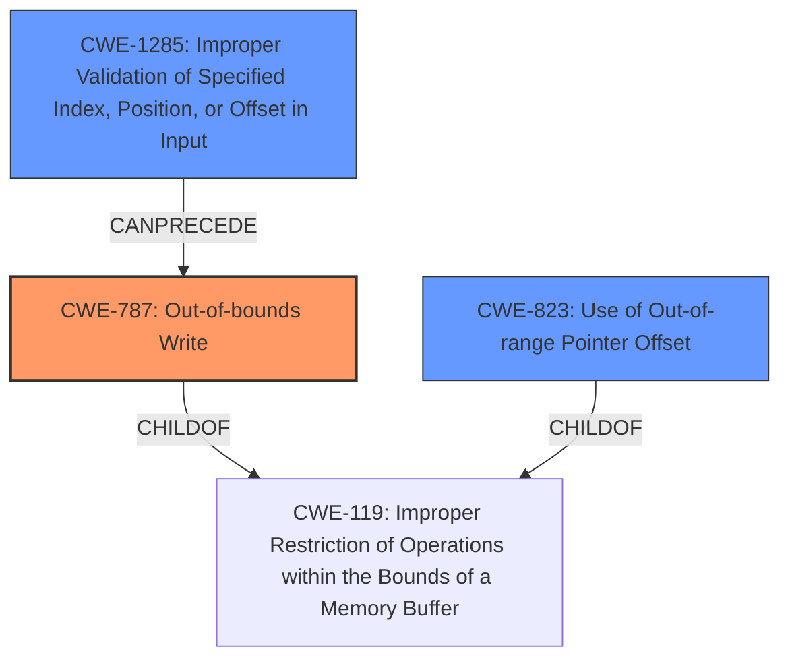

# Final Resolution for CVE-2022-24936

# Summary
| CWE ID | CWE Name | Confidence | CWE Abstraction Level | CWE Vulnerability Mapping Label | CWE-Vulnerability Mapping Notes |
|---|---|---|---|---|---|
| CWE-787 | **CWE-787: Out-of-bounds Write** | 0.95 | Base | Allowed | Primary CWE |
| CWE-1285 | **CWE-1285: Improper Validation of Specified Index, Position, or Offset in Input** | 0.75 | Base | Allowed | Secondary Candidate |
| CWE-823 | **CWE-823: Use of Out-of-range Pointer Offset** | 0.65 | Base | Allowed | Secondary Candidate |

## Evidence and Confidence

*   **Confidence Score:** 0.85
*   **Evidence Strength:** MEDIUM

## Relationship Analysis
The primary relationship is that **CWE-787 (Out-of-bounds Write)** is a child of **CWE-119 (Improper Restriction of Operations within the Bounds of a Memory Buffer)**, indicating a more specific type of buffer handling issue. **CWE-1285 (Improper Validation of Specified Index, Position, or Offset in Input)** can precede **CWE-787**, suggesting that a lack of input validation may lead to the out-of-bounds write. **CWE-823 (Use of Out-of-range Pointer Offset)** is another potential secondary issue, also a child of **CWE-119**. Abstraction levels influenced the selection by preferring Base level CWEs over the Class level **CWE-119**.

## Vulnerability Chain
The vulnerability chain starts with potentially missing or improper validation of the input (GBL file) that specifies the size or offset. This leads to an out-of-range pointer offset being used. This offset results in an out-of-bounds write, allowing the attacker to overwrite flash Sign key and OTA decryption key.

Missing Link: There is no concrete evidence whether there is a read operation.

## Summary of Analysis
The initial analysis correctly identified **CWE-787 (Out-of-bounds Write)** as the primary **WEAKNESS** due to the vulnerability description explicitly stating an "Out-of-Bounds error". I agree with the initial assessment's selection of **CWE-787** as the primary **ROOTCAUSE** and the supporting evidence provided.

Based on the criticism, I added **CWE-1285 (Improper Validation of Specified Index, Position, or Offset in Input)** as a secondary candidate. This is because the "Out-of-Bounds error in GBL parser" strongly suggests a lack of validation or incorrect validation of input that specifies the size or offset. The vulnerability description states that the attacker can "overwrite flash Sign key and OTA decryption key via malicious bootloader upgrade" which is done via a GBL file. This indicates a lack of validation of the input, specifically "index, position, or offset."

I have retained **CWE-823 (Use of Out-of-range Pointer Offset)** as a secondary candidate because it is possible that the offset is calculated incorrectly. However, I believe that the lack of validation is a more direct cause.

I have increased the confidence score for **CWE-787 (Out-of-bounds Write)** to 0.95 because the evidence is strong and directly supports the classification. I have set the confidence score for **CWE-1285 (Improper Validation of Specified Index, Position, or Offset in Input)** to 0.75, as it is likely the root cause.

The selected CWEs are at the optimal level of specificity. **CWE-787** directly describes the **WEAKNESS**, while **CWE-1285** is a plausible **ROOTCAUSE**. Both are Base level CWEs and are more specific than the Class level **CWE-119**. The choice of **CWE-787** is based on the vulnerability description and CVE reference materials. The selection of **CWE-1285** is influenced by the relationship analysis and the understanding that out-of-bounds writes are often caused by a lack of input validation.