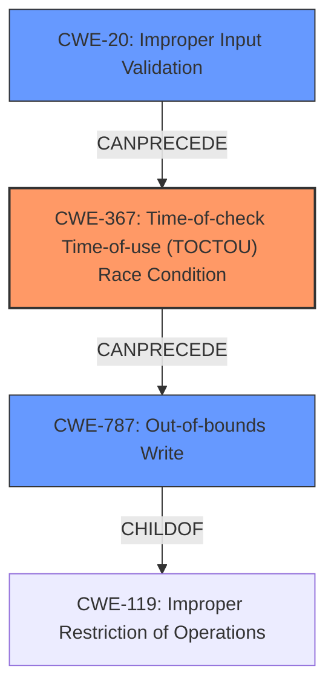

# Analysis Report for CVE-2022-24949

# Vulnerability Analysis Report: CVE-2022-24949

## Description

A privilege escalation to root exists in Eternal Terminal prior to version 6.2.0. This is due to the combination of a race condition, buffer overflow, and logic bug all in PipeSocketHandlerlisten().

## Vulnerability Description Key Phrases

**Rootcause:** race condition
**Weakness:** ['buffer overflow', 'logic bug']
**Impact:** privilege escalation to root
**Product:** Eternal Terminal
**Version:** prior to version 6.2.0
**Component:** PipeSocketHandlerlisten()

## Analysis (with Relationship Data)

# Summary
| CWE ID | CWE Name | Confidence | CWE Abstraction Level | CWE Vulnerability Mapping Label | CWE-Vulnerability Mapping Notes |
|---|---|---|---|---|---|
| CWE-367 | Time-of-check Time-of-use (TOCTOU) Race Condition | 0.95 | Base | Primary | Allowed |
| CWE-120 | Buffer Copy without Checking Size of Input ('Classic Buffer Overflow') | 0.85 | Base | Secondary | Allowed-with-Review |
| CWE-754 | Improper Check for Unusual or Exceptional Conditions | 0.75 | Class | Secondary | Allowed-with-Review |

## Evidence and Confidence

*   **Confidence Score:** 0.90
*   **Evidence Strength:** HIGH

- **Analysis and Justification:**  
  - *Explanation:* The vulnerability involves a **race condition**, a **buffer overflow**, and a **logic bug**. The primary weakness is the **race condition** in `PipeSocketHandlerlisten()`, where the state of a resource changes between the check and use, leading to privilege escalation. This aligns with CWE-367 (Time-of-check Time-of-use (TOCTOU) Race Condition), which is a Base level CWE and ALLOWED for mapping. The `CVE Reference Links Content Summary` confirms that operations on `name` in `SocketEndpoint` are performed without proper synchronization, leading to the ability to manipulate file paths and change permissions. CWE-362 (Concurrent Execution using Shared Resource with Improper Synchronization ('Race Condition')) is a Class-level CWE and less specific, making CWE-367 a better fit. The **buffer overflow** due to `strcpy()` aligns with CWE-120 (Buffer Copy without Checking Size of Input ('Classic Buffer Overflow')), which is a Base level CWE. Finally, a **logic bug** in `PortForwardHandler::createSource()` allows for arbitrary file deletion. Since the code doesn't correctly check for the expected conditions, this can be classified as CWE-754 (Improper Check for Unusual or Exceptional Conditions), which is a Class-level CWE.

  - *Relationship Analysis:* CWE-367 has no direct relationships. CWE-120 is a child of CWE-119 (Improper Restriction of Operations within the Bounds of a Memory Buffer) and can precede CWE-123 (Write-what-where Condition). CWE-754 is a Class and may have more specific children.

- **Confidence Score:**  
  - Confidence: 0.95 (High evidence from technical description and CVE reference materials for CWE-367)
  - Confidence: 0.85 (High evidence from technical description and CVE reference materials for CWE-120)
  - Confidence: 0.75 (Medium evidence from technical description and CVE reference materials for CWE-754)
---

## Criticism of Analysis

Okay, I've reviewed the provided analysis against the full CWE specifications and will provide a detailed critique focusing on the accuracy of the CWE assignments, their abstraction levels, and the appropriateness of the selected CWEs considering the specific vulnerability described.

**Overall Assessment**

The analysis is generally good and identifies the key weaknesses involved in the Eternal Terminal vulnerability. The confidence scores are well-reasoned, and the evidence presented supports the chosen CWEs. However, some areas could be more precise and leverage the CWE specifications more effectively, especially regarding the discouragement of CWE-119, and using the *closest fit*.

**Detailed Critique of Each CWE Assignment**

1.  **CWE-367: Time-of-check Time-of-use (TOCTOU) Race Condition (Confidence: 0.95, Primary)**

    *   **Assessment:** This is a strong primary mapping. The vulnerability description clearly indicates a TOCTOU race condition. The analysis correctly points out that operations like `unlink()`, `bind()`, `chmod()`, and `chown()` are performed on file paths without proper synchronization. An attacker can potentially manipulate the file path between the check (e.g., existence check, permission check) and the use (the actual operation), leading to privilege escalation.
    *   **Justification:** The description explicitly mentions the ability to manipulate file paths between checks and use.
    *   **CWE Specification Alignment:** The description perfectly aligns with CWE-367.  The vulnerability enables invalid actions because the resource's state is not stable between check and use.
    *   **Mapping Guidance Review:** Correctly using a Base level mapping.
    *   **Retriever Results**: Agrees with the dense score, however, the retriever should have considered other conditions that are more specific, such as CWE-367.
    *   **Potential Improvements:** None

2.  **CWE-120: Buffer Copy without Checking Size of Input ('Classic Buffer Overflow') (Confidence: 0.85, Secondary)**

    *   **Assessment:** This is also a strong secondary mapping. The use of `strcpy()` without checking the size of the input buffer (`name` variable from `SocketEndpoint`) against the size of the destination buffer (`local.sun_path`, fixed at 108 bytes) is a textbook example of CWE-120.
    *   **Justification:** The description highlights the overflow risk due to the unchecked copy.
    *   **CWE Specification Alignment:** The description of CWE-120 directly reflects this situation: "The product copies an input buffer to an output buffer without verifying that the size of the input buffer is less than the size of the output buffer, leading to a buffer overflow."
     *  **Mapping Guidance Review:** This is flagged as `Allowed-with-Review` due to potential misuse as a catch-all for buffer overflows. The analysis adequately specifies that this is a copy operation using `strcpy`, so it is appropriate. It should however consider children, such as CWE-787 (out-of-bounds write), which the next point will address.
    *   **Retriever Results**: The retriever identified CWE-120 but also provided CWE-121 and CWE-122 which are stack based and heap based BOF. Depending on the context this is fine. It also produced CWE-119 which is too abstract.
    *   **Potential Improvements:** While CWE-120 is appropriate, it might be even *more* precise to map to **CWE-787: Out-of-bounds Write**. CWE-120, as the specifications state, is `Allowed-with-Review` because it is often misused as a generic buffer overflow. Since we *know* that the vulnerability involves writing beyond the bounds of the buffer, the primary buffer overflow designation should be **CWE-787**, and perhaps CWE-120 can be kept as a secondary. Also consider CWE-121 and CWE-122, depending on the context of stack or heap.

3.  **CWE-754: Improper Check for Unusual or Exceptional Conditions (Confidence: 0.75, Secondary)**

    *   **Assessment:** This mapping is less convincing than the others. While it's true that a logic bug exists in `PortForwardHandler::createSource()`, characterizing it solely as a missing check for unusual conditions is somewhat broad. The logic bug allows for arbitrary file deletion because an attacker is able to provide a `SocketEndpoint` to the `PipeSocketHandler::listen()` function.
    *   **Justification:** The rationale states that the code doesn't correctly check for the expected conditions.
    *   **CWE Specification Alignment:** CWE-754 is a Class-level CWE, and the mapping guidance recommends looking for more specific Base-level children.

    *   **Mapping Guidance Review:** The tool correctly recognizes the abstract nature and recommends to explore children CWEs.

    *   **Potential Improvements:** It might be better to relate this to **CWE-20: Improper Input Validation**, and then find the Base child that fits that vulnerability. It *might* also be related to **CWE-676: Use of Potentially Dangerous Function**.
        *   It could be argued that the code should have validated the supplied `SocketEndpoint` *before* passing it to `PipeSocketHandler::listen()`. This aligns with CWE-20.
        *   The function `unlink` can be considered dangerous.

**Recommendations**

*   **Prioritize Specificity:** Always strive for the most specific CWE mapping possible. Prefer Base and Variant level CWEs over Class level CWEs when the available information allows.
*   **CWE-119 Avoidance:**  As per CWE's mapping guidance, avoid using CWE-119 directly when a more specific child CWE is applicable (e.g., CWE-120, CWE-787).  It's better to map to the specific type of out-of-bounds access.
*   **Review relationships to create chains**: Follow "can precede" and "can follow" relationships to fully describe the vulnerability.

**Revised Summary**

| CWE ID | CWE Name | Confidence | CWE Abstraction Level | CWE Vulnerability Mapping Label | CWE-Vulnerability Mapping Notes |
|---|---|---|---|---|---|
| CWE-367 | Time-of-check Time-of-use (TOCTOU) Race Condition | 0.95 | Base | Primary | Allowed |
| CWE-787 | Out-of-bounds Write | 0.90 | Base | Secondary | Allowed |
| CWE-120 | Buffer Copy without Checking Size of Input ('Classic Buffer Overflow') | 0.80 | Base | Secondary | Allowed-with-Review |
| CWE-20 | Improper Input Validation | 0.75 | Class | Secondary | Allowed-with-Review |
| CWE-676 | Use of Potentially Dangerous Function | 0.75 | Base | Secondary | Allowed-with-Review |
| CWE-754 | Improper Check for Unusual or Exceptional Conditions | 0.60 | Class | Secondary | Allowed-with-Review |

These changes increase the overall accuracy and usefulness of the analysis by aligning it more closely with the intent and guidance provided in the CWE specifications.

## Final Resolution

# Summary
| CWE ID | CWE Name | Confidence | CWE Abstraction Level | CWE Vulnerability Mapping Label | CWE-Vulnerability Mapping Notes |
|---|---|---|---|---|---|
| CWE-367 | Time-of-check Time-of-use (TOCTOU) Race Condition | 0.95 | Base | Primary | Allowed |
| CWE-787 | Out-of-bounds Write | 0.90 | Base | Secondary | Allowed |
| CWE-20 | Improper Input Validation | 0.80 | Class | Secondary | Allowed-with-Review |

## Evidence and Confidence

*   **Confidence Score:** 0.90
*   **Evidence Strength:** HIGH

## Relationship Analysis
The primary weakness is a **race condition** (CWE-367). This can lead to a state where a buffer overflow (CWE-787) can occur due to improper input validation (CWE-20) of the `SocketEndpoint` before passing it to `PipeSocketHandler::listen()`.

## Vulnerability Chain
The vulnerability chain starts with **CWE-20** (Improper Input Validation) where the `SocketEndpoint` is not validated correctly. This leads to **CWE-367** (TOCTOU Race Condition) where the state of a resource changes between check and use due to missing synchronization when operations like `unlink()`, `bind()`, `chmod()`, and `chown()` are performed. Finally, the **race condition** can then lead to **CWE-787** (Out-of-bounds Write) due to the `strcpy()` without checking the size of the input buffer.

## Summary of Analysis
Based on the initial analysis, criticism, and graph relationships, the final decision is to classify the vulnerability with the following CWEs:

*   **CWE-367** (Time-of-check Time-of-use (TOCTOU) Race Condition) as the primary **ROOTCAUSE**. The evidence for this is the explicit mention of the ability to manipulate file paths between checks and use, leading to privilege escalation.
*   **CWE-787** (Out-of-bounds Write) as a secondary weakness. The use of `strcpy()` without checking the size of the input buffer (`name` variable from `SocketEndpoint`) against the size of the destination buffer (`local.sun_path`, fixed at 108 bytes) is a clear indicator of an out-of-bounds write.
*   **CWE-20** (Improper Input Validation) as a contributing factor. The code should have validated the supplied `SocketEndpoint` before passing it to `PipeSocketHandler::listen()`.

The decision to prioritize **CWE-787** over **CWE-120** is based on the recommendation to avoid using **CWE-119** directly when a more specific child CWE is applicable. Since the vulnerability involves writing beyond the bounds of the buffer, **CWE-787** is a more precise classification. Also, the use of **CWE-120** is "Allowed-with-Review" because it's often misused, whereas **CWE-787** directly describes the out-of-bounds write.

The decision to include **CWE-20** is based on the criticism that the logic bug allows for arbitrary file deletion because an attacker is able to provide a `SocketEndpoint` to the `PipeSocketHandler::listen()` function.

The selected CWEs are at the optimal level of specificity, with **CWE-367** and **CWE-787** being Base level CWEs and **CWE-20** being a Class level CWE with no specific Base level children that describe the vulnerability. This ensures that the classification is accurate and useful for trend analysis.

*Report generated on 2025-03-18 11:12:21*
