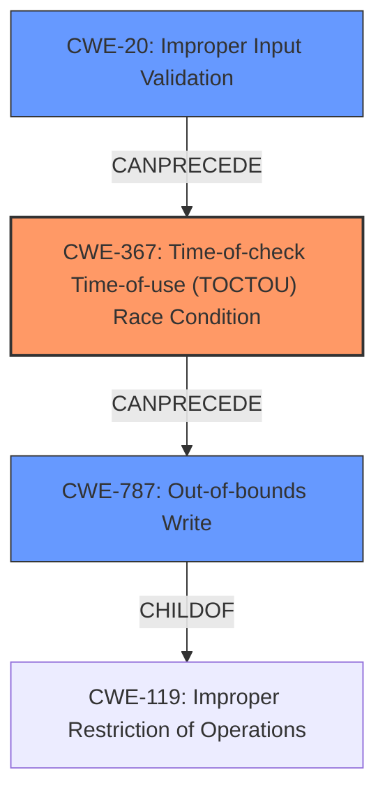

# Final Resolution for CVE-2022-24949

# Summary
| CWE ID | CWE Name | Confidence | CWE Abstraction Level | CWE Vulnerability Mapping Label | CWE-Vulnerability Mapping Notes |
|---|---|---|---|---|---|
| CWE-367 | Time-of-check Time-of-use (TOCTOU) Race Condition | 0.95 | Base | Primary | Allowed |
| CWE-787 | Out-of-bounds Write | 0.90 | Base | Secondary | Allowed |
| CWE-20 | Improper Input Validation | 0.80 | Class | Secondary | Allowed-with-Review |

## Evidence and Confidence

*   **Confidence Score:** 0.90
*   **Evidence Strength:** HIGH

## Relationship Analysis
The primary weakness is a **race condition** (CWE-367). This can lead to a state where a buffer overflow (CWE-787) can occur due to improper input validation (CWE-20) of the `SocketEndpoint` before passing it to `PipeSocketHandler::listen()`.

## Vulnerability Chain
The vulnerability chain starts with **CWE-20** (Improper Input Validation) where the `SocketEndpoint` is not validated correctly. This leads to **CWE-367** (TOCTOU Race Condition) where the state of a resource changes between check and use due to missing synchronization when operations like `unlink()`, `bind()`, `chmod()`, and `chown()` are performed. Finally, the **race condition** can then lead to **CWE-787** (Out-of-bounds Write) due to the `strcpy()` without checking the size of the input buffer.

## Summary of Analysis
Based on the initial analysis, criticism, and graph relationships, the final decision is to classify the vulnerability with the following CWEs:

*   **CWE-367** (Time-of-check Time-of-use (TOCTOU) Race Condition) as the primary **ROOTCAUSE**. The evidence for this is the explicit mention of the ability to manipulate file paths between checks and use, leading to privilege escalation.
*   **CWE-787** (Out-of-bounds Write) as a secondary weakness. The use of `strcpy()` without checking the size of the input buffer (`name` variable from `SocketEndpoint`) against the size of the destination buffer (`local.sun_path`, fixed at 108 bytes) is a clear indicator of an out-of-bounds write.
*   **CWE-20** (Improper Input Validation) as a contributing factor. The code should have validated the supplied `SocketEndpoint` before passing it to `PipeSocketHandler::listen()`.

The decision to prioritize **CWE-787** over **CWE-120** is based on the recommendation to avoid using **CWE-119** directly when a more specific child CWE is applicable. Since the vulnerability involves writing beyond the bounds of the buffer, **CWE-787** is a more precise classification. Also, the use of **CWE-120** is "Allowed-with-Review" because it's often misused, whereas **CWE-787** directly describes the out-of-bounds write.

The decision to include **CWE-20** is based on the criticism that the logic bug allows for arbitrary file deletion because an attacker is able to provide a `SocketEndpoint` to the `PipeSocketHandler::listen()` function.

The selected CWEs are at the optimal level of specificity, with **CWE-367** and **CWE-787** being Base level CWEs and **CWE-20** being a Class level CWE with no specific Base level children that describe the vulnerability. This ensures that the classification is accurate and useful for trend analysis.