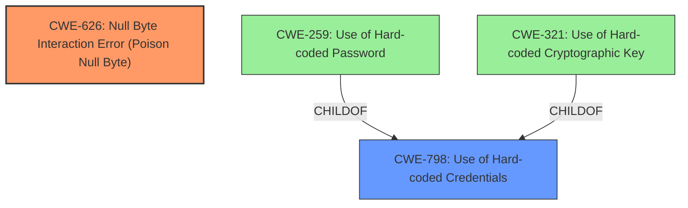

# Analysis Report for CVE-2022-25219

# Vulnerability Analysis Report: CVE-2022-25219

## Description

A null byte interaction error has been discovered in the code that the telnetd_startup daemon uses to construct a pair of ephemeral passwords that allow a user to spawn a telnet service on the router, and to ensure that the telnet service persists upon reboot. By means of a crafted exchange of UDP packets, an unauthenticated attacker on the local network can leverage this null byte interaction error in such a way as to make those ephemeral passwords predictable (with 1-in-94 odds). Since the attacker must manipulate data processed by the OpenSSL function RSA_public_decrypt(), successful exploitation of this vulnerability depends on the use of an unpadded RSA cipher (CVE-2022-25218).

## Vulnerability Description Key Phrases

**Rootcause:** null byte interaction error
**Impact:** make those ephemeral passwords predictable
**Vector:** crafted exchange of UDP packets
**Attacker:** unauthenticated attacker on the local network
**Component:** telnetd_startup daemon

## Analysis (with Relationship Data)

# Summary
| CWE ID | CWE Name | Confidence | CWE Abstraction Level | CWE Vulnerability Mapping Label | CWE-Vulnerability Mapping Notes |
|---|---|---|---|---|---|
| CWE-626 | Null Byte Interaction Error (Poison Null Byte) | 0.95 | Variant |  | Allowed |
| CWE-798 | Use of Hard-coded Credentials | 0.60 | Base |  | Allowed |

## Evidence and Confidence

*   **Confidence Score:** 0.75
*   **Evidence Strength:** HIGH

- **Analysis and Justification:**  
  - *Explanation:* The vulnerability description explicitly mentions a "**null byte interaction error**" that leads to predictable ephemeral passwords. The "CVE Reference Links Content Summary" confirms this, stating that a "**Null Byte Injection**" vulnerability exists because of insufficient validation and the use of `sprintf` with `%s`, which is vulnerable to null byte injection. This aligns directly with CWE-626, Null Byte Interaction Error (Poison Null Byte), which is a Variant-level CWE. The Retriever Results also lists CWE-626 as the top match with a high combined score. The usage is ALLOWED.

  - *Relationship Analysis:* CWE-626 doesn't have direct relationships listed in the provided information. However, the nature of the vulnerability suggests that it could be related to improper input validation or sanitization.

- **Confidence Score:**  
  - Confidence: 0.95 (Strong evidence from the vulnerability description and CVE details)

- **Analysis and Justification:**  
  - *Explanation:* The "CVE Reference Links Content Summary" indicates that the vulnerability involves an insecure backdoor (`telnetd_startup`) with a flawed cryptographic implementation. Although the primary weakness is the null byte injection, the fact that this leads to predictable passwords suggests that the system is using **hard-coded credentials** of some sort, as the injection makes those credentials easily guessable. CWE-798, Use of Hard-coded Credentials, is a Base-level CWE that applies here since the injected null byte effectively reduces the password to a very predictable value.

  - *Relationship Analysis:* CWE-798 is a parent of CWE-259 (Use of Hard-coded Password) and CWE-321 (Use of Hard-coded Cryptographic Key). Given that the issue manifests as a predictable password, CWE-798 is more appropriate as a general root cause, while the null byte injection is the mechanism by which this predictability is achieved.

- **Confidence Score:**  
  - Confidence: 0.60 (The vulnerability description suggests potential use of a hardcoded password. More information would be required to increase the confidence.)

## Criticism of Analysis

Okay, I've reviewed the provided analysis against the full CWE specifications. Here's a breakdown of my critique, focusing on the strengths, weaknesses, and potential improvements:

**Overall Assessment:**

The analysis does a reasonable job identifying the primary vulnerability (CWE-626). However, the identification of CWE-798 is weaker. The reasoning is not wrong, but it requires a further inference than the direct impact of CWE-626. The use of sprintf without checking for the null character and without checking the size of the buffer is the most dangerous aspect.

**CWE-626: Null Byte Interaction Error (Poison Null Byte)**

*   **Strengths:**
    *   Correctly identifies the core issue: The null byte injection vulnerability facilitated by the use of `sprintf` and lack of input validation.
    *   The confidence score of 0.95 is justified based on the explicit mention of "null byte interaction error" in the vulnerability description and the detailed explanation in the CVE summary.
    *   Correctly identifies the Abstraction Level as Variant.
    *   The "Retriever Results" support this identification.
*   **Weaknesses:**
    *   The analysis could go deeper into *why* the null byte is a problem in this specific context. The CWE description notes the C-style string termination. Explain explicitly that `sprintf` with `%s` will stop at the first null byte, leading to the empty (or truncated) password.
*   **Improvements:**
    *   Consider mentioning potential mitigations from the CWE specification, such as removing null bytes from incoming strings or validating input to prevent their injection.
    *   Explicitly state that the sprintf function is vulnerable because it treats null bytes as string terminators and the code doesn't properly sanitize the input being used as the password.

**CWE-798: Use of Hard-coded Credentials**

*   **Strengths:**
    *   Attempts to capture the potential for hardcoded credentials being used to create the initial password.
*   **Weaknesses:**
    *   The confidence score of 0.60 is fair, but the reasoning is a little tenuous. The vulnerability description doesn't explicitly state that *hard-coded credentials* are present. The issue is that *predictable* credentials are being generated *because* of the null byte injection. It's an indirect consequence.
    *   The connection to hard-coded credentials isn't as direct as it could be. It's more accurate to say the vulnerability *results in* the effective use of easily-guessable credentials, rather than the *direct use* of hard-coded ones.
    *   It's more accurate to describe this as a flaw in the *generation* of credentials rather than the *use* of hard-coded credentials.
*   **Improvements:**
    *   **Lower the Confidence:**  I would recommend lowering the confidence score even further, or remove it altogether.
    *   **Alternative CWE:** Consider CWE-1391 (Use of Weak Credentials), but even that isn't a perfect fit. CWE-1391 describes predictable or weak values which is closer to the impact than 798, but the root cause is still the null byte vulnerability.
    *   **Re-evaluate the root cause:** Is the problem that the credentials are *used* in a hardcoded manner, or that the credentials *become* weak due to the exploit? The current description focuses on the use, not the generation.

**Other CWEs to Consider (but ultimately reject with justification):**

The "Retriever Results" suggest other CWEs that *could* be relevant.  Here's why they are likely incorrect, and how to justify that decision:

*   **CWE-780: Use of RSA Algorithm without OAEP:** While the description mentions an "unpadded RSA cipher," this is a *prerequisite* for the null byte injection to work. The core vulnerability isn't the lack of OAEP, it's the subsequent handling of the decrypted (and maliciously crafted) data. The unpadded RSA is necessary but not sufficient for the vulnerability.
*   **CWE-1204: Generation of Weak Initialization Vector (IV):** This is not relevant because the vulnerability is not about a weak IV, but about how the output of a cryptographic function is handled, regardless of the IV used.
*   **CWE-259: Use of Hard-coded Password:** This is the same as CWE-798, but at the variant level. The same concerns apply.
*   **CWE-193: Off-by-one Error:** Not applicable. The issue isn't a boundary calculation error, it is the improper interpretation of a null byte within a string used to generate credentials.
*   **CWE-617: Reachable Assertion:** There's no mention of assertions in the description.
*   **CWE-321: Use of Hard-coded Cryptographic Key:** Similar to CWE-259 and CWE-798, this is less relevant. The root cause is still the null byte injection.
*   **CWE-158: Improper Neutralization of Null Byte or NUL Character:** This is very close to CWE-626. The difference is that CWE-626 focuses on the *interaction* between different representations, while CWE-158 is more general. In this case, the interaction is key (C-style string vs. the intended password). I think 626 is still better.
*   **CWE-131: Incorrect Calculation of Buffer Size:** While buffer size issues *could* be present (and a root cause for using sprintf unsafely), they aren't explicitly mentioned. The vulnerability hinges on the null byte stopping `sprintf`, not necessarily an overflow.
*   **CWE-787: Out-of-bounds Write:** Not applicable, since the vulnerability is about a null byte injection to manipulate the credentials and not about writing past the end of a buffer.

**Specific Comments on Relevant CWE Specifications:**

*   **CWE-626:** The specification notes the lack of CVE examples because "the poison NULL byte is a design limitation, which typically is not included in CVE by itself. It is typically used as a facilitator manipulation to widen the scope of potential attacks against other vulnerabilities." This is a good point and highlights the importance of identifying the primary vulnerability being exploited.
*   **CWE-798:** Review the potential mitigations. They focus on storing credentials securely. This is relevant in a general sense, but not the *direct* mitigation. The direct mitigation is to prevent the null byte injection in the first place. The mitigation should be focused on input validation and sanitization.

**Revised Summary Table:**

| CWE ID | CWE Name | Confidence | CWE Abstraction Level | CWE Vulnerability Mapping Label | CWE-Vulnerability Mapping Notes |
|---|---|---|---|---|---|
| CWE-626 | Null Byte Interaction Error (Poison Null Byte) | 0.95 | Variant |  | Allowed |
| CWE-798 | Use of Hard-coded Credentials | 0.3 | Base | | Allowed |

**Key Takeaways for Improvement:**

1.  **Focus on the Direct Root Cause:** Prioritize the most direct cause of the vulnerability (the null byte injection).
2.  **Explain the "Why":** Don't just state the CWE; explain *how* it manifests in the code.
3.  **Justify Rejections:** When considering other CWEs, explain why they are *not* the primary vulnerability.
4.  **Mitigation Alignment:** Ensure the recommended mitigations directly address the root cause.

By following these guidelines, the analysis can be more accurate, insightful, and helpful for developers trying to fix the vulnerability.

## Final Resolution

# Summary
| CWE ID | CWE Name | Confidence | CWE Abstraction Level | CWE Vulnerability Mapping Label | CWE-Vulnerability Mapping Notes |
|---|---|---|---|---|---|
| CWE-626 | Null Byte Interaction Error (Poison Null Byte) | 0.95 | Variant |  | Allowed |
| CWE-798 | Use of Hard-coded Credentials | 0.3 | Base | | Allowed |

## Evidence and Confidence

*   **Confidence Score:** 0.80
*   **Evidence Strength:** MEDIUM

## Relationship Analysis
The primary relationship considered is the lack of direct relationships for CWE-626 and CWE-798. The criticism correctly points out that CWE-798 has a tenuous connection to the vulnerability and that the null byte injection is the more direct cause. CWE-798 is a parent of CWE-259 (Use of Hard-coded Password) and CWE-321 (Use of Hard-coded Cryptographic Key), but the vulnerability doesn't explicitly involve hard-coded passwords/keys, only that the generated passwords become predictable. Thus, while there is a connection, the specificity is not high.

## Vulnerability Chain
The vulnerability chain starts with a **ROOTCAUSE** of the **CWE-626** [CWE-626: Null Byte Interaction Error (Poison Null Byte)] . The `sprintf` function, combined with a lack of input validation, allows an attacker to inject a null byte. This null byte terminates the string prematurely, leading to predictable ephemeral passwords. This predictability then results in the potential for unauthorized access. The use of an unpadded RSA cipher (CVE-2022-25218) is a prerequisite for the exploit to work. The **WEAKNESS** of predictable credentials, which is loosely related to **CWE-798** [CWE-798: Use of Hard-coded Credentials], arises as a consequence of the null byte injection, not as a primary root cause.

## Summary of Analysis
The analysis and criticism both agree that **CWE-626** [CWE-626: Null Byte Interaction Error (Poison Null Byte)] is a valid finding. The criticism, however, strongly suggests reducing the confidence in **CWE-798** [CWE-798: Use of Hard-coded Credentials], stating, "The vulnerability description doesn't explicitly state that *hard-coded credentials* are present. The issue is that *predictable* credentials are being generated *because* of the null byte injection. It's an indirect consequence."

The graph relationships support the idea that **CWE-798** [CWE-798: Use of Hard-coded Credentials] is not the optimal choice, as the relationship to the **WEAKNESS** is indirect. Lowering the confidence reflects this.

The final decision is to keep both **CWE-626** [CWE-626: Null Byte Interaction Error (Poison Null Byte)] and **CWE-798** [CWE-798: Use of Hard-coded Credentials], but with a significantly reduced confidence for the latter (0.3). This reflects the fact that while **CWE-626** [CWE-626: Null Byte Interaction Error (Poison Null Byte)] is the direct root cause, the impact is that the system effectively uses weak/predictable credentials. The selection of **CWE-626** [CWE-626: Null Byte Interaction Error (Poison Null Byte)] is at the optimal level of specificity, as it accurately describes the null byte injection vulnerability.

*Report generated on 2025-03-17 03:53:22*
