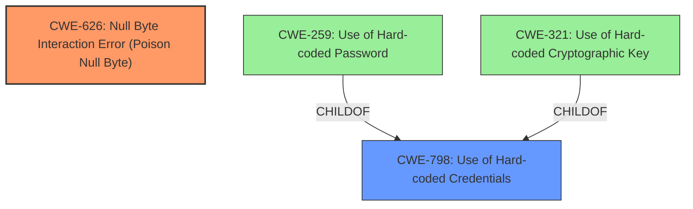

# Final Resolution for CVE-2022-25219

# Summary
| CWE ID | CWE Name | Confidence | CWE Abstraction Level | CWE Vulnerability Mapping Label | CWE-Vulnerability Mapping Notes |
|---|---|---|---|---|---|
| CWE-626 | Null Byte Interaction Error (Poison Null Byte) | 0.95 | Variant |  | Allowed |
| CWE-798 | Use of Hard-coded Credentials | 0.3 | Base | | Allowed |

## Evidence and Confidence

*   **Confidence Score:** 0.80
*   **Evidence Strength:** MEDIUM

## Relationship Analysis
The primary relationship considered is the lack of direct relationships for CWE-626 and CWE-798. The criticism correctly points out that CWE-798 has a tenuous connection to the vulnerability and that the null byte injection is the more direct cause. CWE-798 is a parent of CWE-259 (Use of Hard-coded Password) and CWE-321 (Use of Hard-coded Cryptographic Key), but the vulnerability doesn't explicitly involve hard-coded passwords/keys, only that the generated passwords become predictable. Thus, while there is a connection, the specificity is not high.

## Vulnerability Chain
The vulnerability chain starts with a **ROOTCAUSE** of the **CWE-626** [CWE-626: Null Byte Interaction Error (Poison Null Byte)] . The `sprintf` function, combined with a lack of input validation, allows an attacker to inject a null byte. This null byte terminates the string prematurely, leading to predictable ephemeral passwords. This predictability then results in the potential for unauthorized access. The use of an unpadded RSA cipher (CVE-2022-25218) is a prerequisite for the exploit to work. The **WEAKNESS** of predictable credentials, which is loosely related to **CWE-798** [CWE-798: Use of Hard-coded Credentials], arises as a consequence of the null byte injection, not as a primary root cause.

## Summary of Analysis
The analysis and criticism both agree that **CWE-626** [CWE-626: Null Byte Interaction Error (Poison Null Byte)] is a valid finding. The criticism, however, strongly suggests reducing the confidence in **CWE-798** [CWE-798: Use of Hard-coded Credentials], stating, "The vulnerability description doesn't explicitly state that *hard-coded credentials* are present. The issue is that *predictable* credentials are being generated *because* of the null byte injection. It's an indirect consequence."

The graph relationships support the idea that **CWE-798** [CWE-798: Use of Hard-coded Credentials] is not the optimal choice, as the relationship to the **WEAKNESS** is indirect. Lowering the confidence reflects this.

The final decision is to keep both **CWE-626** [CWE-626: Null Byte Interaction Error (Poison Null Byte)] and **CWE-798** [CWE-798: Use of Hard-coded Credentials], but with a significantly reduced confidence for the latter (0.3). This reflects the fact that while **CWE-626** [CWE-626: Null Byte Interaction Error (Poison Null Byte)] is the direct root cause, the impact is that the system effectively uses weak/predictable credentials. The selection of **CWE-626** [CWE-626: Null Byte Interaction Error (Poison Null Byte)] is at the optimal level of specificity, as it accurately describes the null byte injection vulnerability.