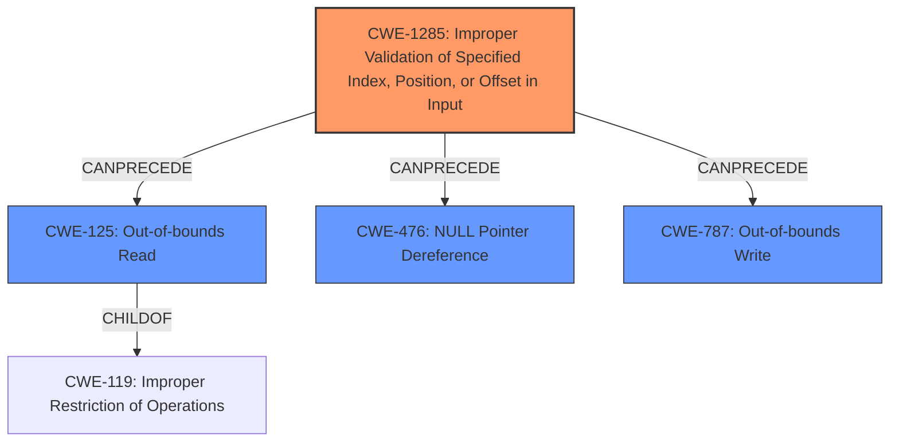

# Final Resolution for CVE-2022-25258

# Summary

| CWE ID | CWE Name | Confidence | CWE Abstraction Level | CWE Vulnerability Mapping Label | CWE-Vulnerability Mapping Notes |
|---|---|---|---|---|---|
| CWE-1285 | Improper Validation of Specified Index, Position, or Offset in Input | 0.85 | Base | Primary CWE | Allowed |
| CWE-125 | Out-of-bounds Read | 0.80 | Base | Secondary Candidate | Allowed |
| CWE-476 | NULL Pointer Dereference | 0.80 | Base | Secondary Candidate | Allowed |
| CWE-787 | Out-of-bounds Write | 0.60 | Base | Secondary Candidate | Allowed |

## Evidence and Confidence

*   **Confidence Score:** 0.80
*   **Evidence Strength:** HIGH

## Relationship Analysis

The primary relationship influencing the decision is the chain where **CWE-1285** (Improper Validation) *CanPrecede* **CWE-125** (Out-of-bounds Read) and **CWE-476** (NULL Pointer Dereference). The lack of validation of the interface index leads directly to the possibility of reading beyond the bounds of the buffer. In some cases, this invalid index can lead to a NULL pointer dereference, if the code attempts to use the out-of-bounds data as a pointer. The parent-child relationships show that **CWE-125** is a child of **CWE-119** (Improper Restriction of Operations within the Bounds of a Memory Buffer). We are using the base level **CWE-125** because it is more specific than its parent.

## Vulnerability Chain

The vulnerability chain starts with the **ROOTCAUSE** being **CWE-1285** (Improper Validation of Specified Index, Position, or Offset in Input). Because of the **WEAKNESS** **CWE-1285**, it leads to **CWE-125** (Out-of-bounds Read), **CWE-476** (NULL Pointer Dereference), and potentially **CWE-787** (Out-of-bounds Write). The final impact is memory corruption and potential code execution.

## Summary of Analysis

The initial analysis correctly identified **CWE-125**, **CWE-476**, and **CWE-1285** as relevant to the vulnerability. The criticism provided valuable suggestions for refining the classification and increasing confidence. I agree with the suggestion to prioritize **CWE-1285** as the primary **ROOTCAUSE**, as the vulnerability stems from the lack of input validation on the `interface` variable. The original analysis also did not consider that the **CWE-787** might occur.

The vulnerability description states: "The USB Gadget subsystem **lacks certain validation** of interface OS descriptor requests... Memory corruption might occur." This directly supports the classification of **CWE-1285** as the primary weakness. The lack of validation allows an attacker to supply an invalid index, leading to an out-of-bounds read (**CWE-125**). The advisory also confirms that the functions `count_ext_prop`, `len_ext_prop`, and `fill_ext_prop` do not check if the retrieved `usb_function` pointer is valid before dereferencing, which leads to a null pointer dereference (**CWE-476**) if the pointer is NULL.

The inclusion of **CWE-787** (Out-of-bounds Write) as a secondary candidate is based on the NetApp advisory's mention of memory corruption and the possibility suggested by the github repo. This is speculative but plausible given the potential for writing to arbitrary memory locations as a consequence of the out-of-bounds read.

The selected CWEs are at the optimal level of specificity, as they are all Base-level CWEs that accurately reflect the specific weaknesses present in the vulnerability.