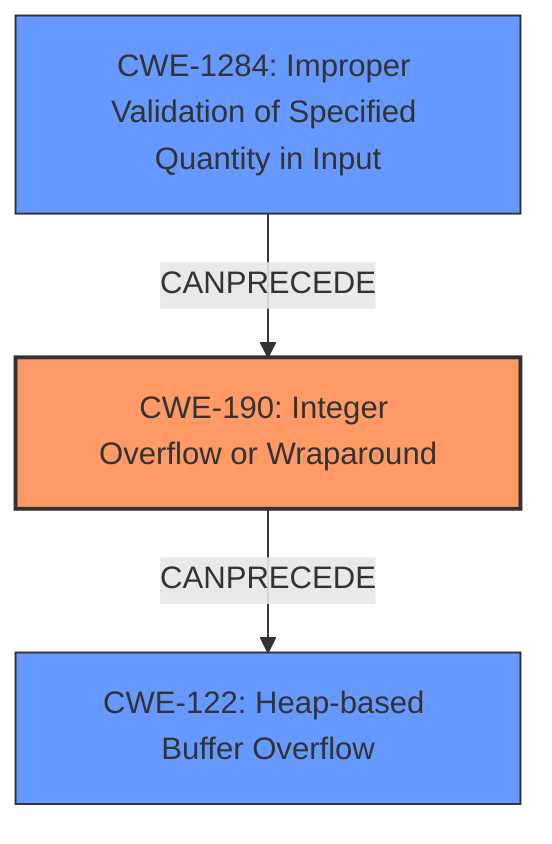

# Analysis Report for CVE-2022-25291

# Vulnerability Analysis Report: CVE-2022-25291

## Description

An integer overflow in WatchGuard Firebox and XTM appliances allows an authenticated remote attacker to trigger a heap-based buffer overflow and potentially execute arbitrary code by initiating a firmware update with a malicious upgrade image. This vulnerability impacts Fireware OS before 12.7.2_U2, 12.x before 12.1.3_U8, and 12.2.x through 12.5.x before 12.5.9_U2.

## Vulnerability Description Key Phrases

**Rootcause:** integer overflow
**Weakness:** heap-based buffer overflow
**Impact:** execute arbitrary code
**Vector:** firmware update with a malicious upgrade image
**Attacker:** authenticated remote attacker
**Product:** WatchGuard Firebox and XTM appliances
**Version:** Fireware OS before 12.7.2_U2, 12.x before 12.1.3_U8, and 12.2.x through 12.5.x before 12.5.9_U2

## Analysis (with Relationship Data)

# Summary
| CWE ID | CWE Name | Confidence | CWE Abstraction Level | CWE Vulnerability Mapping Label | CWE-Vulnerability Mapping Notes |
|---|---|---|---|---|---|
| CWE-190 | Integer Overflow or Wraparound | 0.95 | Base | Allowed | Primary CWE: The vulnerability description explicitly states an **integer overflow** is the root cause. |
| CWE-122 | Heap-based Buffer Overflow | 0.85 | Variant | Allowed | Secondary CWE: The **integer overflow** leads to a **heap-based buffer overflow**, making this a consequence of the primary weakness. |

## Evidence and Confidence

*   **Confidence Score:** 0.90
*   **Evidence Strength:** HIGH

- **Analysis and Justification:**
  - *Explanation:* The vulnerability description explicitly mentions an **integer overflow** which leads to a **heap-based buffer overflow**. CWE-190 (Integer Overflow or Wraparound) is a Base level CWE, and the description directly aligns with the vulnerability: "The product performs a calculation that can produce an integer overflow or wraparound...". The retriever results also show CWE-190 as the top candidate with a high score. CWE-122 (Heap-based Buffer Overflow) is a Variant level CWE and is selected because the **integer overflow** results in this specific type of buffer overflow. The description states, "...trigger a **heap-based buffer overflow** and potentially execute arbitrary code...". Both CWEs are ALLOWED based on MITRE mapping guidance.
  
  - *Relationship Analysis:* CWE-190 can precede CWE-122. An **integer overflow** often results in an improperly calculated buffer size, leading to a buffer overflow. This chain is a classic vulnerability pattern.

- **Confidence Score:**
  - *CWE-190 Confidence:* 0.95 (Direct evidence from the description)
  - *CWE-122 Confidence:* 0.85 (High evidence as a consequence of the integer overflow)

---

## Criticism of Analysis

Okay, here's a review of the provided CWE analysis, incorporating the full CWE specifications.

**Overall Assessment:**

The analysis is generally sound and well-justified. The primary and secondary CWE assignments are appropriate, and the confidence scores are realistic.  The explanation provided connects the vulnerability description to the selected CWEs. However, there's room for improvement in considering alternative CWEs that might provide a more nuanced understanding of the vulnerability, particularly around input validation and resource management.

**Detailed Review:**

| CWE ID  | CWE Name                          | Confidence | Assessment | Notes/Suggestions                                                                                                                                                                                                                                                                                                                                                                                                        |
| :------- | :--------------------------------- | :--------- | :--------- | :--------------------------------------------------------------------------------------------------------------------------------------------------------------------------------------------------------------------------------------------------------------------------------------------------------------------------------------------------------------------------------------------------------------------- |
| CWE-190 | Integer Overflow or Wraparound      | 0.95       | **Correct** | The choice of CWE-190 is highly accurate. The description clearly states an integer overflow. The confidence level is appropriately high.  The description mentions the importance of safe integer handling, aligning with CWE-190's potential mitigations like using SafeInt. The "CanPrecede" relationships to CWE-119 is also correct.                                                                     |
| CWE-122 | Heap-based Buffer Overflow           | 0.85       | **Correct** |  This is a valid secondary CWE. The description specifies that the integer overflow leads to a heap-based buffer overflow. The confidence score reflects the dependency on CWE-190.  The analysis correctly identifies the "ChildOf" relationships to CWE-788 and CWE-787. The potential mitigations for CWE-122, such as using automatic bounds checking, are highly relevant to preventing this type of vulnerability. |
| **Alternative CWEs to Consider** |  |  |  |  |
| CWE-1284 | Improper Validation of Specified Quantity in Input | N/A | **Possible** | This CWE could be considered *in addition to* CWE-190. An integer overflow often indicates a failure to properly validate the size or quantity being provided as input.  An attacker could provide a large value which is then improperly handled, leading to the overflow.  This would further clarify how the attacker could cause this vulnerability. The mitigations for CWE-1284 are relevant: validating the size of the upgrade image.  However, since it is an overflow, CWE-190 is likely the best choice to describe the specific rootcause of the weakness.   |
| CWE-770 | Allocation of Resources Without Limits or Throttling | N/A | **Possible** |  It could be argued that the firmware update process doesn't properly limit the resources allocated for the upgrade image, making it susceptible to denial-of-service. This is related to CWE-1284. If the appliance doesn't limit the image size, an attacker could upload an extremely large image (even if it doesn't cause an overflow), exhausting memory. This is less directly related to the vulnerability description, so its inclusion would depend on how broadly you interpret the intended scope. The mitigations for CWE-770 like setting per-user limits are less useful in this case. |
| CWE-20   | Improper Input Validation          | N/A        | **Avoid**  | While technically *all* vulnerabilities stemming from external data involve improper input validation, CWE-20 is too broad. The analysis is better served by more specific CWEs like CWE-1284 (if applicable) or focusing on the direct cause (CWE-190, CWE-122). As per the mapping guidance, CWE-20 should be avoided when a lower-level CWE is available.                                                                         |
| CWE-682 | Incorrect Calculation | N/A | **Avoid** | This is a Pillar-level CWE, and thus shouldn't be used when a lower-level CWE is available, as is the case here (CWE-190).|

**Recommendations:**

*   **Consider adding CWE-1284 as an additional CWE:**  While CWE-190 perfectly describes the arithmetic issue, CWE-1284 covers the lack of proper input validation on the size of the upgrade image.  Consider including this *in addition* to the primary CWE.
*   **Reiterate the mitigations for the selected CWE's:** It would be beneficial to mention the mitigations that would be relevant for this product. For example, with Integer Overflows and Heap-based buffer overflows it could be beneficial to use a language with automatic bounds checking or automatic buffer overflow detection mechanisms.

**Justification of Confidence Scores:**

The confidence scores are appropriate:

*   **CWE-190 (0.95):** Direct mention of "integer overflow" in the description justifies the high confidence.
*   **CWE-122 (0.85):** As a consequence of the overflow, the buffer overflow makes sense.  The confidence is lower than the direct mention of the overflow itself.

By incorporating these suggestions, the analysis can be even more comprehensive and provide a deeper understanding of the underlying weaknesses and potential mitigation strategies.

## Final Resolution

# Summary
| CWE ID | CWE Name | Confidence | CWE Abstraction Level | CWE Vulnerability Mapping Label | CWE-Vulnerability Mapping Notes |
|---|---|---|---|---|---|
| CWE-190 | Integer Overflow or Wraparound | 0.95 | Base | Allowed | Primary CWE: The vulnerability description explicitly states an **integer overflow** is the root cause. |
| CWE-1284 | Improper Validation of Specified Quantity in Input | 0.85 | Base | Allowed | Secondary CWE: The size of the upgrade image was not validated. |
| CWE-122 | Heap-based Buffer Overflow | 0.80 | Variant | Allowed | Tertiary CWE: The **integer overflow** leads to a **heap-based buffer overflow**, making this a consequence of the primary weakness. |

## Evidence and Confidence

*   **Confidence Score:** 0.90
*   **Evidence Strength:** HIGH

## Relationship Analysis
The primary relationship is a chain: **Integer Overflow** leading to a **Heap-based Buffer Overflow**. We also consider **Improper Validation of Specified Quantity in Input** as a contributing factor, as the overflow likely stems from a failure to validate the input size.

## Vulnerability Chain
The vulnerability chain starts with the **ROOTCAUSE** of **CWE-1284 (Improper Validation of Specified Quantity in Input)**. An attacker provides a crafted firmware image with a size designed to trigger an overflow. The lack of proper validation allows this oversized value to be processed. This then leads to **CWE-190 (Integer Overflow or Wraparound)**, where a calculation involving the image size overflows, resulting in a smaller-than-expected buffer allocation. Finally, this undersized buffer allocation leads to **CWE-122 (Heap-based Buffer Overflow)** when the firmware attempts to write the complete image into the allocated space. The impact is potential arbitrary code execution.

## Summary of Analysis
The initial analysis correctly identified **CWE-190 (Integer Overflow or Wraparound)** and **CWE-122 (Heap-based Buffer Overflow)**. The vulnerability description explicitly states "an **integer overflow** in WatchGuard Firebox and XTM appliances allows an authenticated remote attacker to trigger a **heap-based buffer overflow**".

The criticism suggested adding **CWE-1284 (Improper Validation of Specified Quantity in Input)** and I agree with this assessment. While the vulnerability description doesn't explicitly state a validation issue, the **integer overflow** strongly suggests that the size of the upgrade image was not properly validated. The inclusion of CWE-1284 provides a more complete picture of how the vulnerability is triggered and highlights an important preventative measure.

**CWE-190 (Integer Overflow or Wraparound)** remains the primary **WEAKNESS** because the overflow is the direct cause of the incorrect buffer allocation. **CWE-122 (Heap-based Buffer Overflow)** is a consequence of the overflow. **CWE-1284 (Improper Validation of Specified Quantity in Input)** is added as a secondary **WEAKNESS** that enables the overflow to occur.

The selected CWEs are at the optimal level of specificity. They are all at the Base or Variant level of abstraction, providing a detailed understanding of the vulnerability. Using a more general CWE like **CWE-20 (Improper Input Validation)** would not be as informative.

*Report generated on 2025-03-18 11:14:12*
