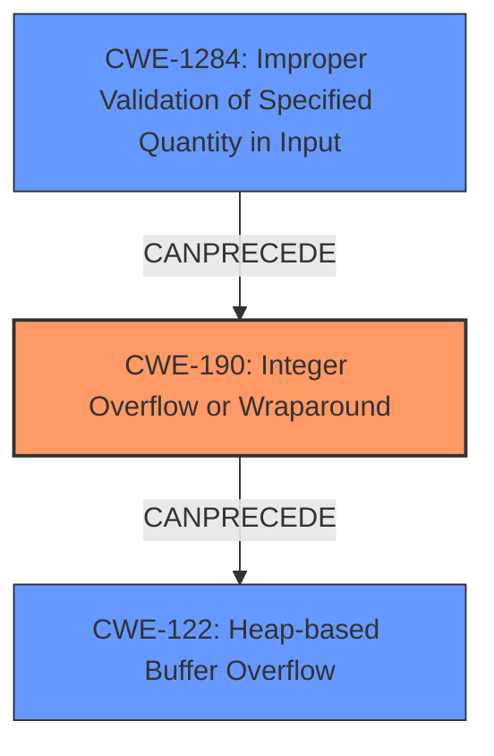

# Final Resolution for CVE-2022-25291

# Summary
| CWE ID | CWE Name | Confidence | CWE Abstraction Level | CWE Vulnerability Mapping Label | CWE-Vulnerability Mapping Notes |
|---|---|---|---|---|---|
| CWE-190 | Integer Overflow or Wraparound | 0.95 | Base | Allowed | Primary CWE: The vulnerability description explicitly states an **integer overflow** is the root cause. |
| CWE-1284 | Improper Validation of Specified Quantity in Input | 0.85 | Base | Allowed | Secondary CWE: The size of the upgrade image was not validated. |
| CWE-122 | Heap-based Buffer Overflow | 0.80 | Variant | Allowed | Tertiary CWE: The **integer overflow** leads to a **heap-based buffer overflow**, making this a consequence of the primary weakness. |

## Evidence and Confidence

*   **Confidence Score:** 0.90
*   **Evidence Strength:** HIGH

## Relationship Analysis
The primary relationship is a chain: **Integer Overflow** leading to a **Heap-based Buffer Overflow**. We also consider **Improper Validation of Specified Quantity in Input** as a contributing factor, as the overflow likely stems from a failure to validate the input size.

## Vulnerability Chain
The vulnerability chain starts with the **ROOTCAUSE** of **CWE-1284 (Improper Validation of Specified Quantity in Input)**. An attacker provides a crafted firmware image with a size designed to trigger an overflow. The lack of proper validation allows this oversized value to be processed. This then leads to **CWE-190 (Integer Overflow or Wraparound)**, where a calculation involving the image size overflows, resulting in a smaller-than-expected buffer allocation. Finally, this undersized buffer allocation leads to **CWE-122 (Heap-based Buffer Overflow)** when the firmware attempts to write the complete image into the allocated space. The impact is potential arbitrary code execution.

## Summary of Analysis
The initial analysis correctly identified **CWE-190 (Integer Overflow or Wraparound)** and **CWE-122 (Heap-based Buffer Overflow)**. The vulnerability description explicitly states "an **integer overflow** in WatchGuard Firebox and XTM appliances allows an authenticated remote attacker to trigger a **heap-based buffer overflow**".

The criticism suggested adding **CWE-1284 (Improper Validation of Specified Quantity in Input)** and I agree with this assessment. While the vulnerability description doesn't explicitly state a validation issue, the **integer overflow** strongly suggests that the size of the upgrade image was not properly validated. The inclusion of CWE-1284 provides a more complete picture of how the vulnerability is triggered and highlights an important preventative measure.

**CWE-190 (Integer Overflow or Wraparound)** remains the primary **WEAKNESS** because the overflow is the direct cause of the incorrect buffer allocation. **CWE-122 (Heap-based Buffer Overflow)** is a consequence of the overflow. **CWE-1284 (Improper Validation of Specified Quantity in Input)** is added as a secondary **WEAKNESS** that enables the overflow to occur.

The selected CWEs are at the optimal level of specificity. They are all at the Base or Variant level of abstraction, providing a detailed understanding of the vulnerability. Using a more general CWE like **CWE-20 (Improper Input Validation)** would not be as informative.