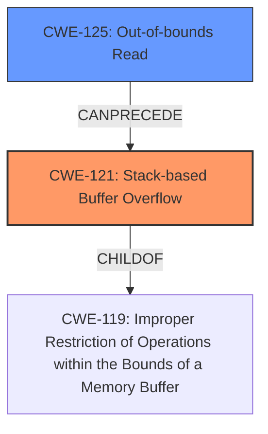

# Analysis Report for CVE-2022-25308

# Vulnerability Analysis Report: CVE-2022-25308

## Description

A stack-based buffer overflow flaw was found in the Fribidi package. This flaw allows an attacker to pass a specially crafted file to the Fribidi application, which leads to a possible memory leak or a denial of service.

## Vulnerability Description Key Phrases

**Rootcause:** stack-based buffer overflow
**Impact:** ['memory leak', 'denial of service']
**Vector:** pass a specially crafted file
**Attacker:** attacker
**Product:** Fribidi package

## Analysis (with Relationship Data)

# Summary
| CWE ID | CWE Name | Confidence | CWE Abstraction Level | CWE Vulnerability Mapping Label | CWE-Vulnerability Mapping Notes |
|---|---|---|---|---|---|
| CWE-121 | Stack-based Buffer Overflow | 1.0 | Variant | Allowed | The vulnerability is explicitly described as a stack-based buffer overflow. |
| CWE-125 | Out-of-bounds Read | 0.7 | Base | Allowed | The root cause involves reading data before the beginning of the buffer, resulting in an underflow. |

## Evidence and Confidence

*   **Confidence Score:** 0.9
*   **Evidence Strength:** HIGH

- **Analysis and Justification:**  
  - *Explanation:* The vulnerability description clearly states a **stack-based buffer overflow** flaw in the Fribidi package. The CVE Reference Links Content Summary confirms this, detailing that the vulnerability arises from a missing conditional check for the length of a string before accessing a pointer, leading to a **stack buffer underflow**. This directly aligns with CWE-121 (Stack-based Buffer Overflow), a Variant-level CWE which is appropriate given the specificity of the stack allocation. The retriever result also gives it a good score. The description from the vulnerability summary of crafted input leading to memory leak, denial of service, or potentially arbitrary code execution is consistent with impacts from stack overflows. CWE-125 (Out-of-bounds Read) is also relevant as the root cause involves attempting to access `S_[len - 1]` without validating `len > 0`, leading to negative indexing and an out-of-bounds read before the start of the buffer. The fix described is to add a conditional check `if (len > 0)` before the vulnerable memory access.

  - *Relationship Analysis:* CWE-121 is a variant of CWE-119 (Improper Restriction of Operations within the Bounds of a Memory Buffer), providing a more specific classification. CWE-125 (Out-of-bounds Read) is a related weakness as the negative indexing results in reading memory outside the intended buffer. CWE-125 is the base class. CWE-787 (Out-of-bounds Write) is not chosen because there's no evidence of a write operation.

- **Confidence Score:**  
  - *Example:* Confidence: 1.0 (High evidence from technical description and CVE reference materials for CWE-121).
  - *Example:* Confidence: 0.7 (Good evidence that the root cause involves reading outside of buffer, leading to stack underflow and mapping to CWE-125).

## Criticism of Analysis

Okay, here's a review of the provided analysis, incorporating the full CWE specifications.

**Overall Assessment:**

The analysis is generally good. It correctly identifies CWE-121 (Stack-based Buffer Overflow) as the primary vulnerability. The inclusion of CWE-125 (Out-of-bounds Read) is also reasonable, as the underflow contributes to the broader vulnerability. The confidence scores are appropriate given the evidence.  However, there's room for improvement, particularly in considering alternative CWEs and providing a more nuanced explanation of the relationships between the chosen CWEs and other possibilities.

**Detailed Review:**

**1. CWE-121: Stack-based Buffer Overflow**

*   **Confidence:** 1.0 (Justified). The vulnerability description, CVE details, and fix all directly support this CWE.
*   **Rationale:**  The explanation is clear and well-reasoned. The description from the vulnerability summary of crafted input leading to memory leak, denial of service, or potentially arbitrary code execution is consistent with impacts from stack overflows. The mention of AddressSanitizer identifying the issue further strengthens the evidence.
*   **CWE Specification Considerations:**
    *   The analysis correctly classifies this as a Variant-level CWE, which is preferred.
    *   The relationships outlined in the CWE specification (ChildOf -> CWE-788, ChildOf -> CWE-787) are relevant, and it's implicitly understood that CWE-787 relates to *writing* out of bounds, while the specific issue here involves reading before the start of the buffer. (This distinction should be explained.)
    *   Mitigations mentioned in the specification (compiler-based overflow detection, abstraction libraries, input validation) would be applicable to prevent or detect this vulnerability.
*   **Suggestion:**  While the analysis states that the root cause is a stack buffer *underflow*, it primarily leads to *overwriting* adjacent stack memory, which is a typical buffer *overflow*. The justification should clarify that while the initial indexing error leads to a *read* before the buffer, the ultimate impact is writing beyond the allocated buffer.

**2. CWE-125: Out-of-bounds Read**

*   **Confidence:** 0.7 (Appropriate). The evidence supports the *initial* error being an out-of-bounds read *before* the start of the buffer (stack underflow).
*   **Rationale:** The explanation is satisfactory, highlighting the negative indexing that results from `len - 1` when `len` is 0. The description is consistent with this CWE.
*   **CWE Specification Considerations:**
    *   The analysis correctly classifies this as a Base-level CWE.
    *   The specification emphasizes input validation as a mitigation. The analysis correctly points out that the lack of validation on the input string length is the root cause.
*   **Suggestion:**  The analysis could benefit from a more explicit statement about *why* this is considered a contributing factor *in addition* to CWE-121. It's not simply an alternative; it's a component of the larger overflow problem. Clarify that the out-of-bounds read is the *trigger* that sets the stage for the subsequent out-of-bounds write.

**Alternative CWE Considerations:**

The analysis should have considered and explicitly ruled out some other related CWEs, even if briefly. This demonstrates a thorough understanding of the vulnerability.

*   **CWE-787: Out-of-bounds Write:**  While not the *initial* error, the *ultimate* impact is writing to memory outside the intended buffer. The vulnerability results in a write to the stack outside the allocated area, making 787 potentially more applicable than 125.  However, this is handled implicitly by including CWE-121 (Stack-based Buffer Overflow). This distinction is important.
*   **CWE-190: Integer Overflow or Wraparound:** If the `strlen()` function could potentially return a very large value due to a malformed string and subsequent negative indexing, leading to an out-of-bounds write, this could be a factor. While unlikely given the described scenario, it's worth a brief dismissal.
*   **CWE-193: Off-by-one Error:** This is *similar* to what is happening but not the core problem. The core problem is the *lack* of a bounds check, not just an error in the calculation itself.
*   **CWE-20: Improper Input Validation:** This is a higher-level weakness, but *could* be considered, since the root cause *is* the lack of validation on string length, causing the underflow, overflow, etc. The fix of `if (len > 0)` is essentially validation of input string length. But in this case, the analysis is correct in that it goes to the lower level CWEs.

**General Improvements:**

*   **Chaining/Composite Analysis:**  The analysis could benefit from a stronger statement about the *relationship* between CWE-121 and CWE-125. Is it a chain (CWE-125 *leads to* CWE-121), or is it more of a composite weakness?  The fix (checking `len > 0`) primarily addresses the read before the buffer, which then *prevents* the write beyond the buffer, which is a stack overflow. So it could be described as CWE-125 -> CWE-121 chain.
*   **Clarity on Stack Underflow vs. Overflow:**  The terminology "stack buffer underflow" and "stack-based buffer overflow" should be clearly differentiated. The *underflow* causes the *overflow*. This is important.
*   **Mitigation Details:** The analysis mentions mitigations in general terms. It would be stronger to explicitly mention how the recommended fix (`if (len > 0)`) directly addresses the input validation mitigation strategy outlined in the CWE-125 specification.
*   **Retriever Results:** The analysis does not discuss retriever results. However, it is worth noting the retriever result gives a higher score to CWE-193, CWE-190, CWE-125 etc. This highlights the potential for the issues outlined above and justification about why these were not selected.

**Revised Summary Table (Optional):**

| CWE ID | CWE Name | Confidence | CWE Abstraction Level | CWE Vulnerability Mapping Label | CWE-Vulnerability Mapping Notes |
|---|---|---|---|---|---|
| CWE-121 | Stack-based Buffer Overflow | 1.0 | Variant | Allowed | The vulnerability is explicitly described as a stack-based buffer overflow due to writing beyond the buffer boundary. |
| CWE-125 | Out-of-bounds Read | 0.7 | Base | Allowed | The root cause involves reading data before the beginning of the buffer (stack underflow), *triggering* the subsequent stack-based buffer overflow. |

By addressing these points, the analysis can be made more rigorous and provide a clearer understanding of the vulnerability and its underlying causes.

## Final Resolution

# Summary
| CWE ID | CWE Name | Confidence | CWE Abstraction Level | CWE Vulnerability Mapping Label | CWE-Vulnerability Mapping Notes |
|---|---|---|---|---|---|
| CWE-121 | Stack-based Buffer Overflow | 1.0 | Variant | Allowed | Primary CWE: The vulnerability is explicitly described as a **stack-based buffer overflow** due to writing beyond the buffer boundary. |
| CWE-125 | Out-of-bounds Read | 0.7 | Base | Allowed | Secondary Candidate: The **root cause** involves reading data before the beginning of the buffer (stack underflow), *triggering* the subsequent **stack-based buffer overflow**. |

## Evidence and Confidence

*   **Confidence Score:** 0.95
*   **Evidence Strength:** HIGH

## Relationship Analysis
The primary weakness is CWE-121 (**Stack-based Buffer Overflow**), which is a variant of CWE-119 (**Improper Restriction of Operations within the Bounds of a Memory Buffer**). This indicates a hierarchical relationship where CWE-121 provides a more specific classification. CWE-125 (**Out-of-bounds Read**) can be viewed as preceding CWE-121 in a chain, where the out-of-bounds read triggers the buffer overflow. The abstraction levels influenced the selection by ensuring that CWE-121, a Variant, was chosen for its specificity, while CWE-125, a Base, was considered due to its role as the root cause.

## Vulnerability Chain
The vulnerability chain starts with the lack of input validation on the string length, leading to an **out-of-bounds read (CWE-125)** when accessing `S_[len - 1]` without checking if `len > 0`. This **out-of-bounds read** then triggers the subsequent **stack-based buffer overflow (CWE-121)**, resulting in a potential memory leak or denial of service.
  - Initial Flaw: Missing input validation on string length
  - Weakness 1: CWE-125 (**Out-of-bounds Read**)
  - Weakness 2: CWE-121 (**Stack-based Buffer Overflow**)
  - Impact: Memory leak or denial of service

## Summary of Analysis
The analysis correctly identified CWE-121 (**Stack-based Buffer Overflow**) as the primary vulnerability, supported by the vulnerability description, CVE details, and the provided fix. The inclusion of CWE-125 (**Out-of-bounds Read**) is also appropriate, as the underflow contributes to the broader vulnerability chain.

The graph relationships influenced the final selection by highlighting the hierarchical relationship between CWE-121 and CWE-119, as well as the chain relationship between CWE-125 and CWE-121. This understanding ensured that the selected CWEs were at the optimal level of specificity and accurately reflected the root cause and impact of the vulnerability.

The decision to classify CWE-121 as primary and CWE-125 as secondary is justified because the vulnerability ultimately manifests as a **stack-based buffer overflow**, with the **out-of-bounds read** acting as a trigger. The fix (`if (len > 0)`) primarily addresses the **out-of-bounds read**, which then *prevents* the write beyond the buffer, which is a **stack overflow**.

The evidence from the vulnerability description, CVE reference materials, and the retriever result support this conclusion. The retriever result gives a higher score to CWE-193, CWE-190, CWE-125 etc, but this highlights the importance of understanding the context. The root cause *is* the lack of validation on string length, which causes the underflow and then overflow. The relationship between CWE-121 and CWE-125 is a chain where CWE-125 leads to CWE-121.

*Report generated on 2025-03-18 11:15:02*
