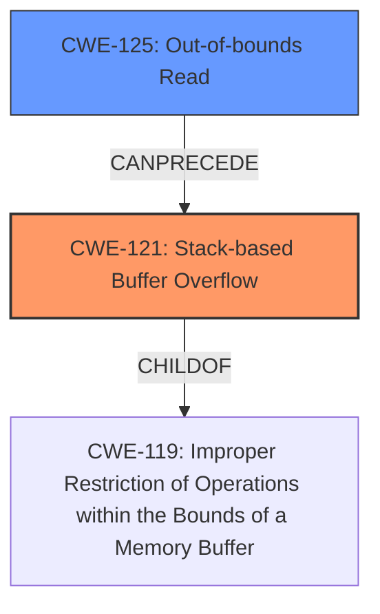

# Final Resolution for CVE-2022-25308

# Summary
| CWE ID | CWE Name | Confidence | CWE Abstraction Level | CWE Vulnerability Mapping Label | CWE-Vulnerability Mapping Notes |
|---|---|---|---|---|---|
| CWE-121 | Stack-based Buffer Overflow | 1.0 | Variant | Allowed | Primary CWE: The vulnerability is explicitly described as a **stack-based buffer overflow** due to writing beyond the buffer boundary. |
| CWE-125 | Out-of-bounds Read | 0.7 | Base | Allowed | Secondary Candidate: The **root cause** involves reading data before the beginning of the buffer (stack underflow), *triggering* the subsequent **stack-based buffer overflow**. |

## Evidence and Confidence

*   **Confidence Score:** 0.95
*   **Evidence Strength:** HIGH

## Relationship Analysis
The primary weakness is CWE-121 (**Stack-based Buffer Overflow**), which is a variant of CWE-119 (**Improper Restriction of Operations within the Bounds of a Memory Buffer**). This indicates a hierarchical relationship where CWE-121 provides a more specific classification. CWE-125 (**Out-of-bounds Read**) can be viewed as preceding CWE-121 in a chain, where the out-of-bounds read triggers the buffer overflow. The abstraction levels influenced the selection by ensuring that CWE-121, a Variant, was chosen for its specificity, while CWE-125, a Base, was considered due to its role as the root cause.

## Vulnerability Chain
The vulnerability chain starts with the lack of input validation on the string length, leading to an **out-of-bounds read (CWE-125)** when accessing `S_[len - 1]` without checking if `len > 0`. This **out-of-bounds read** then triggers the subsequent **stack-based buffer overflow (CWE-121)**, resulting in a potential memory leak or denial of service.
  - Initial Flaw: Missing input validation on string length
  - Weakness 1: CWE-125 (**Out-of-bounds Read**)
  - Weakness 2: CWE-121 (**Stack-based Buffer Overflow**)
  - Impact: Memory leak or denial of service

## Summary of Analysis
The analysis correctly identified CWE-121 (**Stack-based Buffer Overflow**) as the primary vulnerability, supported by the vulnerability description, CVE details, and the provided fix. The inclusion of CWE-125 (**Out-of-bounds Read**) is also appropriate, as the underflow contributes to the broader vulnerability chain.

The graph relationships influenced the final selection by highlighting the hierarchical relationship between CWE-121 and CWE-119, as well as the chain relationship between CWE-125 and CWE-121. This understanding ensured that the selected CWEs were at the optimal level of specificity and accurately reflected the root cause and impact of the vulnerability.

The decision to classify CWE-121 as primary and CWE-125 as secondary is justified because the vulnerability ultimately manifests as a **stack-based buffer overflow**, with the **out-of-bounds read** acting as a trigger. The fix (`if (len > 0)`) primarily addresses the **out-of-bounds read**, which then *prevents* the write beyond the buffer, which is a **stack overflow**.

The evidence from the vulnerability description, CVE reference materials, and the retriever result support this conclusion. The retriever result gives a higher score to CWE-193, CWE-190, CWE-125 etc, but this highlights the importance of understanding the context. The root cause *is* the lack of validation on string length, which causes the underflow and then overflow. The relationship between CWE-121 and CWE-125 is a chain where CWE-125 leads to CWE-121.