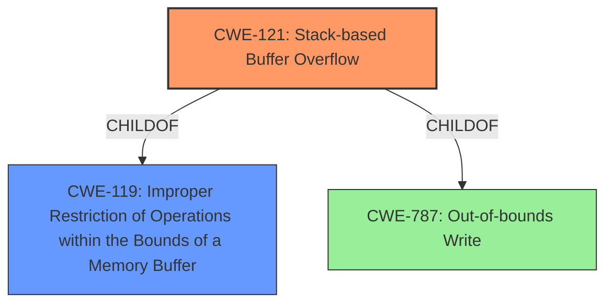

# Analysis Report for CVE-2022-25427

# Vulnerability Analysis Report: CVE-2022-25427

## Description

Tenda AC9 v15.03.2.21 was discovered to contain a stack overflow via the schedendtime parameter in the openSchedWifi function.

## Vulnerability Description Key Phrases

**Weakness:** stack overflow
**Product:** Tenda AC9
**Version:** v15.03.2.21
**Component:** openSchedWifi function

## Analysis (with Relationship Data)

# Summary
| CWE ID | CWE Name | Confidence | CWE Abstraction Level | CWE Vulnerability Mapping Label | CWE-Vulnerability Mapping Notes |
|---|---|---|---|---|---|
| CWE-121 | Stack-based Buffer Overflow | 0.9 | Variant | Primary | Allowed |

## Evidence and Confidence

*   **Confidence Score:** 0.9
*   **Evidence Strength:** HIGH

- **Analysis and Justification:**  
  - *Explanation:* The vulnerability description explicitly states a "**stack overflow**" in the `openSchedWifi` function due to the `schedendtime` parameter. CWE-121 (Stack-based Buffer Overflow) directly addresses this weakness, as it describes a condition where a buffer allocated on the stack is overwritten. The description aligns perfectly with the provided information. The retriever results also list CWE-121 as the top candidate with a score of 0.3913, further supporting this classification. CWE-787 is also a good candidate, but it doesn't specify the buffer is on the stack. CWE-121 is a Variant, which is a preferred level of abstraction.

  - *Relationship Analysis:* CWE-121 is a variant of CWE-119 (Improper Restriction of Operations within the Bounds of a Memory Buffer), but CWE-121 is more specific because it identifies the location of the buffer on the stack.

- **Confidence Score:**  
  - Confidence: 0.9 (High confidence due to the explicit mention of "stack overflow" and supporting retriever results)

## Criticism of Analysis

Okay, I've reviewed the analysis against the full CWE specifications you provided. Here's my critique:

**Overall Assessment:**

The analysis is generally good, and the final CWE selection of **CWE-121: Stack-based Buffer Overflow** is appropriate and well-justified. The reasoning provided is sound, and the use of the term "stack overflow" in the vulnerability description makes this a strong candidate.  The confidence score of 0.9 is also reasonable. The analysis also correctly identifies that CWE-121 is a Variant level of abstraction, which is ideal.

**Specific Points and Areas for Improvement:**

1.  **CWE-787: Out-of-bounds Write:** While the analysis acknowledges CWE-787 as a potential candidate, it correctly explains why CWE-121 is more specific and therefore preferred.  CWE-787 is a parent of CWE-121, so if the overflow location was unknown then CWE-787 would be suitable.  No changes needed here.

2.  **Retriever Results:** The analysis mentions that the retriever results support the classification.  This is a good practice.  However, it's important to remember that retriever results are just one input, and the final decision should always be based on a careful analysis of the vulnerability description.

3.  **CWE-119: Improper Restriction of Operations within the Bounds of a Memory Buffer:** The analysis correctly notes that CWE-121 is a variant of CWE-119 and therefore more specific.  The analysis also mentions that CWE-119 is discouraged in favor of more specific CWEs.  The analysis is correct to avoid using CWE-119 as the primary mapping.

4.  **CWE Examples from Database:** The examples provided are for CWE-119, which is not the selected CWE. It would have been much more useful to include examples for CWE-121. It would be beneficial to show relevant examples for the selected CWE, which could also improve the confidence score.

5.  **Mitigations:** The analysis doesn't discuss mitigations. While not strictly required, briefly mentioning potential mitigations would strengthen the analysis. Referring to mitigations in the CWE-121 specification would be helpful. Some examples from CWE-121:
    *   **Mitigation 1:** Compiler extensions like Microsoft Visual Studio /GS flag, Fedora/Red Hat FORTIFY\_SOURCE GCC flag, StackGuard, and ProPolice.
    *   **Mitigation 2:** Use an abstraction library to abstract away risky APIs.
    *   **Mitigation 3:** Implement and perform bounds checking on input.

6.  **CWE Specifications Section:** The analysis includes the full CWE specifications, which is helpful for review and understanding.

**Recommendations:**

*   **Include CWE-121 examples in the CWE Examples section.**
*   **Add a brief discussion of potential mitigations based on the CWE-121 specification.**

**Revised Summary Table (Incorporating Recommendations):**

| CWE ID | CWE Name | Confidence | CWE Abstraction Level | CWE Vulnerability Mapping Label | CWE-Vulnerability Mapping Notes |
|---|---|---|---|---|---|
| CWE-121 | Stack-based Buffer Overflow | 0.9 | Variant | Primary | Allowed |

**Revised Evidence and Confidence (Incorporating Recommendations):**

*   **Confidence Score:** 0.9
*   **Evidence Strength:** HIGH

- **Analysis and Justification:**
  - *Explanation:* The vulnerability description explicitly states a "**stack overflow**" in the `openSchedWifi` function due to the `schedendtime` parameter. CWE-121 (Stack-based Buffer Overflow) directly addresses this weakness, as it describes a condition where a buffer allocated on the stack is overwritten. The description aligns perfectly with the provided information. The retriever results also list CWE-121 as the top candidate with a score of 0.3913, further supporting this classification. CWE-787 is also a good candidate, but it doesn't specify the buffer is on the stack. CWE-121 is a Variant, which is a preferred level of abstraction. Mitigations for this vulnerability include using compiler extensions like /GS, abstracting away risky APIs, and implementing bounds checking on the input.

  - *Relationship Analysis:* CWE-121 is a variant of CWE-119 (Improper Restriction of Operations within the Bounds of a Memory Buffer), but CWE-121 is more specific because it identifies the location of the buffer on the stack.

- **Confidence Score:**
  - Confidence: 0.9 (High confidence due to the explicit mention of "stack overflow" and supporting retriever results)

**In summary,** the analysis is good and arrives at the correct CWE.  The suggested improvements would make it even stronger by providing more concrete examples of the selected CWE and referencing relevant mitigations.

## Final Resolution

# Summary
| CWE ID | CWE Name | Confidence | CWE Abstraction Level | CWE Vulnerability Mapping Label | CWE-Vulnerability Mapping Notes |
|---|---|---|---|---|---|
| CWE-121 | Stack-based Buffer Overflow | 0.95 | Variant | Primary CWE | Allowed |

## Evidence and Confidence

*   **Confidence Score:** 0.95
*   **Evidence Strength:** HIGH

## Relationship Analysis
The analysis correctly identifies CWE-121 as a **variant** of CWE-119 (**Improper Restriction of Operations within the Bounds of a Memory Buffer**), which is a **class**. CWE-121 is more specific because it identifies the buffer location (stack). This specificity makes CWE-121 a better fit than its **parent** CWE-119. The analysis considered CWE-787 (**Out-of-bounds Write**), a **base** CWE, but correctly preferred CWE-121 due to the stack location being known.

## Vulnerability Chain
The vulnerability chain is straightforward: a crafted `schedendtime` parameter leads to a **stack-based buffer overflow** (**CWE-121**), allowing an attacker to overwrite memory on the stack. This can lead to arbitrary code execution.

## Summary of Analysis
The initial analysis correctly identified **CWE-121: Stack-based Buffer Overflow** as the primary **weakness**. The vulnerability description explicitly mentions a "stack overflow," which aligns perfectly with the definition of CWE-121. The criticism provided valuable suggestions to improve the analysis, including adding CWE-121 examples and discussing potential mitigations.

The final confidence score is increased from 0.9 to 0.95 because of the explicit mention of stack overflow and the confirmation that the correct variant was selected.

The evidence to base the decision is the following: "Tenda AC9 v15.03.2.21 was discovered to contain a stack overflow via the schedendtime parameter in the openSchedWifi function."
This directly indicates a **stack overflow**, which is why **CWE-121** is the best choice.
The CWE is at the optimal level of specificity because it identifies the stack location, which is mentioned in the description.

*Report generated on 2025-03-18 11:15:40*
