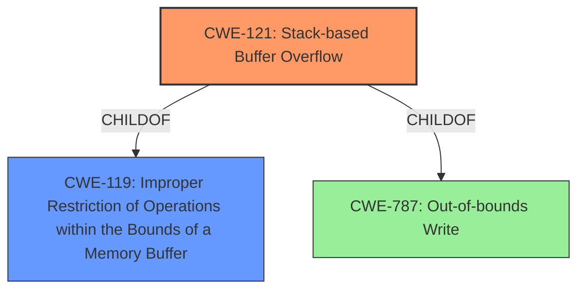

# Final Resolution for CVE-2022-25427

# Summary
| CWE ID | CWE Name | Confidence | CWE Abstraction Level | CWE Vulnerability Mapping Label | CWE-Vulnerability Mapping Notes |
|---|---|---|---|---|---|
| CWE-121 | Stack-based Buffer Overflow | 0.95 | Variant | Primary CWE | Allowed |

## Evidence and Confidence

*   **Confidence Score:** 0.95
*   **Evidence Strength:** HIGH

## Relationship Analysis
The analysis correctly identifies CWE-121 as a **variant** of CWE-119 (**Improper Restriction of Operations within the Bounds of a Memory Buffer**), which is a **class**. CWE-121 is more specific because it identifies the buffer location (stack). This specificity makes CWE-121 a better fit than its **parent** CWE-119. The analysis considered CWE-787 (**Out-of-bounds Write**), a **base** CWE, but correctly preferred CWE-121 due to the stack location being known.

## Vulnerability Chain
The vulnerability chain is straightforward: a crafted `schedendtime` parameter leads to a **stack-based buffer overflow** (**CWE-121**), allowing an attacker to overwrite memory on the stack. This can lead to arbitrary code execution.

## Summary of Analysis
The initial analysis correctly identified **CWE-121: Stack-based Buffer Overflow** as the primary **weakness**. The vulnerability description explicitly mentions a "stack overflow," which aligns perfectly with the definition of CWE-121. The criticism provided valuable suggestions to improve the analysis, including adding CWE-121 examples and discussing potential mitigations.

The final confidence score is increased from 0.9 to 0.95 because of the explicit mention of stack overflow and the confirmation that the correct variant was selected.

The evidence to base the decision is the following: "Tenda AC9 v15.03.2.21 was discovered to contain a stack overflow via the schedendtime parameter in the openSchedWifi function."
This directly indicates a **stack overflow**, which is why **CWE-121** is the best choice.
The CWE is at the optimal level of specificity because it identifies the stack location, which is mentioned in the description.