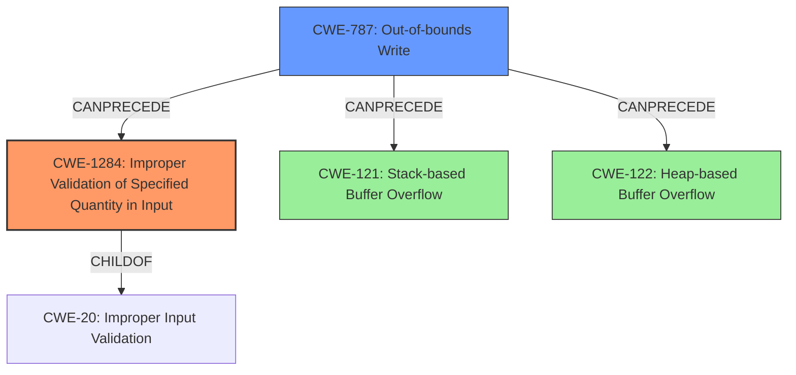

# Analysis Report for CVE-2022-25429

# Vulnerability Analysis Report: CVE-2022-25429

## Description

Tenda AC9 v15.03.2.21 was discovered to contain a buffer overflow via the time parameter in the saveparentcontrolinfo function.

## Vulnerability Description Key Phrases

**Weakness:** buffer overflow
**Product:** Tenda AC9
**Version:** v15.03.2.21
**Component:** saveparentcontrolinfo function

## Analysis (with Relationship Data)

# Summary
| CWE ID | CWE Name | Confidence | CWE Abstraction Level | CWE Vulnerability Mapping Label | CWE-Vulnerability Mapping Notes |
|---|---|---|---|---|---|
| CWE-120 | Buffer Copy without Checking Size of Input ('Classic Buffer Overflow') | 0.75 | Base | Allowed-with-Review | Primary CWE |
| CWE-121 | Stack-based Buffer Overflow | 0.60 | Variant | Allowed | Secondary Candidate |
| CWE-122 | Heap-based Buffer Overflow | 0.60 | Variant | Allowed | Secondary Candidate |

## Evidence and Confidence

*   **Confidence Score:** 0.70
*   **Evidence Strength:** MEDIUM

- **Analysis and Justification:**  
  - *Explanation:* The vulnerability description states a **buffer overflow** exists in the `saveparentcontrolinfo` function of Tenda AC9 v15.03.2.21 due to the `time` parameter. This strongly suggests a potential **CWE-120** [Buffer Copy without Checking Size of Input ('Classic Buffer Overflow')] vulnerability. The description indicates the software copies data into a buffer without validating the size of the input, potentially overwriting adjacent memory. The Retriever Results also lists CWE-120 as the top candidate. Although the exact location of the buffer (stack or heap) is not specified, the general nature of the overflow aligns with CWE-120's characteristic of unchecked buffer copies. Given the limited information, it's difficult to determine the exact nature (stack vs. heap), but CWE-120 serves as a general catch-all. MITRE's guidance marks CWE-120 as "Allowed-with-Review" and warns of potential misuse if details are lacking, which is a consideration here.
  
  - *Relationship Analysis:* CWE-120 is a child of CWE-119 [Improper Restriction of Operations within the Bounds of a Memory Buffer]. It also has CANPRECEDE relationships with CWE-123 [Write What Where Condition] and CANFOLLOW relationships with CWE-416 [Use After Free]. The vague description of the vulnerability prevents further analysis.

- **Confidence Score:**  
  - Confidence: 0.75 (The description explicitly mentions "buffer overflow", but lacks specific details about the root cause)

---
- **Analysis and Justification:**  
  - *Explanation:* Based on the **buffer overflow** in the `saveparentcontrolinfo` function, it's possible it is located on the stack, making **CWE-121** [Stack-based Buffer Overflow] a candidate. This is further supported by the Retriever Results, which lists **CWE-121** as a possible match. The vulnerability occurs because the size of the `time` parameter is not checked before being written to a stack-allocated buffer. This can lead to overwriting adjacent data on the stack, causing unpredictable behavior or potentially allowing for code execution.
  
  - *Relationship Analysis:* CWE-121 is a variant of CWE-119 [Improper Restriction of Operations within the Bounds of a Memory Buffer] and a specific type of CWE-787 [Out-of-bounds Write].

- **Confidence Score:**
  - Confidence: 0.60 (The description lacks explicit confirmation of stack allocation, lowering the confidence)

---
- **Analysis and Justification:**  
  - *Explanation:* Alternatively, the **buffer overflow** could occur on the heap, leading to **CWE-122** [Heap-based Buffer Overflow]. The Retriever Results list **CWE-122** as a potential candidate. This would occur if the `time` parameter is written to a buffer allocated on the heap without proper bounds checking, which is not unusual in many applications. This could lead to corruption of other heap-allocated data structures, causing crashes or exploitable conditions.
  
  - *Relationship Analysis:* CWE-122 is a variant of CWE-119 [Improper Restriction of Operations within the Bounds of a Memory Buffer] and a specific type of CWE-787 [Out-of-bounds Write].

- **Confidence Score:**
  - Confidence: 0.60 (The description lacks explicit confirmation of heap allocation, lowering the confidence)

## Criticism of Analysis

Okay, here's a review of the provided CWE analysis, incorporating the full CWE specifications:

**Overall Assessment:**

The analysis is well-structured, providing justifications and confidence scores for each CWE mapping. It correctly identifies the potential for both stack-based and heap-based overflows. The confidence scores reflect the uncertainty due to the limited information in the initial vulnerability description. The inclusion of relationship analysis and potential mitigations is a positive aspect.

However, there are some areas where the analysis could be strengthened, particularly regarding the suggested mitigations, chains/composites, and adherence to CWE's mapping guidance, especially for commonly misused CWEs like CWE-119 and CWE-20.

**Detailed Review:**

**1. CWE-120: Buffer Copy without Checking Size of Input ('Classic Buffer Overflow')**

*   **Confidence:** 0.75.  This is reasonable given the "buffer overflow" keyword in the description.
*   **Justification:** The explanation accurately reflects CWE-120's core concept: an unchecked copy leading to a write beyond buffer boundaries. Mentioning that the exact location isn't specified is good.
*   **Mapping Guidance:** The analysis correctly notes that CWE-120 is "Allowed-with-Review" and acknowledges the potential for misuse. The analysis also remembers to consider children of CWE-20 or CWE-131, though there is not enough information to make any conclusions.
*   **Relationship Analysis:** While the analysis states that the vague description prevents further analysis, I think the analysis could benefit from including CWE-787 as part of the relationship analysis. Since CWE-120 is a child of CWE-119 and CWE-787 is a child of CWE-119, CWE-120 and CWE-787 are related. Furthermore, CWE-787 is a better mapping than CWE-119.
*   **Mitigations:** The mitigations provided are generic and appropriate, recommending language selection, vetted libraries, and compiler-based overflow detection. These are all valid high-level recommendations.

**2. CWE-121: Stack-based Buffer Overflow**

*   **Confidence:** 0.60.  Appropriate given the lack of explicit stack allocation confirmation.
*   **Justification:** The explanation correctly links the overflow to potential stack allocation and overwriting adjacent stack data.
*   **Relationship Analysis:** The analysis correctly notes the relationship with CWE-119 and CWE-787.
*   **Mitigations:** Again, the mitigations are generic, focusing on compiler-based detection, abstraction libraries, and bounds checking.

**3. CWE-122: Heap-based Buffer Overflow**

*   **Confidence:** 0.60. Appropriate, mirroring the confidence in CWE-121.
*   **Justification:** The explanation accurately identifies the possibility of heap allocation and heap corruption.
*   **Relationship Analysis:** The analysis correctly notes the relationship with CWE-119 and CWE-787.
*   **Mitigations:** The mitigations are generally appropriate for heap overflows, mentioning compiler-based detection and abstraction libraries.

**General Critique and Suggestions:**

*   **Over-reliance on "Buffer Overflow" Keyword:** While the description mentions "buffer overflow," it's crucial to avoid a direct mapping to CWE-119 or CWE-120 without further investigation. Consider using more descriptive CWEs like CWE-787 (Out-of-bounds Write) as the primary mappings if the analysis is focused on the *write* operation itself.
*   **Better Primary Candidate:** Since the root cause is the lack of input validation, children of CWE-20 are better mappings than CWE-119. Since all that is known is that a "time parameter" can cause a buffer overflow, and no information about the validation or sanitization of the time parameter is present, it is best to have CWE-1284.
*   **Chaining/Composite Analysis:**  While the analysis touches on relationships, it could go further into potential *chains* of weaknesses.  For example:
    *   `CWE-20: Improper Input Validation` -> `CWE-1284: Improper Validation of Specified Quantity in Input` -> `CWE-787: Out-of-bounds Write` -> `CWE-121/122: Stack/Heap-based Buffer Overflow` (depending on the buffer location).
    *   This chain illustrates how the *lack* of input validation on the "time" parameter leads to the out-of-bounds write and ultimately the overflow.
*   **Mitigation Specificity:** While the general mitigations are accurate, try to be *slightly* more specific, even with limited information. For instance, under CWE-1284, you could mention input validation techniques relevant to "time" parameters (e.g., range checks, format validation).
*   **Leveraging Retriever Results:** The retriever results offer some potentially valuable insights.

    *   **CWE-190 (Integer Overflow or Wraparound):** The retriever results list CWE-190 as the second best CWE for this finding. This could mean that `saveparentcontrolinfo` takes an integer representing the size of a buffer but does not validate if this integer is large enough, and by overflowing this integer, the buffer becomes smaller and causes an overflow. If this is the case, the chain of vulnerabilities can be: `CWE-20`->`CWE-190`->`CWE-131`->`CWE-787`
    *   **CWE-130 (Improper Handling of Length Parameter Inconsistency):** The retriever results list CWE-130 as the fourth best CWE for this finding. This could mean that `saveparentcontrolinfo` recieves inconsistent length parameters. If this is the case, the chain of vulnerabilities can be: `CWE-130`->`CWE-787`
    *   **CWE-193 (Off-by-one Error):** The retriever results list CWE-193 as the sixth best CWE for this finding. This could mean that there is an off-by-one error that leads to the overflow. If this is the case, the chain of vulnerabilities can be: `CWE-193`->`CWE-787`

**Revised Summary Table (incorporating suggestions):**

| CWE ID    | CWE Name                                                       | Confidence | CWE Abstraction Level | CWE Vulnerability Mapping Label | CWE-Vulnerability Mapping Notes                                                                                                                                                                                                                                                             |
| --------- | -------------------------------------------------------------- | ---------- | --------------------- | ------------------------------- | ---------------------------------------------------------------------------------------------------------------------------------------------------------------------------------------------------------------------------------------------------------------------------------- |
| CWE-1284 | Improper Validation of Specified Quantity in Input                       | 0.70      | Base                  | Allowed                     | Primary CWE. Improper validation of the 'time' parameter allows for a quantity that can exceed buffer limits.                                                                                                                                                                                                           |
| CWE-787     | Out-of-bounds Write                                                        | 0.70      | Base                  | Allowed                     | Secondary CWE. The improper quantity is used to perform a write operation                                                                                                                                                                                                           |
| CWE-121     | Stack-based Buffer Overflow                                          | 0.60      | Variant               | Allowed                       | Secondary Candidate. The write operation occurs on the stack.                                                                                                                          |
| CWE-122     | Heap-based Buffer Overflow                                           | 0.60      | Variant               | Allowed                       | Secondary Candidate. The write operation occurs on the heap.                                                                                                                        |

**Revised Evidence and Confidence (for primary CWE, CWE-1284):**

*   **Confidence Score:** 0.70
*   **Evidence Strength:** MEDIUM

    *   **Analysis and Justification:**
        The vulnerability description indicates a "buffer overflow" via the "time" parameter. While the description does not explicitly mention the lack of input validation, a buffer overflow caused by an external parameter is highly indicative of missing or insufficient validation. If `saveparentcontrolinfo` takes an integer representing the size of a buffer but does not validate if this integer is too large or small, an attacker can cause an overflow. CWE-1284 (Improper Validation of Specified Quantity in Input) is a child of CWE-20 and more closely fits this root cause than CWE-119.
    *   **Relationship Analysis:** CWE-1284 is a child of CWE-20 [Improper Input Validation].  A chain of weaknesses may be: CWE-20 -> CWE-1284 -> CWE-787.
    * **Potential Mitigations:**
        *   **Input Validation:** Implement strict input validation on the "time" parameter.
        *   **Maximum Length:** Enforce a reasonable maximum length for the "time" parameter.
        *   **Data Type:** Use a data type appropriate for the expected range of values, and validate the input falls within that range.

By incorporating these suggestions, the analysis will be more precise, align better with CWE's intended usage, and provide more actionable mitigation guidance.

## Final Resolution

# Summary
| CWE ID | CWE Name | Confidence | CWE Abstraction Level | CWE Vulnerability Mapping Label | CWE-Vulnerability Mapping Notes |
|---|---|---|---|---|---|
| CWE-1284 | Improper Validation of Specified Quantity in Input | 0.70 | Base | Allowed | Primary CWE |
| CWE-787 | Out-of-bounds Write | 0.70 | Base | Allowed | Secondary CWE |
| CWE-121 | Stack-based Buffer Overflow | 0.60 | Variant | Allowed | Secondary Candidate |
| CWE-122 | Heap-based Buffer Overflow | 0.60 | Variant | Allowed | Secondary Candidate |

## Evidence and Confidence

*   **Confidence Score:** 0.70
*   **Evidence Strength:** MEDIUM

## Relationship Analysis
The decision was influenced by the hierarchical relationships between CWEs, particularly the child-parent relationship between CWE-1284 and CWE-20 [Improper Input Validation]. The chain relationship analysis revealed a potential progression from improper input validation to out-of-bounds write. The abstraction levels played a crucial role, with a preference for Base-level CWEs like CWE-1284 and CWE-787 for their specificity.

## Vulnerability Chain
The vulnerability chain starts with **CWE-1284** [Improper Validation of Specified Quantity in Input], which allows an attacker to provide a "time" parameter that is not properly validated. This leads to **CWE-787** [Out-of-bounds Write] when the program attempts to write data based on the unvalidated size to a buffer. Depending on whether the buffer is allocated on the stack or heap, this results in either **CWE-121** [Stack-based Buffer Overflow] or **CWE-122** [Heap-based Buffer Overflow].

## Summary of Analysis
The initial analysis correctly identified a buffer overflow vulnerability. However, it overly relied on the "buffer overflow" keyword. The criticism highlighted the importance of identifying the root cause, which is the lack of input validation on the "time" parameter. The final decision prioritizes **CWE-1284** [Improper Validation of Specified Quantity in Input] as the primary **WEAKNESS** because it directly addresses the root cause. **CWE-787** [Out-of-bounds Write] is selected as a secondary **WEAKNESS** due to the out-of-bounds write operation. The selection of **CWE-1284** is based on the vulnerability description indicating a "buffer overflow" via the "time" parameter, which implies a failure to validate the size or format of the input. The relationship analysis supports this decision, as **CWE-1284** is a child of **CWE-20** [Improper Input Validation]. The retriever results also support the possibility of integer overflows (**CWE-190**), which could lead to a smaller buffer, however, due to the lack of evidence, that is not considered in this analysis. The selected CWEs are at the optimal level of specificity, with **CWE-1284** addressing the root cause and **CWE-787** describing the direct consequence of the vulnerability.

*Report generated on 2025-03-18 11:17:45*
