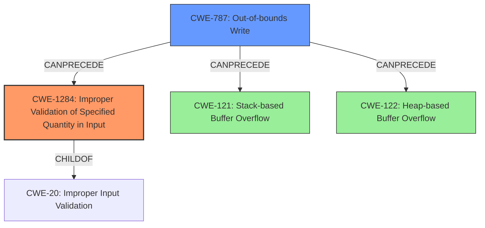

# Final Resolution for CVE-2022-25429

# Summary
| CWE ID | CWE Name | Confidence | CWE Abstraction Level | CWE Vulnerability Mapping Label | CWE-Vulnerability Mapping Notes |
|---|---|---|---|---|---|
| CWE-1284 | Improper Validation of Specified Quantity in Input | 0.70 | Base | Allowed | Primary CWE |
| CWE-787 | Out-of-bounds Write | 0.70 | Base | Allowed | Secondary CWE |
| CWE-121 | Stack-based Buffer Overflow | 0.60 | Variant | Allowed | Secondary Candidate |
| CWE-122 | Heap-based Buffer Overflow | 0.60 | Variant | Allowed | Secondary Candidate |

## Evidence and Confidence

*   **Confidence Score:** 0.70
*   **Evidence Strength:** MEDIUM

## Relationship Analysis
The decision was influenced by the hierarchical relationships between CWEs, particularly the child-parent relationship between CWE-1284 and CWE-20 [Improper Input Validation]. The chain relationship analysis revealed a potential progression from improper input validation to out-of-bounds write. The abstraction levels played a crucial role, with a preference for Base-level CWEs like CWE-1284 and CWE-787 for their specificity.

## Vulnerability Chain
The vulnerability chain starts with **CWE-1284** [Improper Validation of Specified Quantity in Input], which allows an attacker to provide a "time" parameter that is not properly validated. This leads to **CWE-787** [Out-of-bounds Write] when the program attempts to write data based on the unvalidated size to a buffer. Depending on whether the buffer is allocated on the stack or heap, this results in either **CWE-121** [Stack-based Buffer Overflow] or **CWE-122** [Heap-based Buffer Overflow].

## Summary of Analysis
The initial analysis correctly identified a buffer overflow vulnerability. However, it overly relied on the "buffer overflow" keyword. The criticism highlighted the importance of identifying the root cause, which is the lack of input validation on the "time" parameter. The final decision prioritizes **CWE-1284** [Improper Validation of Specified Quantity in Input] as the primary **WEAKNESS** because it directly addresses the root cause. **CWE-787** [Out-of-bounds Write] is selected as a secondary **WEAKNESS** due to the out-of-bounds write operation. The selection of **CWE-1284** is based on the vulnerability description indicating a "buffer overflow" via the "time" parameter, which implies a failure to validate the size or format of the input. The relationship analysis supports this decision, as **CWE-1284** is a child of **CWE-20** [Improper Input Validation]. The retriever results also support the possibility of integer overflows (**CWE-190**), which could lead to a smaller buffer, however, due to the lack of evidence, that is not considered in this analysis. The selected CWEs are at the optimal level of specificity, with **CWE-1284** addressing the root cause and **CWE-787** describing the direct consequence of the vulnerability.