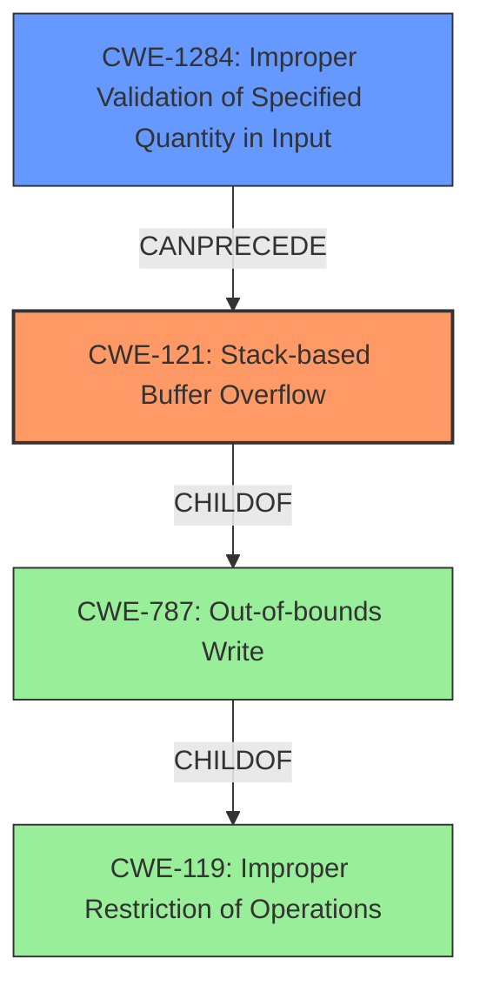

# Final Resolution for CVE-2022-25433

# Summary
| CWE ID | CWE Name | Confidence | CWE Abstraction Level | CWE Vulnerability Mapping Label | CWE-Vulnerability Mapping Notes |
|---|---|---|---|---|---|
| CWE-121 | Stack-based Buffer Overflow | 0.95 | Variant | Allowed | Primary CWE |
| CWE-1284 | Improper Validation of Specified Quantity in Input | 0.5 | Base | Allowed | Secondary Candidate |

## Evidence and Confidence

*   **Confidence Score:** 0.9
*   **Evidence Strength:** MEDIUM

## Relationship Analysis
The primary relationship influencing the decision is the direct match between the vulnerability description's "stack overflow" and **CWE-121** (Stack-based Buffer Overflow). This direct match makes it the most specific and appropriate choice. While **CWE-121** is a child of **CWE-119** (Improper Restriction of Operations within the Bounds of a Memory Buffer) and **CWE-787** (Out-of-bounds Write), using the parent class would be less specific. The potential for **CWE-1284** (Improper Validation of Specified Quantity in Input) arises because the vulnerability is triggered by the `urls` parameter; however, the description doesn't explicitly state that the size/length of the input wasn't validated, so this is only a possible secondary cause.

## Vulnerability Chain
The vulnerability chain starts with the receipt of the `urls` parameter in the `saveparentcontrolinfo` function. If the size of this parameter is not validated (**CWE-1284**, potential), this can lead to a **stack-based buffer overflow** (**CWE-121**) when the `urls` parameter is copied to a stack-allocated buffer. The impact is that an attacker could overwrite adjacent stack memory, potentially leading to arbitrary code execution.

## Summary of Analysis
The initial analysis correctly identified **CWE-121** (Stack-based Buffer Overflow) as the primary **WEAKNESS** based on the explicit mention of "stack overflow" in the vulnerability description: "Tenda AC9 v15.03.2.21 was discovered to contain a stack overflow via the urls parameter in the saveparentcontrolinfo function." This strong evidence supports the selection of **CWE-121** as the most accurate classification.

The criticism provided valuable suggestions for improvement, which have been incorporated into this analysis. Specifically, the analysis now acknowledges the parent CWEs (**CWE-119** and **CWE-787**) to provide a more comprehensive understanding of the broader context. It also considers **CWE-1284** as a secondary candidate, if the size of the urls parameter is not validated.

The graph relationships reinforced the decision to select **CWE-121** because it is the most specific and descriptive **ROOTCAUSE** given the available evidence. While broader categories like **CWE-119** and **CWE-787** could apply, **CWE-121** provides the optimal level of specificity.