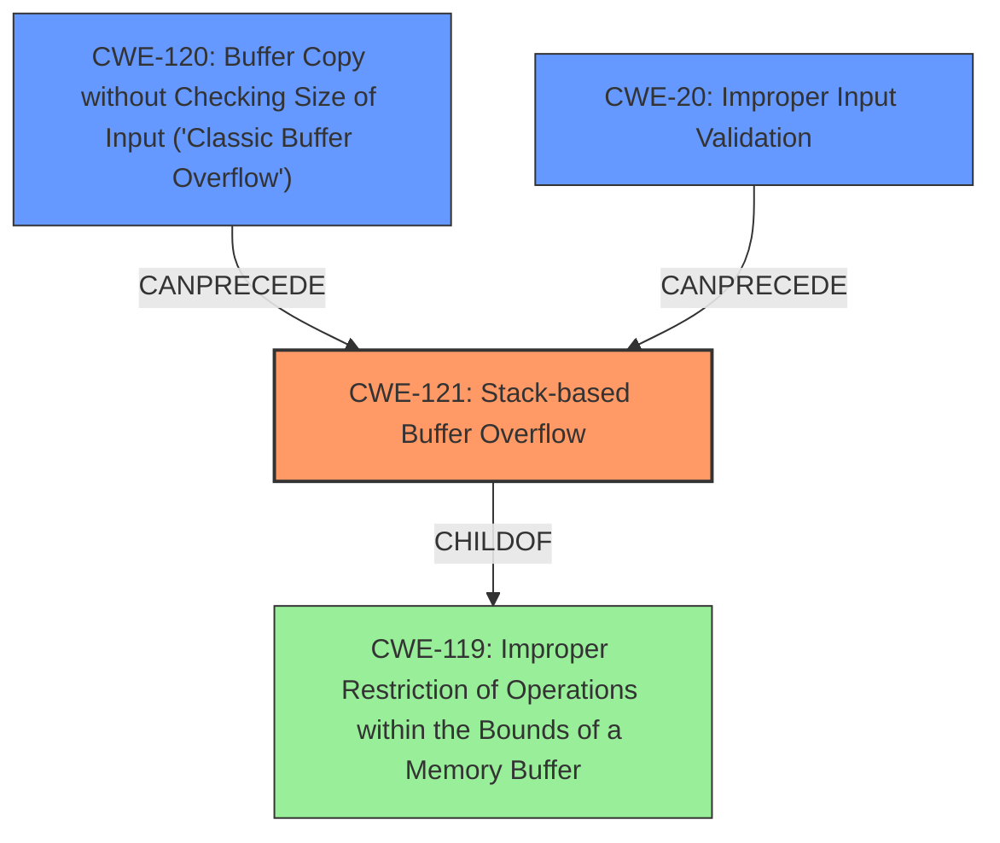

# Final Resolution for CVE-2022-25437

# Summary
| CWE ID | CWE Name | Confidence | CWE Abstraction Level | CWE Vulnerability Mapping Label | CWE-Vulnerability Mapping Notes |
|---|---|---|---|---|---|
| CWE-121 | Stack-based Buffer Overflow | 0.9 | Variant | Allowed | Primary CWE.  The vulnerability description explicitly states a "stack overflow." While CWE-787 is a broader category, CWE-121 provides the necessary specificity. Further investigation is needed to determine the underlying cause (e.g., missing input validation or incorrect buffer size calculation). Compiler-based protections and robust input validation are important mitigations. |
| CWE-120 | Buffer Copy without Checking Size of Input ('Classic Buffer Overflow') | 0.6 | Base | Allowed-with-Review | Secondary Candidate. A potential contributing factor if `memcpy` without size checking is the mechanism by which the stack buffer is overflowed, but this is not explicitly stated in the description. |
| CWE-20 | Improper Input Validation | 0.5 | Class | Allowed | Secondary Candidate. Missing input validation on the 'list' parameter could lead to the overflow. Further investigation needed. |

## Evidence and Confidence

*   **Confidence Score:** 0.85
*   **Evidence Strength:** MEDIUM

## Relationship Analysis
The primary CWE is CWE-121, which is a variant of CWE-119. The analysis also considers CWE-120 and CWE-20 as potential contributing factors. The abstraction levels influenced the selection by favoring the most specific applicable CWE (CWE-121) while acknowledging potential root causes at the Base level (CWE-120, CWE-20).

## Vulnerability Chain
The vulnerability chain starts with a potential **improper input validation (CWE-20)** of the 'list' parameter. This could lead to a **buffer copy without checking size (CWE-120)**, ultimately resulting in a **stack-based buffer overflow (CWE-121)**. The final impact is arbitrary code execution due to the overflow on the stack.

## Summary of Analysis
The initial analysis correctly identified CWE-121 as the primary weakness. The criticism highlighted the importance of considering potential root causes and alternative CWEs. Based on the vulnerability description ("stack overflow via the list parameter in the SetVirtualServerCfg function"), CWE-121 is the most specific and appropriate classification.

The graph relationships influenced the decision by illustrating how CWE-121 is a child of CWE-119, but more specific. It also shows how CWE-120 and CWE-20 could precede CWE-121 in the vulnerability chain.

The selected CWEs are at the optimal level of specificity because CWE-121 directly reflects the described vulnerability, while CWE-120 and CWE-20 represent potential underlying causes that require further investigation. The evidence provided directly supports the choice of CWE-121 ("stack overflow via the list parameter").