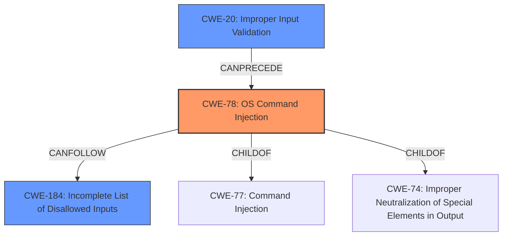

# Final Resolution for CVE-2022-25597

# Summary
| CWE ID | CWE Name | Confidence | CWE Abstraction Level | CWE Vulnerability Mapping Label | CWE-Vulnerability Mapping Notes |
|---|---|---|---|---|---|
| CWE-78 | Improper Neutralization of Special Elements used in an OS Command ('OS Command Injection') | 0.95 | Base | Allowed | Primary CWE: The vulnerability allows execution of arbitrary OS commands due to **insufficient filtering** of special elements. |
| CWE-184 | Incomplete List of Disallowed Inputs | 0.70 | Base | Allowed | Secondary CWE: The LPD service's filtering mechanism relies on a list of disallowed inputs, but this list is incomplete, leading to bypasses. |
| CWE-20 | Improper Input Validation | 0.60 | Class | Discouraged | This weakness can **precede** command injection by failing to adequately validate input before it's used in a command. |

## Evidence and Confidence

*   **Confidence Score:** 0.90
*   **Evidence Strength:** HIGH

## Relationship Analysis
The classification prioritizes CWE-78 due to the explicit mention of "command injection" in the vulnerability description, placing it at the base of the vulnerability chain. CWE-184 is selected as a secondary CWE because the **insufficient filtering** implies an incomplete list of disallowed inputs. CWE-20 is included as a weakness that **can precede** command injection through a failure to adequately validate input. The parent-child relationships were considered, but the base-level CWEs were chosen for specificity. The relationships considered are:
  - CWE-78 is a base CWE that is a child of CWE-77 (Command Injection) and CWE-74 (Improper Neutralization of Special Elements in Output).
  - CWE-184 can follow CWE-78.
  - CWE-20 can precede CWE-78.

## Vulnerability Chain
The vulnerability chain begins with **Improper Input Validation (CWE-20)** where the application fails to validate or sanitize user-provided input. This leads to **Incomplete List of Disallowed Inputs (CWE-184)**, where the application uses a blacklist approach that is incomplete. This results in **OS Command Injection (CWE-78)**, where an attacker can inject arbitrary OS commands due to the **insufficient filtering** of special characters in user requests.

## Summary of Analysis
The initial analysis correctly identified CWE-78 as the primary weakness, supported by the vulnerability description and CVE summary explicitly stating "command injection" and **insufficient filtering**. However, the criticism led to a better understanding of the vulnerability chain and a more refined classification. The selection of CWE-184 as a secondary CWE provides a more accurate representation of the root cause than CWE-791, as it emphasizes the incomplete nature of the input filtering. Adding CWE-20 highlights the potential role of input validation in preventing the injection.

The decision to include CWE-184 is based on the statement: "ASUS RT-AC86Us LPD service has **insufficient filtering** for special characters in the user request." This suggests that there is an attempt to filter special characters, implying a list of disallowed characters, but this list is incomplete.

The relationship analysis influenced the selection by emphasizing the chain of events leading to command injection. Input validation, incomplete filtering, and command injection form a clear sequence. The final classification reflects the optimal level of specificity by using base-level CWEs where possible, providing a detailed and accurate representation of the vulnerability.