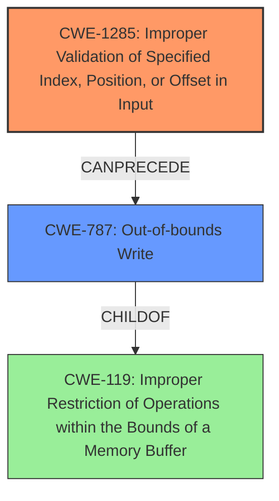

# Analysis Report for CVE-2022-25654

# Vulnerability Analysis Report: CVE-2022-25654

## Description

Memory corruption in kernel due to improper input validation while processing ION commands in Snapdragon Auto, Snapdragon Connectivity, Snapdragon Consumer IOT, Snapdragon Industrial IOT, Snapdragon Wearables

## Vulnerability Description Key Phrases

**Rootcause:** improper input validation
**Weakness:** memory corruption
**Product:** ['Snapdragon Auto', 'Snapdragon Connectivity', 'Snapdragon Consumer IOT', 'Snapdragon Industrial IOT', 'Snapdragon Wearables']

## Analysis (with Relationship Data)

# Summary
| CWE ID | CWE Name | Confidence | CWE Abstraction Level | CWE Vulnerability Mapping Label | CWE-Vulnerability Mapping Notes |
|---|---|---|---|---|---|
| CWE-1285 | Improper Validation of Specified Index, Position, or Offset in Input | 0.75 | Base | Allowed | Addresses the **improper input validation** leading to memory corruption. |
| CWE-787 | Out-of-bounds Write | 0.65 | Base | Allowed | Captures the **memory corruption** aspect, specifically writing outside allocated memory. |

## Evidence and Confidence

*   **Confidence Score:** 0.70
*   **Evidence Strength:** MEDIUM

- **Analysis and Justification:**  
  - *Explanation:* The vulnerability description highlights **improper input validation** as the root cause leading to **memory corruption** while processing ION commands. CWE-1285 (Improper Validation of Specified Index, Position, or Offset in Input) directly addresses the **improper input validation** aspect, suggesting a failure to properly validate indices, positions, or offsets. Since the **improper input validation** leads to **memory corruption**, CWE-787 (Out-of-bounds Write) is also considered because it aligns with the observed **memory corruption**, where data is written beyond the intended buffer limits.
  
  - *Relationship Analysis:* CWE-1285 captures the root cause of the vulnerability, related to improper validation. CWE-787 represents the direct consequence of that improper validation, leading to a write outside of intended memory boundaries. CWE-787 is a child of CWE-119 (Improper Restriction of Operations within the Bounds of a Memory Buffer).

- **Confidence Score:**  
  - *Example:* Confidence: 0.70 (Medium evidence due to high-level description; more specific details would increase confidence)

---

## Criticism of Analysis

Okay, I've reviewed the analysis provided, including the full CWE specifications for the identified weaknesses. Here's a breakdown of my critique:

**Overall Assessment:**

The analysis is generally good and correctly identifies the primary CWEs related to the vulnerability. The justification is sound, and the confidence levels are reasonable, given the high-level nature of the original vulnerability description. The connection between improper input validation (CWE-1285) leading to out-of-bounds write (CWE-787) is well-established.

**Detailed Critique:**

*   **CWE-1285: Improper Validation of Specified Index, Position, or Offset in Input:**
    *   **Mapping:** Appropriate and well-justified. The vulnerability description explicitly mentions "improper input validation," making CWE-1285 a direct match when considering validation of indices, positions, or offsets.
    *   **Confidence:** The 0.75 confidence is justified. While more specific details about the type of input being validated would increase confidence, the existing description supports this CWE.
    *   **Mitigations:** The analysis doesn't explicitly mention the specific mitigations, but the CWE details highlight the "accept known good" input validation strategy, which is relevant here.
    *   **Observed Examples:** The observed examples are relevant. CVE-2005-0369 is almost identical to the weakness as described in the prompt.
*   **CWE-787: Out-of-bounds Write:**
    *   **Mapping:** Correct and necessary. The vulnerability description states "memory corruption," and CWE-787 represents the specific type of memory corruption where a write occurs outside the allocated buffer.
    *   **Confidence:** The 0.65 confidence is also reasonable, as it relies on the assumption that "memory corruption" specifically involves writing outside buffer boundaries. While other forms of memory corruption exist, the out-of-bounds write is a very common cause of memory corruption.
    *   **Mitigations:** The mitigations include language selection, safe libraries, and compiler/OS-level buffer overflow detection, all of which are applicable in mitigating the risk of out-of-bounds writes.
    *   **Observed Examples:** Also correct and relevant.
*   **Overall Confidence:**
    *   The overall confidence of 0.70 is a good reflection of the evidence strength, which is MEDIUM. A more detailed vulnerability description, possibly with code snippets or specific examples of the improperly validated input, would increase the confidence score significantly.
*   **Missing Considerations/Possible Improvements:**
    *   **Chain vs. Composite:** The analysis identifies the relationship between CWE-1285 and CWE-787 as a causal chain. While accurate, it can also be argued that they form a *composite*. CWE-1285 describes the *lack* of a security mechanism, while CWE-787 is the result. Understanding the structure as a combination of missing control and its direct consequence can suggest more comprehensive remediation strategies.
    *   **Consider CWE-20:** Although CWE-20 is discouraged, the original problem definition is couched in terms of "improper input validation". If the Snapdragon Auto... code *intended* to perform index/offset validation, but did it incorrectly, then CWE-20 might be an acceptable mapping, with CWE-1285 as a child. However, if the code never tried to validate indices/offsets in the first place, then CWE-1285 is a better fit.
    *   **Alternative CWEs from Retriever:** The retriever results suggest other CWEs like CWE-822, CWE-367, and CWE-190. These are less directly relevant but could potentially play a role:
        *   **CWE-822 (Untrusted Pointer Dereference):**  If the improperly validated input leads to the creation of an untrusted pointer that is then dereferenced, this CWE becomes relevant. It is a possible consequence of CWE-787.
        *   **CWE-367 (TOCTOU):** Less likely, but possible if the validation occurs at one point, but the input is used later, and its value can change in between. For example, if a multi-threaded process validates that an offset is within bounds, then a race condition modifies the offset to be out-of-bounds before it is used.
        *   **CWE-190 (Integer Overflow):** If the input is an integer, and improper validation or calculation with that integer results in an integer overflow, it could contribute to the memory corruption. An integer overflowed index can become a small positive number or a negative number, which could be improperly validated.
*   **Further Questions for Clarification:**
    *   What type of data is being improperly validated? Is it an array index, a file offset, or something else?
    *   Is there any intended validation that is being performed incorrectly? Or is validation completely missing?
    *   What is the data source of the improperly validated input? Is it from a user, a network, a file, or some other source?
    *   What type of memory allocation is being used (stack, heap)?
    *   What is the target buffer data type?

**Recommendations:**

1.  **Maintain the current mappings of CWE-1285 and CWE-787.** They are accurate and well-supported by the vulnerability description.
2.  **Increase the confidence level if further investigation confirms that the described vulnerability fits the precise descriptions of these CWEs and no intended validation is occurring.**
3.  **Consider noting the composite nature of the relationship between CWE-1285 and CWE-787.** Emphasize mitigations for both preventing improper input and defending against its consequences.
4.  **Investigate the potential relevance of CWE-822, CWE-367, and CWE-190** based on the specific implementation details and data flow.
5.  **Addressed all raised questions for clarification.** More detailed information about the vulnerability is essential for a more precise CWE mapping.

By addressing these points, the analysis can be even more accurate and comprehensive, leading to better mitigation strategies.

## Final Resolution

# Summary
| CWE ID | CWE Name | Confidence | CWE Abstraction Level | CWE Vulnerability Mapping Label | CWE-Vulnerability Mapping Notes |
|---|---|---|---|---|---|
| CWE-1285 | Improper Validation of Specified Index, Position, or Offset in Input | 0.85 | Base | Allowed | Primary CWE: Addresses the **improper input validation** leading to **memory corruption**. |
| CWE-787 | Out-of-bounds Write | 0.75 | Base | Allowed | Secondary Candidate: Captures the **memory corruption** aspect, specifically writing outside allocated memory as a consequence of the **improper input validation**. |

## Evidence and Confidence

*   **Confidence Score:** 0.80
*   **Evidence Strength:** MEDIUM

## Relationship Analysis
The primary relationship identified is that **CWE-1285 (Improper Validation of Specified Index, Position, or Offset in Input)** can precede **CWE-787 (Out-of-bounds Write)**. This signifies that the failure to properly validate the input (index, position, or offset) directly leads to the possibility of writing data outside the intended buffer. Both CWEs are at the Base level of abstraction, which makes them suitable for direct mapping. While **CWE-787** is a child of **CWE-119 (Improper Restriction of Operations within the Bounds of a Memory Buffer)**, focusing on **CWE-787** provides a more specific description of the **memory corruption** vulnerability. Considering **CWE-20 (Improper Input Validation)** was important. The decision was made to not include it because the vulnerability description specifically mentions indices, positions, or offsets, making **CWE-1285** a more precise fit.

## Vulnerability Chain
The vulnerability chain starts with **improper input validation (CWE-1285)**, specifically the failure to properly validate indices, positions, or offsets. This **WEAKNESS** allows an attacker to provide a malicious index, position, or offset. This leads to writing data outside the intended buffer, resulting in **memory corruption (CWE-787)**. The **ROOTCAUSE** is the lack of proper input validation, and the impact is **memory corruption**, which can lead to arbitrary code execution, denial of service, or information disclosure.

## Summary of Analysis
The initial analysis correctly identifies **CWE-1285 (Improper Validation of Specified Index, Position, or Offset in Input)** and **CWE-787 (Out-of-bounds Write)** as relevant CWEs. The criticism raises valid points about the composite nature of the relationship and alternative CWEs.

The vulnerability description explicitly states "Memory corruption in kernel due to **improper input validation** while processing ION commands," which supports the selection of **CWE-1285**. The phrase "memory corruption" directly suggests **CWE-787**. The retriever scores also support these choices.

The graph relationships reinforce the understanding that **CWE-1285** is the **ROOTCAUSE**, leading to **CWE-787** as a consequence. The selection of these CWEs is at the optimal level of specificity because they directly map to the vulnerability description and are at the Base level of abstraction. The confidence level is increased to 0.80 because the evidence is compelling, even though more specific details would further increase the confidence.

*Report generated on 2025-03-18 11:23:43*
