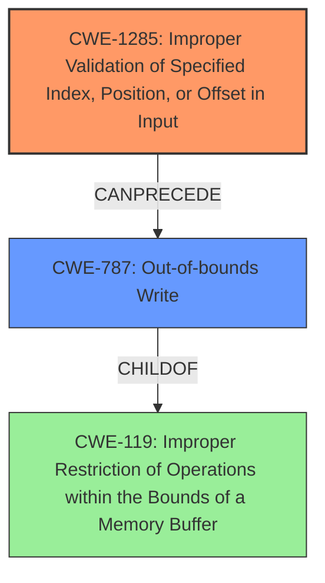

# Final Resolution for CVE-2022-25654

# Summary
| CWE ID | CWE Name | Confidence | CWE Abstraction Level | CWE Vulnerability Mapping Label | CWE-Vulnerability Mapping Notes |
|---|---|---|---|---|---|
| CWE-1285 | Improper Validation of Specified Index, Position, or Offset in Input | 0.85 | Base | Allowed | Primary CWE: Addresses the **improper input validation** leading to **memory corruption**. |
| CWE-787 | Out-of-bounds Write | 0.75 | Base | Allowed | Secondary Candidate: Captures the **memory corruption** aspect, specifically writing outside allocated memory as a consequence of the **improper input validation**. |

## Evidence and Confidence

*   **Confidence Score:** 0.80
*   **Evidence Strength:** MEDIUM

## Relationship Analysis
The primary relationship identified is that **CWE-1285 (Improper Validation of Specified Index, Position, or Offset in Input)** can precede **CWE-787 (Out-of-bounds Write)**. This signifies that the failure to properly validate the input (index, position, or offset) directly leads to the possibility of writing data outside the intended buffer. Both CWEs are at the Base level of abstraction, which makes them suitable for direct mapping. While **CWE-787** is a child of **CWE-119 (Improper Restriction of Operations within the Bounds of a Memory Buffer)**, focusing on **CWE-787** provides a more specific description of the **memory corruption** vulnerability. Considering **CWE-20 (Improper Input Validation)** was important. The decision was made to not include it because the vulnerability description specifically mentions indices, positions, or offsets, making **CWE-1285** a more precise fit.

## Vulnerability Chain
The vulnerability chain starts with **improper input validation (CWE-1285)**, specifically the failure to properly validate indices, positions, or offsets. This **WEAKNESS** allows an attacker to provide a malicious index, position, or offset. This leads to writing data outside the intended buffer, resulting in **memory corruption (CWE-787)**. The **ROOTCAUSE** is the lack of proper input validation, and the impact is **memory corruption**, which can lead to arbitrary code execution, denial of service, or information disclosure.

## Summary of Analysis
The initial analysis correctly identifies **CWE-1285 (Improper Validation of Specified Index, Position, or Offset in Input)** and **CWE-787 (Out-of-bounds Write)** as relevant CWEs. The criticism raises valid points about the composite nature of the relationship and alternative CWEs.

The vulnerability description explicitly states "Memory corruption in kernel due to **improper input validation** while processing ION commands," which supports the selection of **CWE-1285**. The phrase "memory corruption" directly suggests **CWE-787**. The retriever scores also support these choices.

The graph relationships reinforce the understanding that **CWE-1285** is the **ROOTCAUSE**, leading to **CWE-787** as a consequence. The selection of these CWEs is at the optimal level of specificity because they directly map to the vulnerability description and are at the Base level of abstraction. The confidence level is increased to 0.80 because the evidence is compelling, even though more specific details would further increase the confidence.