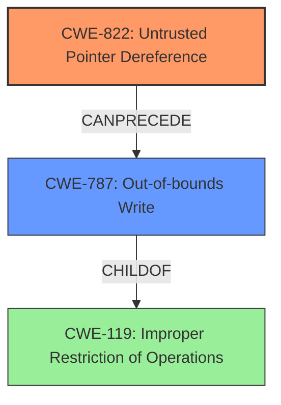

# Final Resolution for CVE-2022-25661

# Summary
| CWE ID | CWE Name | Confidence | CWE Abstraction Level | CWE Vulnerability Mapping Label | CWE-Vulnerability Mapping Notes |
|---|---|---|---|---|---|
| CWE-822 | **Untrusted Pointer Dereference** | 0.95 | Base | Allowed | Primary CWE: **Root cause** of the vulnerability. |
| CWE-787 | **Out-of-bounds Write** | 0.3 | Base | Allowed | Secondary Candidate: Possible consequence of the **untrusted pointer dereference**, leading to memory corruption via out-of-bounds write. |

## Evidence and Confidence

*   **Confidence Score:** 0.8
*   **Evidence Strength:** MEDIUM

## Relationship Analysis
The primary relationship is that CWE-787 (Out-of-bounds Write) can be a consequence of CWE-822 (**Untrusted Pointer Dereference**). CWE-787 is a child of CWE-119 (Improper Restriction of Operations within the Bounds of a Memory Buffer), however, using CWE-119 is discouraged, so we select the child CWE-787. The abstraction levels influenced my selection by favoring the more specific Base level CWEs.

## Vulnerability Chain
The vulnerability chain starts with the **root cause**, CWE-822 (**Untrusted Pointer Dereference**). The product obtains a pointer from an untrusted source and dereferences it. This can lead to CWE-787 (**Out-of-bounds Write**) if the pointer points to a memory location outside the intended buffer, leading to memory corruption. The vulnerability description directly indicates memory corruption as a result.

## Summary of Analysis
I agree with the initial analysis that CWE-822 (**Untrusted Pointer Dereference**) is the primary **root cause** with high confidence. The vulnerability description explicitly states "untrusted pointer dereference" which directly aligns with CWE-822's description: "The product obtains a value from an untrusted source, converts this value to a pointer, and dereferences the resulting pointer."

I am replacing the initial secondary candidate CWE-119 with CWE-787 (**Out-of-bounds Write**). The criticism correctly noted that CWE-119 is discouraged. The vulnerability description mentions "memory corruption" as a consequence of the **untrusted pointer dereference**. Given that the **untrusted pointer dereference** could lead to writing to an unintended memory location, CWE-787 is a plausible, more specific, consequence. However, since the vulnerability description does not explicitly mention an out-of-bounds write, the confidence remains low.