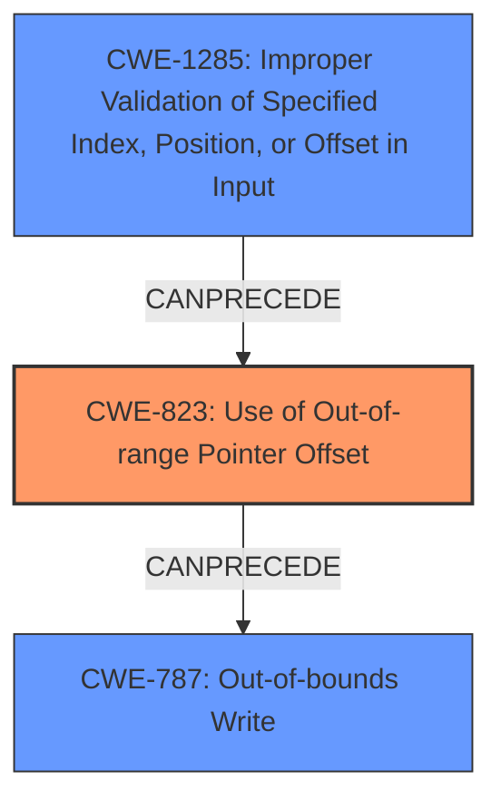

# Final Resolution for CVE-2022-25682

# Summary
| CWE ID | CWE Name | Confidence | CWE Abstraction Level | CWE Vulnerability Mapping Label | CWE-Vulnerability Mapping Notes |
|---|---|---|---|---|---|
| CWE-823 | Use of Out-of-range Pointer Offset | 0.8 | Base | Allowed | Primary CWE: The vulnerability description explicitly mentions the usage of an **out of range pointer offset**, which directly aligns with this CWE. |
| CWE-1285 | Improper Validation of Specified Index, Position, or Offset in Input | 0.7 | Base | Allowed | Secondary CWE: The offset being used is derived from input received from the card, then a failure to validate this offset is a very plausible root cause. |
| CWE-787 | Out-of-bounds Write | 0.6 | Base | Allowed | Secondary CWE: Since an **out-of-range pointer offset** could lead to writing outside the allocated memory, this CWE is a potential consequence. |

## Evidence and Confidence

*   **Confidence Score:** 0.75
*   **Evidence Strength:** MEDIUM

## Relationship Analysis
The primary weakness is CWE-823 (**Use of Out-of-range Pointer Offset**), which describes the core issue. The secondary weaknesses are CWE-1285 (**Improper Validation of Specified Index, Position, or Offset in Input**) and CWE-787 (**Out-of-bounds Write**).

CWE-823 can be caused by CWE-1285 if the offset originates from untrusted input and is not properly validated. CWE-823 can then lead to CWE-787 if the out-of-range offset is used in a write operation.

## Vulnerability Chain
The vulnerability chain starts with a potential lack of input validation (CWE-1285) when decoding commands from the card. This can lead to using an **out-of-range pointer offset** (CWE-823), which in turn causes memory corruption due to an out-of-bounds write (CWE-787).
  - The initial flaw is the missing or incorrect validation of the offset derived from the command.
  - This leads to pointer arithmetic using the invalid offset.
  - Dereferencing the resulting pointer causes an out-of-bounds access.
  - The consequence is memory corruption within the MODEM UIM.

## Summary of Analysis
The initial analysis correctly identified CWE-823 as the primary issue. However, it missed the potential root cause related to input validation. The criticism correctly pointed out that since the "vulnerability description states 'Memory corruption in MODEM UIM due to usage of **out of range pointer offset** while decoding command from card'", that CWE-1285 (Improper Validation of Specified Index, Position, or Offset in Input) should also be included. By adding CWE-1285, we get a more complete picture of the vulnerability, and the potential attack surface.

The confidence in CWE-787 is reduced since this is only a potential consequence and not a certainty.

The selected CWEs are at the optimal level of specificity because they directly address the vulnerability as described and provide actionable insights for mitigation. CWE-823 describes the direct cause (**out of range pointer offset**), and CWE-1285 addresses the potential root cause (lack of input validation).