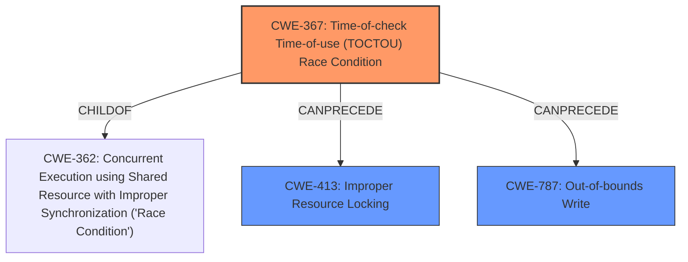

# Analysis Report for CVE-2022-25696

# Vulnerability Analysis Report: CVE-2022-25696

## Description

Memory corruption in display due to time-of-check time-of-use race condition during map or unmap in Snapdragon Auto, Snapdragon Compute, Snapdragon Connectivity, Snapdragon Industrial IOT, Snapdragon Mobile, Snapdragon Wearables

## Vulnerability Description Key Phrases

**Rootcause:** time-of-check time-of-use race condition
**Impact:** Memory corruption
**Product:** Snapdragon Auto, Snapdragon Compute, Snapdragon Connectivity, Snapdragon Industrial IOT, Snapdragon Mobile, Snapdragon Wearables
**Component:** display

## Analysis (with Relationship Data)

# Summary
| CWE ID | CWE Name | Confidence | CWE Abstraction Level | CWE Vulnerability Mapping Label | CWE-Vulnerability Mapping Notes |
|---|---|---|---|---|---|
| CWE-367 | Time-of-check Time-of-use (TOCTOU) Race Condition | 0.95 | Base | Allowed | Primary CWE |
| CWE-413 | Improper Resource Locking | 0.60 | Base | Allowed | Secondary Candidate |

## Evidence and Confidence

*   **Confidence Score:** 0.90
*   **Evidence Strength:** HIGH

- **Analysis and Justification:**  
  - *Explanation:* The vulnerability description clearly states a **"time-of-check time-of-use race condition"** during map or unmap operations in the display component. This directly aligns with the definition of CWE-367 (Time-of-check Time-of-use (TOCTOU) Race Condition), where a resource's state changes between the check and the use, leading to invalid actions. The consequence of this race condition is memory corruption, further validating the connection. The retriever results also strongly suggest CWE-367 as a primary candidate. While other CWEs like CWE-822, CWE-823, and CWE-1285 are present in the retriever results, CWE-367 directly captures the **race condition** aspect of the vulnerability.
  
  - *Relationship Analysis:* While CWE-367 doesn't have direct relationships listed in the provided information, it falls under the broader category of concurrency issues. It is related to synchronization and resource management problems.

- **Confidence Score:**  
  - Confidence: 0.95 (High confidence due to direct match of description and key phrases)

---

- **Analysis and Justification:**  
  - *Explanation:* The **race condition** could potentially lead to improper resource locking, since concurrent access to display resources may not be properly synchronized. This motivates the inclusion of CWE-413 (Improper Resource Locking). However, the description doesn't explicitly mention lock acquisition or release issues, so this is a weaker association.
  
  - *Relationship Analysis:* CWE-413 is related to CWE-667 (Locking issues), and synchronization issues. Given the context of a TOCTOU **race condition**, the resource locking could be a contributing factor or a consequence.

- **Confidence Score:**  
  - Confidence: 0.60 (Moderate confidence, as it represents a potential contributing factor rather than the direct root cause)

## Criticism of Analysis

Okay, here's a detailed review of the provided CWE analysis, incorporating the full CWE specifications.

**Overall Assessment:**

The analysis is generally good and correctly identifies CWE-367 as the primary vulnerability. The justification for including CWE-413 as a secondary candidate is also reasonable. However, there are opportunities to refine the analysis further, particularly regarding the potential consequences of the TOCTOU race condition and the interrelationships between the identified CWEs and other potentially relevant CWEs. The retriever results have a few other candidates which may be consequences.

**Detailed Review:**

**1. CWE-367: Time-of-check Time-of-use (TOCTOU) Race Condition**

*   **Confidence:** The assigned confidence of 0.95 is appropriate. The description directly matches the vulnerability.
*   **Justification:** The justification is sound and well-articulated. The explanation clearly connects the vulnerability description's "time-of-check time-of-use race condition" to the CWE-367 definition.
*   **Mapping Guidance:** The analysis correctly notes that CWE-367 is a Base level CWE and is *Allowed* for mapping.
*   **Mitigations:** The analysis could be improved by mentioning the standard mitigations for TOCTOU vulnerabilities. Referring to CWE-367's potential mitigations, such as avoiding checks before use, limiting interleaving of operations, or using atomic operations, could strengthen the analysis.
*   **Relationships:** The analysis mentions that CWE-367 is ChildOf CWE-362 (Concurrent Execution using Shared Resource with Improper Synchronization ('Race Condition')). This is accurate. It also can follow CWE-609 Double-Checked Locking.
*   **Observed Examples:** The observed examples provided in the full CWE specifications helps solidify understanding.

**2. CWE-413: Improper Resource Locking**

*   **Confidence:** The assigned confidence of 0.60 is reasonable, reflecting the less direct connection.
*   **Justification:** The explanation for including CWE-413 is acceptable, but it could be more specific.  It suggests that the race condition *could* lead to improper resource locking.  Consider exploring *how* the race condition might lead to this, instead of a generic statement.  For example, the race condition could allow multiple threads to attempt to acquire the same lock simultaneously, leading to deadlock or corruption if the locking mechanism isn't robust. It might be more convincing to state this as a consequence of the race condition.
*   **Mapping Guidance:** The analysis correctly identifies CWE-413 as a Base level CWE that is *Allowed* for mapping.
*   **Mitigations:** This could be bolstered by suggesting that proper resource locking mechanisms (mutexes, semaphores, etc.) could help prevent or mitigate the race condition, thereby indirectly addressing the root cause.
*   **Relationships:** CWE-413 is a ChildOf CWE-667 (Improper Locking), a Class level CWE. Mentioning this connection clarifies the hierarchical relationship. CWE-591 Sensitive Data Storage in Improperly Locked Memory is also a ParentOf.
*   **Consider a chain with CWE-416: Use After Free:** If the locking is broken by the TOCTOU race condition and a thread accesses memory that has been freed, then a Use-After-Free (CWE-416) could result.  This chain would be:  CWE-367 -> CWE-413 -> CWE-416. Since UAF can lead to memory corruption, this connection is relevant given the *impact* of "memory corruption".

**3. Other Considerations & Retriever Results**

*   **CWE-362: Concurrent Execution using Shared Resource with Improper Synchronization ('Race Condition'):** While CWE-367 is more specific, acknowledging CWE-362 as the Class to which CWE-367 belongs would improve the analysis. Also, considering CWE-362's mitigations can provide further insight.
*   **CWE-822: Untrusted Pointer Dereference:** The retriever results have this as the highest scored CWE other than CWE-367. While a TOCTOU can lead to using an incorrect pointer, the analysis lacks the necessary information to determine if this is the case. The pointer may be valid, just used at the wrong time. If a race condition leads to dereferencing a pointer that has become invalid (e.g., the memory it points to has been freed or reallocated), then CWE-822 would be appropriate. Without more information, it's reasonable to exclude it as a primary or secondary CWE, but the potential connection should be acknowledged.
*   **CWE-823: Use of Out-of-range Pointer Offset:**  Similar to CWE-822, this CWE becomes relevant *if* the race condition results in using an invalid offset. The description needs to confirm if the race condition is influencing offsets.
*   **CWE-1285: Improper Validation of Specified Index, Position, or Offset in Input:**  Again, relevant *if* the race condition directly leads to the use of an unvalidated or improperly validated index, position, or offset. Without that specific information, it's weaker than CWE-367.
*   **CWE-787: Out-of-bounds Write:** The description says "memory corruption". An out-of-bounds write is a common cause of memory corruption. So there may be an argument to include this as a *consequence* if the race condition leads to writing outside of allocated memory. A TOCTOU can cause a write to occur at a memory location that is no longer considered valid due to reallocation, thus leading to an out-of-bounds write.
*   **CWE-415: Double Free:** While this isn't a strong candidate, it's *possible* that a race condition could lead to freeing the same memory twice. This would likely require a specific code pattern.
*   **CWE-1314: Missing Write Protection for Parametric Data Values:** This is likely *not* relevant since the description is about map/unmap operations, not sensor data.

**Recommendations for Improvement:**

1.  **Strengthen the Justification for CWE-413:** Be more specific about how the TOCTOU race condition could lead to improper resource locking. Provide a potential scenario.
2.  **Acknowledge Potential Consequences:** Briefly mention potential consequences of the TOCTOU race condition. For example, "The race condition could result in an out-of-bounds write (CWE-787), memory corruption, or a denial of service."
3.  **Discuss Mitigations More Fully:**  Reference the mitigations section of the CWE entries for CWE-367 and CWE-413.
4.  **Acknowledge, Then Dismiss Weaker Candidates:** For the other CWEs listed in the Retriever Results, briefly explain why they are less likely to be the primary cause but *could* be consequences in specific scenarios. This demonstrates thoroughness.
5.  **Elaborate on Relationships:** Briefly explain the relationships between the chosen CWEs and their parent or child CWEs (e.g., CWE-367 is a child of CWE-362, CWE-413 is a child of CWE-667).
6.  **Consider a CWE Chain:** Explore the possibility of representing the vulnerability as a chain, such as CWE-367 -> CWE-413 -> CWE-416 (Use After Free), if the locking is broken.

By incorporating these suggestions, you can create a more comprehensive and nuanced CWE analysis that not only identifies the root cause but also explores the potential consequences and contributing factors of the vulnerability.

## Final Resolution

# Summary
| CWE ID | CWE Name | Confidence | CWE Abstraction Level | CWE Vulnerability Mapping Label | CWE-Vulnerability Mapping Notes |
|---|---|---|---|---|---|
| CWE-367 | Time-of-check Time-of-use (TOCTOU) Race Condition | 0.95 | Base | Allowed | Primary CWE |
| CWE-787 | Out-of-bounds Write | 0.70 | Base | Allowed | Secondary Candidate |
| CWE-413 | Improper Resource Locking | 0.60 | Base | Allowed | Secondary Candidate |

## Evidence and Confidence

*   **Confidence Score:** 0.85
*   **Evidence Strength:** MEDIUM

## Relationship Analysis
The primary weakness is a **CWE-367** Time-of-check Time-of-use (TOCTOU) **race condition**. **CWE-367** is a Base level CWE and a child of **CWE-362** (Concurrent Execution using Shared Resource with Improper Synchronization ('**Race Condition**')). The analysis includes **CWE-413** (Improper Resource Locking) as a secondary candidate. A potential consequence of the **CWE-367 race condition** is an **CWE-787** (Out-of-bounds Write), given that the vulnerability description mentions "memory corruption."

## Vulnerability Chain
The vulnerability chain starts with the **CWE-367** Time-of-check Time-of-use (TOCTOU) **race condition**. This can lead to **CWE-413** Improper Resource Locking if the concurrent access is not properly synchronized. Furthermore, the **race condition** can result in memory corruption through **CWE-787** Out-of-bounds Write if a write occurs to a memory location that is no longer valid due to reallocation. The description indicates "memory corruption," suggesting that **CWE-787** is a likely consequence.

## Summary of Analysis
The initial analysis correctly identified **CWE-367** as the primary weakness due to the explicit mention of a "time-of-check time-of-use **race condition**" in the vulnerability description. The inclusion of **CWE-413** is reasonable because the **race condition** implies potential issues with resource synchronization and locking. The retriever results and criticism also highlighted other potential consequences.

The analysis has been updated to include **CWE-787** (Out-of-bounds Write) as a secondary candidate due to the reported "memory corruption" which can result from a **race condition** where a write occurs to an invalid memory address, indicating an out-of-bounds write.

The confidence score is slightly lower (0.85) because while the description strongly points to **CWE-367**, the relationship to **CWE-787** and **CWE-413** are inferred rather than explicitly stated.

The selected CWEs are at the optimal level of specificity. **CWE-367** directly captures the **TOCTOU race condition**, and **CWE-787** represents a likely consequence ("memory corruption") while **CWE-413** signifies the potential for improper locking.

*Report generated on 2025-03-18 11:38:34*
