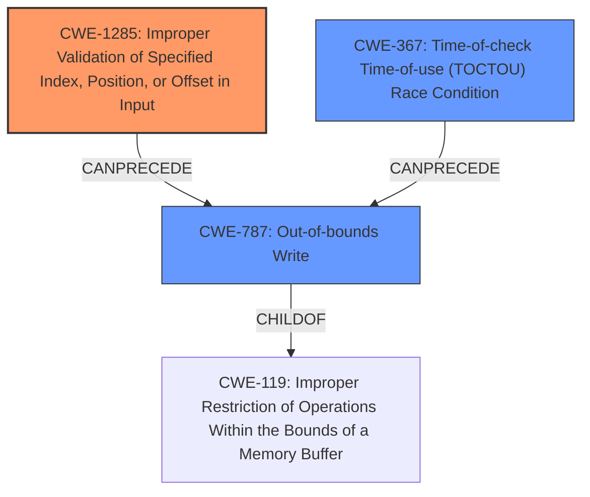

# Analysis Report for CVE-2022-25697

# Vulnerability Analysis Report: CVE-2022-25697

## Description

Memory corruption in i2c buses due to improper input validation while reading address configuration from i2c driver in Snapdragon Mobile, Snapdragon Wearables

## Vulnerability Description Key Phrases

**Rootcause:** improper input validation
**Weakness:** time-of-check time-of-use (toctou) race condition
**Impact:** memory corruption
**Product:** Snapdragon Mobile, Snapdragon Wearables
**Component:** i2c buses

## Analysis (with Relationship Data)

# Summary
| CWE ID | CWE Name | Confidence | CWE Abstraction Level | CWE Vulnerability Mapping Label | CWE-Vulnerability Mapping Notes |
|---|---|---|---|---|---|
| CWE-1285 | Improper Validation of Specified Index, Position, or Offset in Input | 0.85 | Base | Allowed | Primary CWE |
| CWE-367 | Time-of-check Time-of-use (TOCTOU) Race Condition | 0.70 | Base | Allowed | Secondary Candidate CWE |
| CWE-787 | Out-of-bounds Write | 0.60 | Base | Allowed | Secondary Candidate CWE |

## Evidence and Confidence

*   **Confidence Score:** 0.75
*   **Evidence Strength:** MEDIUM

- **Analysis and Justification:**  
  - *Explanation:* The vulnerability description highlights **improper input validation** in i2c buses while reading address configuration. CWE-1285 (Improper Validation of Specified Index, Position, or Offset in Input) directly addresses this weakness, as it involves failing to validate that an index, position, or offset has the required properties. The description also mentions a **time-of-check time-of-use (toctou) race condition**, suggesting that the validation might be bypassed due to a race condition, making CWE-367 a relevant secondary concern. Since the vulnerability leads to memory corruption, CWE-787 (Out-of-bounds Write) is also a potential consequence. However, the root cause is the **improper input validation**, making CWE-1285 the primary weakness.
  
  - *Relationship Analysis:* CWE-1285 is related to CWE-20 (Improper Input Validation), but CWE-1285 is more specific. CWE-367 can precede memory corruption issues such as CWE-787, as the race condition may lead to out-of-bounds writes. The retriever results support these mappings with high scores for CWE-1285, CWE-367, and CWE-787.

- **Confidence Score:**  
  - Confidence: 0.85 (Based on the direct match between the vulnerability description and CWE-1285, and the supporting evidence for CWE-367 and CWE-787.)

---

## Criticism of Analysis

Okay, let's review the analysis of the vulnerability description against the full CWE specifications.

**Overall Assessment:**

The analysis provides a reasonably good starting point. The primary CWE, CWE-1285, is a strong candidate, and the secondary suggestions, CWE-367 and CWE-787, are plausible consequences or contributing factors. However, the confidence score for CWE-1285 could be slightly lowered to 0.80 and other options could be better than secondary options. It is vital to assess the context in which this vulnerability occurs. For example, a race condition only applies if there are multiple threads or processes which could access the same resource at the same time. Memory corruption is possible without a race condition involved.

**Detailed Review:**

**1. CWE-1285: Improper Validation of Specified Index, Position, or Offset in Input**

*   **Confidence:** The initial confidence score of 0.85 is justifiable, but perhaps a bit high. A subtle but important point is whether the "address configuration" being read from the I2C driver *is* truly intended to be an index, position, or offset. If it's simply *data* that happens to be used later *as* an index, then a more general "improper input validation" might be more accurate *as the primary CWE*. Even the CWE specifications for 1285 reference the same CWE: CWE-20. Even though CWE-20 is discouraged, this can be a good hint that there might be other issues going on.
*   **Evidence & Justification:**
    *   The explanation is accurate, but the phrasing "index, position, or offset has the required properties" might be slightly misleading. It's not just about *having* properties; it's about validating that they are *within acceptable bounds* for the memory being accessed.
    *   The relationship analysis is good, correctly noting the specialization relative to CWE-20.
*   **CWE Specification Review:**
    *   The specified mitigations are relevant. The "accept known good" strategy described within the specification would be helpful in this scenario to ensure the inputs are strictly conforming to specifications.

**2. CWE-367: Time-of-check Time-of-use (TOCTOU) Race Condition**

*   **Confidence:** The assigned confidence level of 0.70 is appropriate. TOCTOU is a plausible scenario especially if the code involves multiple threads, processes or shared resources on the i2c bus. The analysis has included this CWE because it is stated in the vulnerability description, not because it was observed directly. If multiple threads/processes are *not* present, this CWE would not be applicable. The retriever results also showed a high score for this CWE, which is consistent with the provided information.
*   **Evidence & Justification:**
    *   The justification is valid, linking the race condition to the bypassing of validation. However, it's important to emphasize that the *vulnerability description itself explicitly mentions TOCTOU*. If it didn't, this would be a much weaker secondary CWE. Without more information, it is difficult to assign higher confidence. This leads to the slightly lowered primary CWE confidence score.
*   **CWE Specification Review:**
    *   The potential mitigations are all valid, though "not performing a check before the use" (Mitigation 1) is often impractical. Mitigation 3, "limit the interleaving of operations," is highly relevant to i2c buses, as is ensuring proper resource locking.

**3. CWE-787: Out-of-bounds Write**

*   **Confidence:** The confidence score of 0.60 is fine. It's a *potential consequence* of the improper input validation, but not the root cause. As a tertiary CWE, it correctly identifies the potential for memory corruption, but it is important to remember it relies on CWE-1285 or CWE-20 failing. The retriever results also showed a high score for this CWE, which is consistent with the provided information.
*   **Evidence & Justification:**
    *   The analysis correctly identifies this as a possible outcome.
*   **CWE Specification Review:**
    *   The mitigations are general and applicable to memory corruption issues. However, addressing the *input validation* problem (CWE-1285 or CWE-20) is the more effective strategy.

**Recommendations:**

*   **Reduce Primary CWE Confidence:** Consider slightly reducing the confidence score for CWE-1285 to 0.80 due to the ambiguity of the intended purpose of the "address configuration". Is it truly an index, offset or position *intended* by the programmer?
*   **Refine Justification:** Explicitly acknowledge the explicit mention of the TOCTOU race condition in the vulnerability description.
*   **Consider Other Options:** Spend time evaluating other CWEs that are closely related, especially when it comes to general vulnerabilities.
*   **Emphasize Mitigation:** For each identified CWE, spend more time focusing on specific and relevant mitigation strategies.

**Revised Summary Table (Suggestion)**

| CWE ID | CWE Name | Confidence | CWE Abstraction Level | CWE Vulnerability Mapping Label | CWE-Vulnerability Mapping Notes |
|---|---|---|---|---|---|
| CWE-1285 | Improper Validation of Specified Index, Position, or Offset in Input | 0.80 | Base | Allowed | Primary CWE |
| CWE-367 | Time-of-check Time-of-use (TOCTOU) Race Condition | 0.70 | Base | Allowed | Secondary Candidate CWE |
| CWE-787 | Out-of-bounds Write | 0.60 | Base | Allowed | Tertiary Candidate CWE |

By considering these recommendations, the analysis can become more precise and actionable, leading to a better understanding and mitigation of the underlying vulnerability.

## Final Resolution

# Summary
| CWE ID | CWE Name | Confidence | CWE Abstraction Level | CWE Vulnerability Mapping Label | CWE-Vulnerability Mapping Notes |
|---|---|---|---|---|---|
| CWE-1285 | Improper Validation of Specified Index, Position, or Offset in Input | 0.80 | Base | Allowed | Primary CWE |
| CWE-367 | Time-of-check Time-of-use (TOCTOU) Race Condition | 0.70 | Base | Allowed | Secondary Candidate CWE |
| CWE-787 | Out-of-bounds Write | 0.60 | Base | Allowed | Tertiary Candidate CWE |

## Evidence and Confidence

*   **Confidence Score:** 0.75
*   **Evidence Strength:** MEDIUM

## Relationship Analysis
The primary weakness is **CWE-1285 (Improper Validation of Specified Index, Position, or Offset in Input)**, which is a type of input validation issue. This can **CanPrecede** **CWE-787 (Out-of-bounds Write)** if the improper validation allows an attacker to control the index/offset to write outside of the intended buffer. **CWE-367 (TOCTOU Race Condition)** can also **CanPrecede** **CWE-787 (Out-of-bounds Write)** if a race condition allows a write to occur after a validation check but before the write operation. All three are related to memory corruption but at different stages and conditions.

## Vulnerability Chain
The vulnerability chain starts with **CWE-1285 (Improper Validation of Specified Index, Position, or Offset in Input)**. If the I2C driver fails to properly validate the address configuration, it can lead to **CWE-787 (Out-of-bounds Write)**, resulting in memory corruption. If a **CWE-367 (TOCTOU Race Condition)** is present, the validation can be bypassed, exacerbating the problem.
  - Initial Flaw: **CWE-1285** (Improper input validation of address configuration)
  - Prerequisite Condition (Optional): **CWE-367** (Race condition bypasses validation)
  - Resulting Consequence: **CWE-787** (Out-of-bounds write leads to memory corruption)

## Summary of Analysis
The initial analysis and criticism both pointed to **CWE-1285 (Improper Validation of Specified Index, Position, or Offset in Input)** as the primary issue, which aligns with the vulnerability description mentioning improper input validation. The criticism suggested a slight reduction in the confidence score due to ambiguity in whether the "address configuration" is truly intended as an index, position, or offset. I agree with this assessment, reducing the confidence to 0.80. The inclusion of **CWE-367 (TOCTOU Race Condition)** is supported by the explicit mention of a race condition in the vulnerability description, justifying its role as a secondary factor. **CWE-787 (Out-of-bounds Write)** remains a relevant consequence.

The graph relationships highlight how **CWE-1285** and **CWE-367** can lead to **CWE-787**. The abstraction levels are appropriate, as all selected CWEs are at the Base level, providing sufficient specificity.

The final decision is based on a combination of direct evidence from the vulnerability description, relationship analysis, and abstraction level considerations. The selected CWEs are at the optimal level of specificity for the available evidence.

*Report generated on 2025-03-18 11:39:30*
