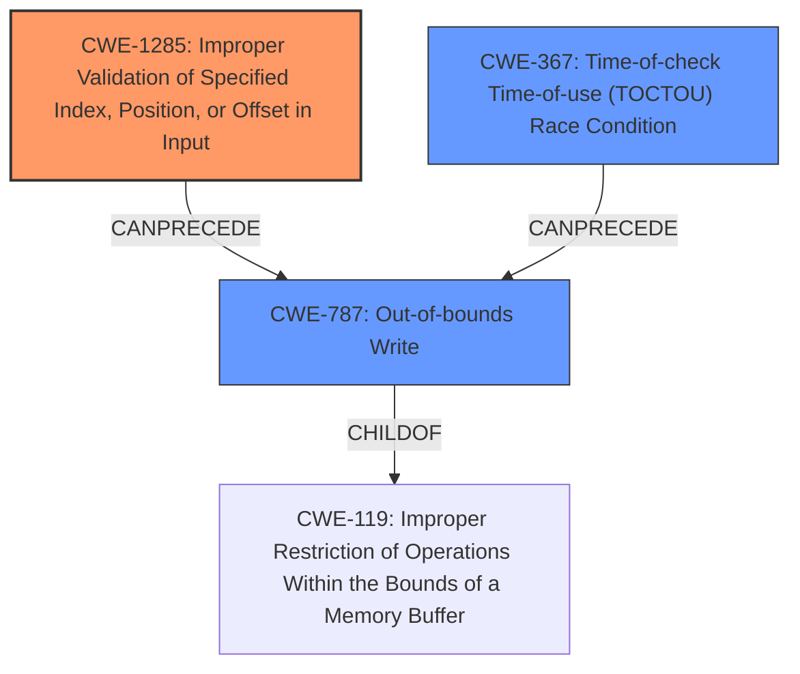

# Final Resolution for CVE-2022-25697

# Summary
| CWE ID | CWE Name | Confidence | CWE Abstraction Level | CWE Vulnerability Mapping Label | CWE-Vulnerability Mapping Notes |
|---|---|---|---|---|---|
| CWE-1285 | Improper Validation of Specified Index, Position, or Offset in Input | 0.80 | Base | Allowed | Primary CWE |
| CWE-367 | Time-of-check Time-of-use (TOCTOU) Race Condition | 0.70 | Base | Allowed | Secondary Candidate CWE |
| CWE-787 | Out-of-bounds Write | 0.60 | Base | Allowed | Tertiary Candidate CWE |

## Evidence and Confidence

*   **Confidence Score:** 0.75
*   **Evidence Strength:** MEDIUM

## Relationship Analysis
The primary weakness is **CWE-1285 (Improper Validation of Specified Index, Position, or Offset in Input)**, which is a type of input validation issue. This can **CanPrecede** **CWE-787 (Out-of-bounds Write)** if the improper validation allows an attacker to control the index/offset to write outside of the intended buffer. **CWE-367 (TOCTOU Race Condition)** can also **CanPrecede** **CWE-787 (Out-of-bounds Write)** if a race condition allows a write to occur after a validation check but before the write operation. All three are related to memory corruption but at different stages and conditions.

## Vulnerability Chain
The vulnerability chain starts with **CWE-1285 (Improper Validation of Specified Index, Position, or Offset in Input)**. If the I2C driver fails to properly validate the address configuration, it can lead to **CWE-787 (Out-of-bounds Write)**, resulting in memory corruption. If a **CWE-367 (TOCTOU Race Condition)** is present, the validation can be bypassed, exacerbating the problem.
  - Initial Flaw: **CWE-1285** (Improper input validation of address configuration)
  - Prerequisite Condition (Optional): **CWE-367** (Race condition bypasses validation)
  - Resulting Consequence: **CWE-787** (Out-of-bounds write leads to memory corruption)

## Summary of Analysis
The initial analysis and criticism both pointed to **CWE-1285 (Improper Validation of Specified Index, Position, or Offset in Input)** as the primary issue, which aligns with the vulnerability description mentioning improper input validation. The criticism suggested a slight reduction in the confidence score due to ambiguity in whether the "address configuration" is truly intended as an index, position, or offset. I agree with this assessment, reducing the confidence to 0.80. The inclusion of **CWE-367 (TOCTOU Race Condition)** is supported by the explicit mention of a race condition in the vulnerability description, justifying its role as a secondary factor. **CWE-787 (Out-of-bounds Write)** remains a relevant consequence.

The graph relationships highlight how **CWE-1285** and **CWE-367** can lead to **CWE-787**. The abstraction levels are appropriate, as all selected CWEs are at the Base level, providing sufficient specificity.

The final decision is based on a combination of direct evidence from the vulnerability description, relationship analysis, and abstraction level considerations. The selected CWEs are at the optimal level of specificity for the available evidence.