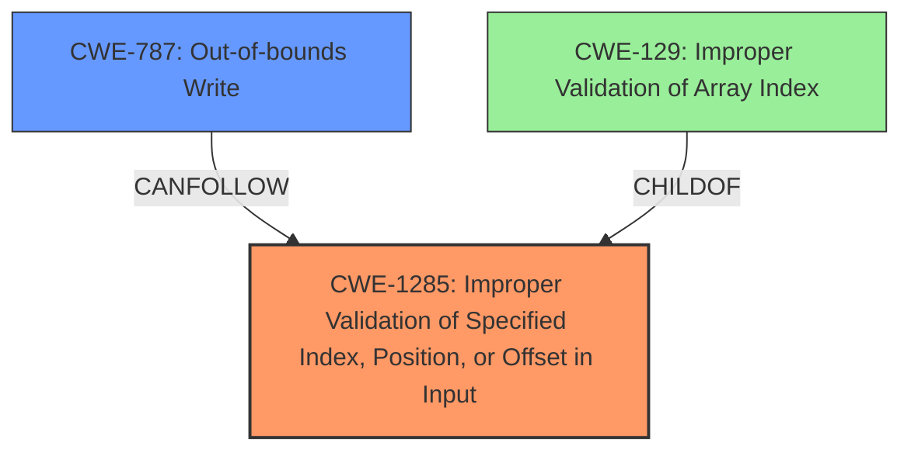

# Final Resolution for CVE-2022-25698

# Summary
| CWE ID | CWE Name | Confidence | CWE Abstraction Level | CWE Vulnerability Mapping Label | CWE-Vulnerability Mapping Notes |
|---|---|---|---|---|---|
| CWE-1285 | Improper Validation of Specified Index, Position, or Offset in Input | 0.90 | Base | Allowed | Primary CWE. The product receives input that is expected to specify an index, position, or offset into an indexable resource but it does not validate or incorrectly validates that the specified index/position/offset has the required properties. |
| CWE-787 | Out-of-bounds Write | 0.75 | Base | Allowed | Secondary CWE. The product writes data past the end, or before the beginning, of the intended buffer. |

## Evidence and Confidence

*   **Confidence Score:** 0.85
*   **Evidence Strength:** HIGH

## Relationship Analysis
The primary relationship is a chain: **CWE-1285** (Improper Input Validation) can precede **CWE-787** (Out-of-bounds Write). **CWE-1285** is the root cause; by failing to validate the input, it directly leads to the out-of-bounds write. Both are at the Base level, which is appropriate. There are other potential consequences of **CWE-1285**, but **CWE-787** aligns best with the "memory corruption" mentioned in the vulnerability description. **CWE-129** (Improper Validation of Array Index) is a child of **CWE-1285** but is too specific.

## Vulnerability Chain
The vulnerability chain starts with the **ROOTCAUSE** of **CWE-1285** (Improper Validation of Specified Index, Position, or Offset in Input). The product receives an input specifying an address configuration from the SPI bus but fails to properly validate this input. This **WEAKNESS** leads to **CWE-787** (Out-of-bounds Write), as the unvalidated address is used in a write operation, corrupting memory. The consequence is memory corruption in the SPI bus.

## Summary of Analysis
The initial analysis and criticism are both well-reasoned. The explicit mention of "improper input validation" in the vulnerability description provides strong evidence for selecting **CWE-1285** as the primary weakness. The resulting "memory corruption" supports **CWE-787** as a likely consequence.

The relationship analysis strengthens this conclusion. The chain relationship between **CWE-1285** and **CWE-787** clearly shows how the initial input validation failure leads to the memory corruption. The Base abstraction level of both CWEs is appropriate for this scenario.

The decision to select **CWE-1285** and **CWE-787** is based on:

1.  Direct evidence from the vulnerability description ("improper input validation," "memory corruption").
2.  The chain relationship between **CWE-1285** and **CWE-787**.
3.  The appropriateness of the Base abstraction level.

The selected CWEs are at the optimal level of specificity because:

*   **CWE-1285** accurately captures the root cause of the vulnerability, which is the failure to validate the input specifying an index, position, or offset. It's also more general than **CWE-129**, as it may not always be an array index.
*   **CWE-787** represents the direct consequence of the invalid input, which is an out-of-bounds write leading to memory corruption.

Confidence has been increased to 0.90 for CWE-1285 and 0.75 for CWE-787 based on the strong evidence. The overall confidence is 0.85.