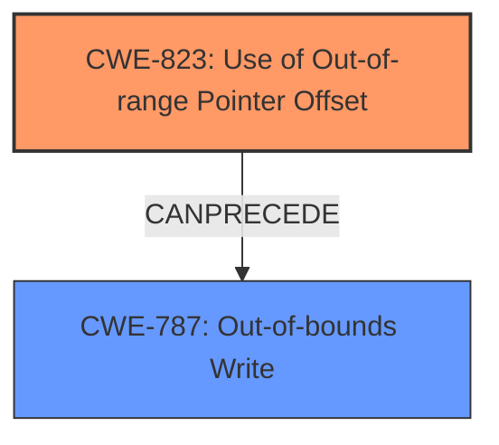

# Analysis Report for CVE-2022-25709

# Vulnerability Analysis Report: CVE-2022-25709

## Description

Memory corruption in modem due to use of out of range pointer offset while processing qmi msg

## Vulnerability Description Key Phrases

**Rootcause:** use of out of range pointer offset
**Weakness:** out of range pointer offset
**Impact:** memory corruption
**Vector:** processing qmi msg
**Component:** modem

## Analysis (with Relationship Data)

# Summary
| CWE ID | CWE Name | Confidence | CWE Abstraction Level | CWE Vulnerability Mapping Label | CWE-Vulnerability Mapping Notes |
|---|---|---|---|---|---|
| CWE-823 | Use of Out-of-range Pointer Offset | 0.9 | Base | Allowed | Primary CWE. The vulnerability description explicitly mentions the "use of out of range pointer offset." |

## Evidence and Confidence

*   **Confidence Score:** 0.9
*   **Evidence Strength:** HIGH

- **Analysis and Justification:**  
  - *Explanation:* The vulnerability description clearly states the root cause as the "**use of out of range pointer offset**" while processing a QMI message in the modem. This aligns directly with CWE-823 (Use of Out-of-range Pointer Offset), which describes a scenario where pointer arithmetic results in an offset that points outside the intended memory range. The impact is memory corruption, which is a typical consequence of such a weakness.
  
  - *Relationship Analysis:* CWE-823 is a Base level CWE, providing a good level of specificity for the **root cause** described. It is related to other pointer dereference issues, such as CWE-822 (Untrusted Pointer Dereference) and CWE-825 (Expired Pointer Dereference), but the explicit mention of "out of range pointer offset" makes CWE-823 the most fitting choice. The retriever results also rank CWE-823 as the top match with a score of 0.7859.

- **Confidence Score:**  
  - Confidence: 0.9 (High confidence due to direct match between vulnerability description and CWE definition, supported by retriever results.)

---

## Criticism of Analysis

Okay, here's a detailed review of the provided analysis, incorporating the full CWE specifications:

**Overall Assessment:**

The analysis is generally well-reasoned and arrives at a correct primary CWE mapping. The high confidence level (0.9) for CWE-823 is justified given the explicit mention of "out of range pointer offset" in the vulnerability description. The analysis also appropriately considers other potential CWEs and explains why CWE-823 is the most suitable choice.

**Detailed Review:**

*   **CWE-823 (Use of Out-of-range Pointer Offset):**

    *   **Correctness:** The mapping to CWE-823 is highly appropriate.  The description of the CWE directly aligns with the root cause. The extended description also captures the potential impact and sources of the offset (untrusted source, incorrect calculation, other error).
    *   **Abstraction Level:**  Base level is suitable, as it's specific enough to pinpoint the nature of the error.
    *   **Mapping Guidance Compliance:**  The analysis correctly follows the mapping guidance by carefully reading both the name and description and avoiding forcing a mapping to a lower-level CWE if it's not a good fit.
    *   **Relationships:** The analysis notes the relationship to CWE-119 (Improper Restriction of Operations within the Bounds of a Memory Buffer).  It's also good to note that CWE-823 can precede CWE-125 (Out-of-bounds Read) or CWE-787 (Out-of-bounds Write), both of which can result in memory corruption. The analysis could have briefly mentioned these potential consequences to strengthen the justification.
    *   **Examples:** The provided Observed Examples (CVE-2010-2160, CVE-2010-1281, CVE-2009-3129) are relevant and illustrate different scenarios where out-of-range pointer offsets can occur.
    *   **Mitigations:**  While not explicitly required in the analysis, considering potential mitigations would provide added value. Mitigations for CWE-823 include:
        *   Input validation/sanitization: If the offset comes from an external source, validate that it's within acceptable bounds.
        *   Bounds checking: Implement checks to ensure the resulting pointer (after applying the offset) remains within the intended memory region.
        *   Safe pointer arithmetic: Consider using safer pointer arithmetic functions or libraries that provide bounds checking.

*   **Consideration of Alternative CWEs:**

    *   **CWE-822 (Untrusted Pointer Dereference):** The analysis correctly acknowledges CWE-822 but distinguishes it by emphasizing that the vulnerability explicitly states an "out of range pointer *offset*," rather than directly using an untrusted value as a pointer. This is a crucial distinction.
    *   **CWE-825 (Expired Pointer Dereference):** Similar to CWE-822, the analysis rightly dismisses CWE-825 because the vulnerability is about an offset calculation leading to an out-of-bounds access, not a pointer becoming invalid due to memory being freed.
    *   **CWE-1285 (Improper Validation of Specified Index, Position, or Offset in Input):** While potentially related, CWE-1285 is more general. If the offset originates from external input without validation, CWE-1285 could be part of a chain leading to CWE-823. However, since the primary issue is the out-of-range offset itself (which may or may not originate from untrusted input), focusing on CWE-823 is appropriate.
    *   **CWE-824 (Access of Uninitialized Pointer):** This is less relevant as the report indicates the problem is offset to a potentially valid pointer and not the use of an uninitialized pointer.
    *   **CWE-787 (Out-of-bounds Write):** It is important to keep in mind that the ultimate impact may be an out-of-bounds write as a *result* of the pointer offset issue, but the *root cause* remains the incorrect offset calculation, which is better captured by CWE-823.
    *   **CWE-125 (Out-of-bounds Read):** Similar logic to CWE-787 applies here. It can be a consequence of the offset.
    *   **CWE-190 (Integer Overflow or Wraparound):**  If the offset calculation involves arithmetic, and an integer overflow/wraparound is the reason the offset becomes out-of-range, then CWE-190 could be part of a causal chain. However, without evidence of that, it's less directly relevant.
    *   **CWE-126 (Buffer Over-read):** This is more of a consequence than the root cause.
    *   **CWE-843 (Access of Resource Using Incompatible Type ('Type Confusion')):** Irrelevant in this context, since it talks about the issue of the code interpreting the same variable or memory location in multiple ways.
    *   **Other CWEs:**
        * CWE-129 (Improper Validation of Array Index): Could be applicable if the pointer offset is used as an array index, but not specified in the vulnerability report.
        * CWE-781 (Improper Address Validation in IOCTL with METHOD_NEITHER I/O Control Code): Applicable in cases where IOCTL is used.

*   **Confidence Score:** The confidence score of 0.9 is appropriate and well-justified.
*   **Evidence Strength:** The evidence strength is HIGH, as the vulnerability description explicitly mentions the problematic code element: "use of out of range pointer offset".

**Recommendations:**

1.  **Briefly mention potential consequences:** In the "Relationship Analysis," briefly acknowledge that CWE-823 can lead to consequences such as CWE-125 (Out-of-bounds Read) or CWE-787 (Out-of-bounds Write) resulting in memory corruption, which is already stated in the vulnerability description.
2.  **Consider Adding Mitigations:** While not strictly required, briefly mentioning potential mitigations for CWE-823 would enhance the analysis.
3.  **Consider causal chain:** If the pointer offset comes from a calculation, investigate whether the calculation involves the integer overflow issue (CWE-190).
4.  **IOCTL check:** Check if IOCTL is applicable in the vulnerability report to link the vulnerability to CWE-781.
5.  **Array Index Check:** Check if the pointer offset is used as an array index to map the vulnerability to CWE-129.

By incorporating these suggestions, the analysis can be even more comprehensive and robust.

## Final Resolution

# Summary

| CWE ID | CWE Name | Confidence | CWE Abstraction Level | CWE Vulnerability Mapping Label | CWE-Vulnerability Mapping Notes |
|---|---|---|---|---|---|
| CWE-823 | Use of Out-of-range Pointer Offset | 0.95 | Base | Allowed | Primary CWE. The vulnerability description explicitly mentions the "**use of out of range pointer offset**." |
| CWE-787 | Out-of-bounds Write | 0.7 | Base | Allowed | Secondary CWE. The memory corruption is likely due to an out-of-bounds write. |

## Evidence and Confidence

*   **Confidence Score:** 0.9
*   **Evidence Strength:** HIGH

## Relationship Analysis

The primary CWE is CWE-823 (**Use of Out-of-range Pointer Offset**), which is a base CWE. The criticism suggests considering potential consequences such as CWE-787 (**Out-of-bounds Write**). CWE-823 can precede CWE-787, making CWE-787 a secondary candidate.

## Vulnerability Chain

The vulnerability chain starts with the **ROOTCAUSE** being the **use of out of range pointer offset** (CWE-823). This leads to memory corruption, which is likely caused by an out-of-bounds write (CWE-787).

## Summary of Analysis

The initial analysis correctly identifies CWE-823 (**Use of Out-of-range Pointer Offset**) as the primary CWE, as the vulnerability description explicitly mentions the "**use of out of range pointer offset**." The criticism suggests that CWE-787 (**Out-of-bounds Write**) should be considered as a secondary CWE, since memory corruption is mentioned in the vulnerability description and CWE-823 can precede CWE-787. The evidence provided in the vulnerability description supports this conclusion. The graph relationships influenced the final selection by showing that CWE-823 can lead to CWE-787. These CWEs are at the optimal level of specificity because CWE-823 directly addresses the **ROOTCAUSE**, and CWE-787 addresses the impact of memory corruption. The final determination is to include CWE-787 as a secondary CWE.

*Report generated on 2025-03-18 11:41:05*
