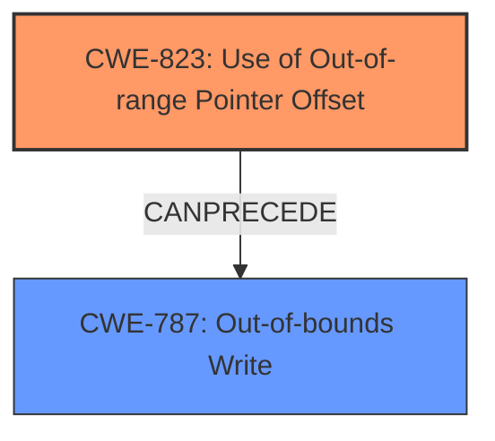

# Final Resolution for CVE-2022-25709

# Summary

| CWE ID | CWE Name | Confidence | CWE Abstraction Level | CWE Vulnerability Mapping Label | CWE-Vulnerability Mapping Notes |
|---|---|---|---|---|---|
| CWE-823 | Use of Out-of-range Pointer Offset | 0.95 | Base | Allowed | Primary CWE. The vulnerability description explicitly mentions the "**use of out of range pointer offset**." |
| CWE-787 | Out-of-bounds Write | 0.7 | Base | Allowed | Secondary CWE. The memory corruption is likely due to an out-of-bounds write. |

## Evidence and Confidence

*   **Confidence Score:** 0.9
*   **Evidence Strength:** HIGH

## Relationship Analysis

The primary CWE is CWE-823 (**Use of Out-of-range Pointer Offset**), which is a base CWE. The criticism suggests considering potential consequences such as CWE-787 (**Out-of-bounds Write**). CWE-823 can precede CWE-787, making CWE-787 a secondary candidate.

## Vulnerability Chain

The vulnerability chain starts with the **ROOTCAUSE** being the **use of out of range pointer offset** (CWE-823). This leads to memory corruption, which is likely caused by an out-of-bounds write (CWE-787).

## Summary of Analysis

The initial analysis correctly identifies CWE-823 (**Use of Out-of-range Pointer Offset**) as the primary CWE, as the vulnerability description explicitly mentions the "**use of out of range pointer offset**." The criticism suggests that CWE-787 (**Out-of-bounds Write**) should be considered as a secondary CWE, since memory corruption is mentioned in the vulnerability description and CWE-823 can precede CWE-787. The evidence provided in the vulnerability description supports this conclusion. The graph relationships influenced the final selection by showing that CWE-823 can lead to CWE-787. These CWEs are at the optimal level of specificity because CWE-823 directly addresses the **ROOTCAUSE**, and CWE-787 addresses the impact of memory corruption. The final determination is to include CWE-787 as a secondary CWE.