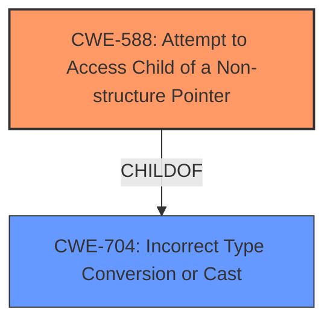

# Final Resolution for CVE-2022-25715

# Summary
| CWE ID | CWE Name | Confidence | CWE Abstraction Level | CWE Vulnerability Mapping Label | CWE-Vulnerability Mapping Notes |
|---|---|---|---|---|---|
| CWE-588 | Attempt to Access Child of a Non-structure Pointer | 0.85 | Base | Allowed | Primary CWE |
| CWE-704 | **Incorrect Type Conversion or Cast** | 0.60 | Class | Allowed-with-Review | Secondary Candidate |

## Evidence and Confidence

*   **Confidence Score:** 0.80
*   **Evidence Strength:** MEDIUM

## Relationship Analysis
The primary relationship influencing the decision is the hierarchical relationship between CWE-704 (**Incorrect Type Conversion or Cast**) and its child CWE-588 (Attempt to Access Child of a Non-structure Pointer). Given the vulnerability description explicitly mentions "accessing the fence structure fields" after the **incorrect type casting**, CWE-588 becomes a more specific and appropriate classification than its parent, CWE-704.

## Vulnerability Chain
The vulnerability chain starts with the **incorrect type casting** (potentially CWE-704). This leads to an attempt to access structure fields on a non-structure pointer (CWE-588), resulting in memory corruption. The **root cause** is the type confusion, and the immediate weakness exploited is the attempt to access a structure member on an incompatible type.

## Summary of Analysis
The initial analysis correctly identified CWE-704 as a possible **root cause**. However, the criticism correctly pointed out that the analysis didn't delve deeply enough into the children of CWE-704. The vulnerability description includes the phrase "**incorrect type casting** while accessing the fence structure fields." This is strong evidence, as noted in the criticism, that CWE-588 (Attempt to Access Child of a Non-structure Pointer) is a more specific and appropriate classification. This CWE directly addresses the attempt to access structure members after the **incorrect type conversion**.

The evidence for selecting CWE-588 is the phrase "**incorrect type casting** while accessing the fence structure fields." This suggests that the code is attempting to treat a non-structure pointer as a structure, then dereferencing a member of it, which is exactly what CWE-588 describes.

CWE-704 remains a secondary candidate, as it represents the general class of **incorrect type conversion**, but CWE-588 provides the necessary specificity to accurately reflect the vulnerability.
CWE-588 is at the optimal level of specificity because it describes the specific action of attempting to access a structure member of a non-structure pointer, which directly aligns with the vulnerability description.