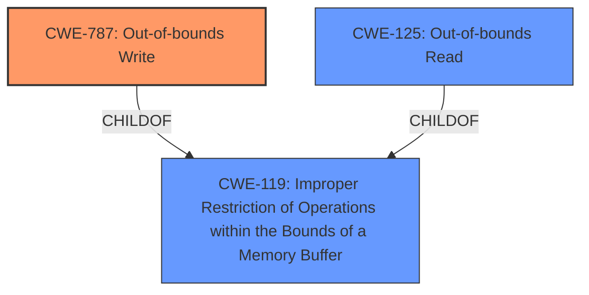

# Final Resolution for CVE-2022-25716

# Summary
| CWE ID | CWE Name | Confidence | CWE Abstraction Level | CWE Vulnerability Mapping Label | CWE-Vulnerability Mapping Notes |
|---|---|---|---|---|---|
| CWE-787 | Out-of-bounds Write | 0.7 | Base | Allowed | Primary CWE |
| CWE-125 | Out-of-bounds Read | 0.6 | Base | Allowed | Secondary Candidate |

## Evidence and Confidence

*   **Confidence Score:** 0.7
*   **Evidence Strength:** MEDIUM

## Relationship Analysis
The primary relationship is between **CWE-787 (Out-of-bounds Write)** and **CWE-125 (Out-of-bounds Read)** as potential causes of memory corruption due to unsafe access. Both are children of **CWE-119 (Improper Restriction of Operations within the Bounds of a Memory Buffer)** but are more specific. The analysis focused on identifying whether the unsafe access leads to reading or writing outside the intended buffer.

## Vulnerability Chain
The vulnerability chain starts with **unsafe access to data members** leading to memory corruption. This unsafe access is further categorized as either an out-of-bounds write (**CWE-787**) or an out-of-bounds read (**CWE-125**), both resulting in memory corruption and potential further exploitation. The provided information does not give enough detail to determine which of these is the more appropriate.

## Summary of Analysis
The initial analysis identified **CWE-823 (Use of Out-of-range Pointer Offset)**, but the criticism pointed out that **CWE-787 (Out-of-bounds Write)** and **CWE-125 (Out-of-bounds Read)** are more specific and potentially better fits, depending on whether the unsafe access involves reading or writing.

The vulnerability description states "Memory corruption in Multimedia Framework due to unsafe access to the data members".

Given the vulnerability description, it is still not definitively clear whether the "unsafe access" involves a write, a read, or both. However, since the vulnerability results in "memory corruption", **CWE-787 (Out-of-bounds Write)** is more likely to directly cause corruption than **CWE-125 (Out-of-bounds Read)**. Therefore, **CWE-787** is selected as the primary CWE with a confidence of 0.7, and **CWE-125** remains a secondary candidate with a confidence of 0.6. Both are at the Base level of abstraction, which is preferred.